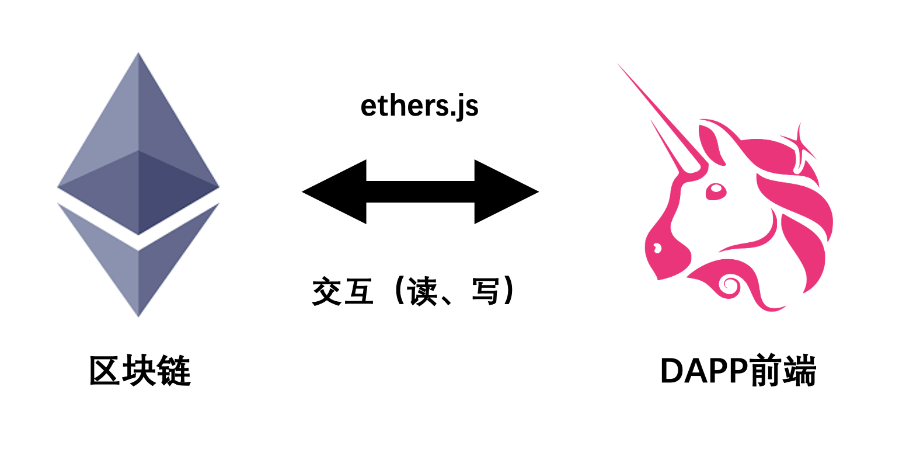
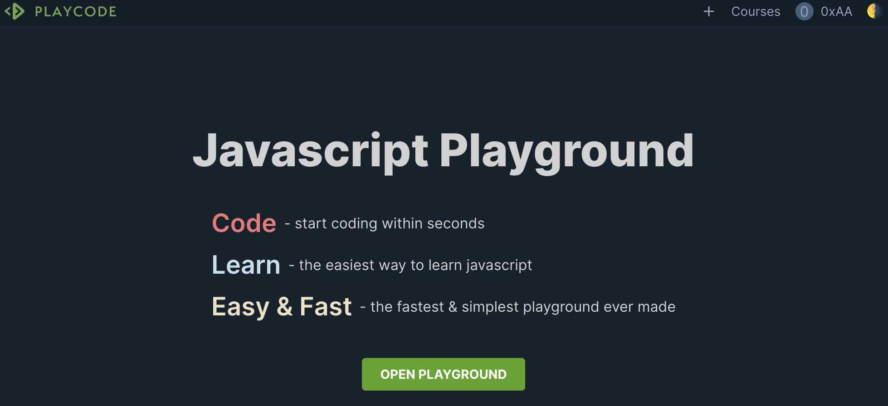
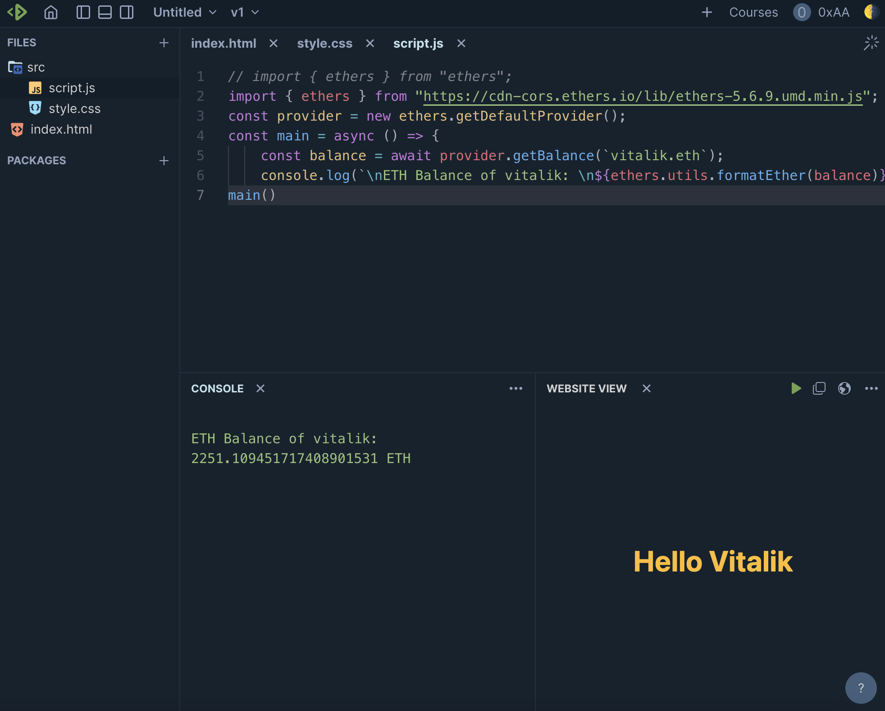
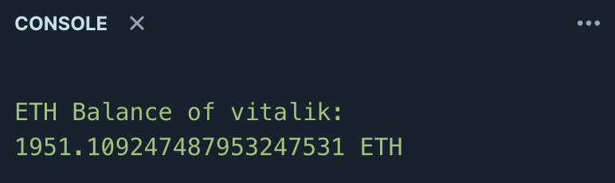

# Ethers极简入门: 1. HelloVitalik (6行代码)

我最近在重新学`ethers.js`，巩固一下细节，也写一个`WTF Ethers极简入门`，供小白们使用。

**推特**：[@0xAA_Science](https://twitter.com/0xAA_Science)

**WTF Academy社群：** [官网 wtf.academy](https://wtf.academy) | [WTF Solidity教程](https://github.com/AmazingAng/WTFSolidity) | [discord](https://discord.gg/5akcruXrsk) | [微信群申请](https://docs.google.com/forms/d/e/1FAIpQLSe4KGT8Sh6sJ7hedQRuIYirOoZK_85miz3dw7vA1-YjodgJ-A/viewform?usp=sf_link)

所有代码和教程开源在github: [github.com/WTFAcademy/WTF-Ethers](https://github.com/WTFAcademy/WTF-Ethers)

-----

这一讲，我们会介绍`ethers.js`库，javascript在线编辑器`playcode`，并且我们会写第一个程序`HelloVitalik`：查询V神的`ETH`余额，并输出在`console`中。

> 教程使用 ethers.js 最新的 v6 版本，与 v5 改动较大。v5 版本教程，见 [链接](https://github.com/WTFAcademy/WTF-Ethers/tree/wtf-ethers-v5)。

## ethers.js简述

`ethers.js`是一个完整而紧凑的开源库，用于与以太坊区块链及其生态系统进行交互。如果你要写Dapp的前端，你就需要用到`ethers.js`。

与更早出现的`web3.js`相比，它有以下优点：

1. 代码更加紧凑：`ethers.js`大小为116.5 kB，而`web3.js`为590.6 kB。
2. 更加安全：`Web3.js`认为用户会在本地部署以太坊节点，私钥和网络连接状态由这个节点管理（实际并不是这样）；`ethers.js`中，`Provider`提供器类管理网络连接状态，`Wallet`钱包类管理密钥，安全且灵活。
3. 原生支持`ENS`。



## 开发工具

### 1. VScode

你可以使用本地`vscode`进行开发。你需要安装[Node.js](https://nodejs.org/zh-cn/download/)，然后利用包管理工具`npm`安装`ethers`库：

```shell
npm install ethers@6.2.3 --save
```

### 2. playcode



[playcode](https://playcode.io/)是一个在线编译`javascript`的平台，你不需要配置`Nodejs`就可以运行`.js`文件，非常方便。且要比更知名的`codesandbox`快一百倍。


本教程将用`playcode`做演示。你需要在官网注册一个免费账号，然后点击`OPEN PLAYGROUND`以`Javascript`模版创建一个新项目，然后将代码写在自动生成的`script.js`中即可。

## HelloVitalik

现在，让我们用`ethers`编写第一个程序`HelloVitalik`：查询V神的`ETH`余额，并输出在`console`中。整个程序只需要6行，非常简单！

**注意**：在`playcode`上第一次运行可能会提示`module not found`，这是因为`ethers`库还没有安装，只需要点击`install`按钮安装即可。



```javascript
import { ethers } from "ethers";
const provider = ethers.getDefaultProvider();
const main = async () => {
    const balance = await provider.getBalance(`vitalik.eth`);
    console.log(`ETH Balance of vitalik: ${ethers.formatEther(balance)} ETH`);
}
main()
```

我们逐行分析这个程序：

### 1. 导入`ethers`
第一行的作用是导入已经安装好的`ethers`库：
```javascript
import { ethers } from "ethers";
```
如果在`playcode`平台上，免费账号不能安装外部库。我们可以直接从`ethers`的CDN导入（出于安全考虑，仅用于教学）：
```javascript
import { ethers } from "https://cdnjs.cloudflare.com/ajax/libs/ethers/6.2.3/ethers.js";
```

### 2. 连接以太坊

在`ethers`中，`Provider`类是一个为以太坊网络连接提供抽象的类，它提供对区块链及其状态的只读访问。我们声明一个`provider`用于连接以太坊网络。`ethers`内置了一些公用`rpc`，方便用户连接以太坊：

```javascript
const provider = ethers.getDefaultProvider();
```

**注意:**`ethers`内置的`rpc`访问速度有限制，仅测试用，生产环境还是要申请个人`rpc`。比如:

```js
const ALCHEMY_MAINNET_URL = 'https://eth-mainnet.g.alchemy.com/v2/oKmOQKbneVkxgHZfibs-iFhIlIAl6HDN';
const provider = new ethers.JsonRpcProvider(ALCHEMY_MAINNET_URL)
```

### 3. 声明`async`函数

由于和区块链交互不是实时的我们需要用到js的`async/await`语法糖。每次和链交互的调用需要用到`await`，再把这些用`async`函数包裹起来，最后再调用这个函数。
```javascript
const main = async () => {
    //...
}
main()
```
### 4. 获取v神地址的`ETH`余额

我们可以利用`Provider`类的`getBalance()`函数来查询某个地址的`ETH`余额。由于`ethers`原生支持`ENS`域名，我们不需要知道具体地址，用`ENS`域名`vitalik.eth`就可以查询到以太坊创始人豚林-vitalik的余额。

```javascript
const balance = await provider.getBalance(`vitalik.eth`);
```

### 5. 转换单位后在`console`中输出

我们从链上获取的以太坊余额以`wei`为单位，而`1 ETH = 10^18 wei`。我们打印在`console`之前，需要进行单位转换。`ethers`提供了功能函数`formatEther`，我们可以利用它将`wei`转换为`ETH`。

```javascript
    console.log(`ETH Balance of vitalik: ${ethers.formatEther(balance)} ETH`);
```
如果你使用的是vscode开发工具的话，你需要在vscode控制台输入以下命令
```shell
node 01_HelloVitalik/HelloVitalik.js
```
这样，你就能在控制台中看到v神的`ETH`余额了：`1951 ETH`。当然这不是v神的全部持仓，他有多个钱包，`vitalik.eth`应该只是他用的比较频繁的一个热钱包。




## 总结

这是WTF Ethers极简教程的第一讲，我们介绍了`ethers.js`，并完成了第一个使用`ethers`的程序`HelloVitalik`，查询v神钱包的`ETH`余额。

**课后作业**：在图4和图5中，v神的`ETH`余额并不一样。第一张余额为`2251 ETH`，而第二张变为了`1951 ETH`，减少`300 ETH`。其实，两张图片对应v神在`2022.07.30`和`2022.07.31`的持仓。那么，这一天v神用`300 ETH`干了什么？

ethers[v5]官方文档：https://docs.ethers.io/v5/
ethers[v6]官方文档：https://docs.ethers.io/v6/

