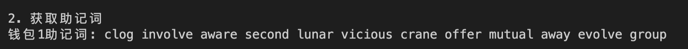

# Ethers极简入门: 4. 发送ETH
我最近在重新学`ethers.js`，巩固一下细节，也写一个`WTF Ethers极简入门`，供小白们使用。

**推特**：[@0xAA_Science](https://twitter.com/0xAA_Science)

**WTF Academy社群：** [官网 wtf.academy](https://wtf.academy) | [WTF Solidity教程](https://github.com/AmazingAng/WTF-Solidity) | [discord](https://discord.gg/5akcruXrsk) | [微信群申请](https://docs.google.com/forms/d/e/1FAIpQLSe4KGT8Sh6sJ7hedQRuIYirOoZK_85miz3dw7vA1-YjodgJ-A/viewform?usp=sf_link)

所有代码和教程开源在github: [github.com/WTFAcademy/WTF-Ethers](https://github.com/WTFAcademy/WTF-Ethers)

-----

这一讲，我们将介绍`Signer`签名者类和它派生的`Wallet`钱包类，并利用它来发送`ETH`。

## `Signer`签名者类

`Web3.js`认为用户会在本地部署以太坊节点，私钥和网络连接状态由这个节点管理（实际并不是这样）；而在`ethers.js`中，`Provider`提供器类管理网络连接状态，`Signer`签名者类或`Wallet`钱包类管理密钥，安全且灵活。

在`ethers`中，`Signer`签名者类是以太坊账户的抽象，可用于对消息和交易进行签名，并将签名的交易发送到以太坊网络，并更改区块链状态。`Signer`类是抽象类，不能直接实例化，我们需要使用它的子类：`Wallet`钱包类。

## `Wallet`钱包类

`Wallet`类继承了`Signer`类，并且开发者可以像包含私钥的外部拥有帐户（`EOA`）一样，用它对交易和消息进行签名。

下面我们介绍创建`Wallet`实例的几种办法：

### 方法1：创建随机的wallet对象

我们可以利用`ethers.Wallet.createRandom()`函数创建带有随机私钥的`Wallet`对象。该私钥由加密安全的熵源生成，如果当前环境没有安全的熵源，则会引发错误（没法在在线平台`playcode`使用此方法）。

```javascript
// 创建随机的wallet对象
const wallet1 = new ethers.Wallet.createRandom()
```

### 方法2：用私钥创建wallet对象
我们已知私钥的情况下，可以利用`ethers.Wallet()`函数创建`Wallet`对象。

```javascript
// 利用私钥和provider创建wallet对象
const privateKey = '0x227dbb8586117d55284e26620bc76534dfbd2394be34cf4a09cb775d593b6f2b'
const wallet2 = new ethers.Wallet(privateKey, provider)
```

### 方法3：从助记词创建wallet对象

我们已知助记词的情况下，可以利用`ethers.Wallet.fromMnemonic()`函数创建`Wallet`对象。


```javascript
// 从助记词创建wallet对象
const wallet3 = new ethers.Wallet.fromMnemonic(mnemonic.phrase)
```
### 其他方法：通过JSON文件创建wallet对象
以上三种方法即可满足大部分需求，当然还可以通过`ethers.Wallet.fromEncryptedJson`解密一个`JSON`钱包文件创建钱包实例，`JSON`文件即`keystore`文件，通常来自`Geth`, `Parity`等钱包，通过`Geth`搭建过以太坊节点的个人对`keystore`文件不会陌生。

## 发送`ETH`

我们可以利用`Wallet`实例来发送`ETH`。首先，我们要构造一个交易请求，在里面声明接收地址`to`和发送的`ETH`数额`value`。交易请求`TransactionRequest`类型可以包含发送方`from`，nonce值`nounce`，请求数据`data`等信息，之后的教程里会更详细介绍。

```javascript
    // 创建交易请求，参数：to为接收地址，value为ETH数额
    const tx = {
        to: address1,
        value: ethers.parseEther("0.001")
    }
```

然后，我们就可以利用`Wallet`类的`sendTransaction`来发送交易，等待交易上链，并获得交易的收据，非常简单。

```javascript
    //发送交易，获得收据
    const receipt = await wallet2.sendTransaction(tx)
    await receipt.wait() // 等待链上确认交易
    console.log(receipt) // 打印交易详情
```

## 代码示例

### 1. 创建`Provider`实例

```javascript
// 利用Wallet类发送ETH
// 由于playcode不支持ethers.Wallet.createRandom()函数，我们只能用VScode运行这一讲代码
import { ethers } from "ethers";

// 利用Alchemy的rpc节点连接以太坊测试网络
// 准备 alchemy API 可以参考https://github.com/AmazingAng/WTFSolidity/blob/main/Topics/Tools/TOOL04_Alchemy/readme.md 
const ALCHEMY_GOERLI_URL = 'https://eth-goerli.alchemyapi.io/v2/GlaeWuylnNM3uuOo-SAwJxuwTdqHaY5l';
const provider = new ethers.JsonRpcProvider(ALCHEMY_GOERLI_URL);
```

### 2. 用三种不同方法创建`Wallet`实例

- 创建随机私钥的`Wallet`对象。这种方法创建的钱包是单机的，我们需要用`connect(provider)`函数，连接到以太坊节点。这种方法创建的钱包可以用`mnemonic`获取助记词。

```javascript
// 创建随机的wallet对象
const wallet1 = ethers.Wallet.createRandom()
const wallet1WithProvider = wallet1.connect(provider)
const mnemonic = wallet1.mnemonic // 获取助记词
```

- 利用私钥和`Provider`实例创建`Wallet`对象。这种方法创建的钱包不能获取助记词。
```javascript
// 利用私钥和provider创建wallet对象
const privateKey = '0x227dbb8586117d55284e26620bc76534dfbd2394be34cf4a09cb775d593b6f2b'
const wallet2 = new ethers.Wallet(privateKey, provider)
```

- 利用助记词创建`Wallet`对象。这里我们使用的是`wallet1`的助记词，因此创建出钱包的私钥和公钥都和`wallet1`相同。

```javascript
// 从助记词创建wallet对象
const wallet3 = ethers.Wallet.fromPhrase(mnemonic.phrase)
```

### 3. 获取钱包地址

利用`getAddress()`函数获取钱包地址。


```javascript
    const address1 = await wallet1.getAddress()
    const address2 = await wallet2.getAddress() 
    const address3 = await wallet3.getAddress() // 获取地址
    console.log(`1. 获取钱包地址`);
    console.log(`钱包1地址: ${address1}`);
    console.log(`钱包2地址: ${address2}`);
    console.log(`钱包3地址: ${address3}`);
    console.log(`钱包1和钱包3的地址是否相同: ${address1 === address3}`);
    
```


### 4. 获取助记词

利用钱包对象的`mnemonic.phrase`成员获取助记词：

```javascript
console.log(`钱包1助记词: ${wallet1.mnemonic.phrase}`)
```


### 5. 获取私钥
利用钱包对象的`privateKey`成员获取私钥：

```javascript
    console.log(`钱包2私钥: ${wallet2.privateKey}`)
```


### 6. 获取钱包在链上的交互次数
利用`getTransactionCount()`函数获取钱包在链上的交互次数。

```javascript
    const txCount1 = await wallet1WithProvider.getTransactionCount()
    const txCount2 = await wallet2.getTransactionCount()
    console.log(`钱包1发送交易次数: ${txCount1}`)
    console.log(`钱包2发送交易次数: ${txCount2}`)
```


### 7. 发送`ETH`

我们用`wallet2`给`wallet1`发送`0.001 ETH`，并打印交易前后的钱包余额。由于`wallet1`是新建的随机私钥钱包，因此交易前余额为`0`，而交易后余额为`0.001 ETH`。


```javascript
    // 5. 发送ETH
    // 如果这个钱包没goerli测试网ETH了，去水龙头领一些，钱包地址: 0xe16C1623c1AA7D919cd2241d8b36d9E79C1Be2A2
    // 1. chainlink水龙头: https://faucets.chain.link/goerli
    // 2. paradigm水龙头: https://faucet.paradigm.xyz/
    console.log(`\n5. 发送ETH（测试网）`);
    // i. 打印交易前余额
    console.log(`i. 发送前余额`)
    console.log(`钱包1: ${ethers.formatEther(await provider.getBalance(wallet1WithProvider))} ETH`)
    console.log(`钱包2: ${ethers.formatEther(await provider.getBalance(wallet2))} ETH`)
    // ii. 构造交易请求，参数：to为接收地址，value为ETH数额
    const tx = {
        to: address1,
        value: ethers.parseEther("0.001")
    }
    // iii. 发送交易，获得收据
    console.log(`\nii. 等待交易在区块链确认（需要几分钟）`)
    const receipt = await wallet2.sendTransaction(tx)
    await receipt.wait() // 等待链上确认交易
    console.log(receipt) // 打印交易详情
    // iv. 打印交易后余额
    console.log(`\niii. 发送后余额`)
    console.log(`钱包1: ${ethers.formatEther(await provider.getBalance(wallet1WithProvider))} ETH`)
    console.log(`钱包2: ${ethers.formatEther(await provider.getBalance(wallet2))} ETH`)
```


## 总结

这一讲，我们介绍了`Signer`签名者类和`Wallet`钱包类，使用钱包实例获取了地址、助记词、私钥、链上交互次数，并发送`ETH`。
