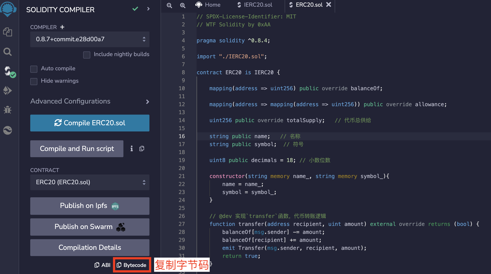
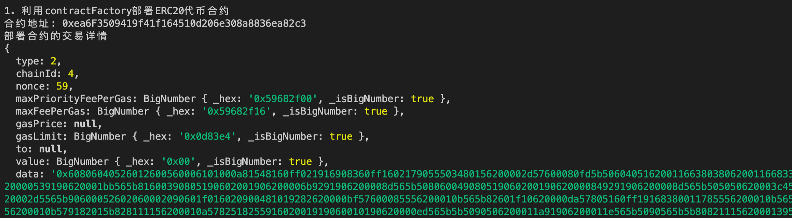

# Ethers极简入门: 6. 部署合约

我最近在重新学`ethers.js`，巩固一下细节，也写一个`WTF Ethers极简入门`，供小白们使用。

**推特**：[@0xAA_Science](https://twitter.com/0xAA_Science)

**WTF Academy社群：** [官网 wtf.academy](https://wtf.academy) | [WTF Solidity教程](https://github.com/AmazingAng/WTF-Solidity) | [discord](https://discord.gg/5akcruXrsk) | [微信群申请](https://docs.google.com/forms/d/e/1FAIpQLSe4KGT8Sh6sJ7hedQRuIYirOoZK_85miz3dw7vA1-YjodgJ-A/viewform?usp=sf_link)

所有代码和教程开源在github: [github.com/WTFAcademy/WTFEthers](https://github.com/WTFAcademy/WTF-Ethers)

-----

提示：本教程基于ethers.js 6.3.0 ，如果你使用的是v5，可以参考[ethers.js v5文档](https://docs.ethers.io/v5/)。

这一讲，我们将介绍`ethers.js`中的合约工厂`ContractFactory`类型，并利用它部署合约。

具体可参考[ethers.js文档](https://docs.ethers.io/v5/api/contract/contract-factory)。

## 部署智能合约

在以太坊上，智能合约的部署是一种特殊的交易：将编译智能合约得到的字节码发送到0地址。如果这个合约的构造函数有参数的话，需要利用`abi.encode`将参数编码为字节码，然后附在在合约字节码的尾部一起发送。对于ABI编码的介绍见WTF Solidity极简教程[第27讲 ABI编码](https://github.com/AmazingAng/WTFSolidity/blob/main/27_ABIEncode/readme.md)。

## 合约工厂

`ethers.js`创造了合约工厂`ContractFactory`类型，方便开发者部署合约。你可以利用合约`abi`，编译得到的字节码`bytecode`和签名者变量`signer`来创建合约工厂实例，为部署合约做准备。

```js
const contractFactory = new ethers.ContractFactory(abi, bytecode, signer);
```
**注意**：如果合约的构造函数有参数，那么在`abi`中必须包含构造函数。

在创建好合约工厂实例之后，可以调用它的`deploy`函数并传入合约构造函数的参数`args`来部署并获得合约实例：
```js
const contract = await contractFactory.deploy(args)
```

你可以利用下面两种命令，等待合约部署在链上确认，然后再进行交互。
```js
await contract.deployed()
//或者 await contract.deployTransaction.wait()
```

## 例子：部署ERC20代币合约

`ERC20`标准代币合约的介绍见WTF Solidity极简教程[第31讲 ERC20](https://github.com/AmazingAng/WTFSolidity/blob/main/31_ERC20/readme.md)。

1. 创建`provider`和`wallet`变量。
    ```js
    import { ethers } from "ethers";

    // 利用Alchemy的rpc节点连接以太坊网络
    // 连接goerli测试网
    const ALCHEMY_GOERLI_URL = 'https://eth-goerli.alchemyapi.io/v2/GlaeWuylnNM3uuOo-SAwJxuwTdqHaY5l';
    const provider = new ethers.JsonRpcProvider(ALCHEMY_GOERLI_URL);

    // 利用私钥和provider创建wallet对象
    const privateKey = '0x227dbb8586117d55284e26620bc76534dfbd2394be34cf4a09cb775d593b6f2b'
    const wallet = new ethers.Wallet(privateKey, provider)
    ```

2. 准备ERC20合约的字节码和ABI。因为ERC20的构造函数含有参数，因此我们必须把它包含在ABI中。合约的字节码可以从`remix`的编译面板中点击`Bytecode`按钮，把它复制下来，其中"object"字段对应的数据就是字节码。如果部署在链上的合约，你可以在etherscan的Contract页面的`Contract Creation Code`中找到。

    ```js
    // ERC20的人类可读abi
    const abiERC20 = [
        "constructor(string memory name_, string memory symbol_)",
        "function name() view returns (string)",
        "function symbol() view returns (string)",
        "function totalSupply() view returns (uint256)",
        "function balanceOf(address) view returns (uint)",
        "function transfer(address to, uint256 amount) external returns (bool)",
        "function mint(uint amount) external",
    ];
    // 填入合约字节码，在remix中，你可以在两个地方找到Bytecode
    // 1. 编译面板的Bytecode按钮
    // 2. 文件面板artifact文件夹下与合约同名的json文件中
    // 里面"bytecode"属性下的"object"字段对应的数据就是Bytecode，挺长的，608060起始
    // "object": "608060405260646000553480156100...
    const bytecodeERC20 = "60806040526012600560006101000a81548160ff021916908360ff1602179055503480156200002d57600080fd5b5060405162001166380380620011668339818101604052810190620000539190620001bb565b81600390805190602001906200006b9291906200008d565b508060049080519060200190620000849291906200008d565b505050620003c4565b8280546200009b90620002d5565b90600052602060002090601f016020900481019282620000bf57600085556200010b565b82601f10620000da57805160ff19168380011785556200010b565b828001600101855582156200010b579182015b828111156200010a578251825591602001919060010190620000ed565b5b5090506200011a91906200011e565b5090565b5b80821115620001395760008160009055506001016200011f565b5090565b6000620001546200014e8462000269565b62000240565b905082815260208101848484011115620001735762000172620003a4565b5b620001808482856200029f565b509392505050565b600082601f830112620001a0576200019f6200039f565b5b8151620001b28482602086016200013d565b91505092915050565b60008060408385031215620001d557620001d4620003ae565b5b600083015167ffffffffffffffff811115620001f657620001f5620003a9565b5b620002048582860162000188565b925050602083015167ffffffffffffffff811115620002285762000227620003a9565b5b620002368582860162000188565b9150509250929050565b60006200024c6200025f565b90506200025a82826200030b565b919050565b6000604051905090565b600067ffffffffffffffff82111562000287576200028662000370565b5b6200029282620003b3565b9050602081019050919050565b60005b83811015620002bf578082015181840152602081019050620002a2565b83811115620002cf576000848401525b50505050565b60006002820490506001821680620002ee57607f821691505b6020821081141562000305576200030462000341565b5b50919050565b6200031682620003b3565b810181811067ffffffffffffffff8211171562000338576200033762000370565b5b80604052505050565b7f4e487b7100000000000000000000000000000000000000000000000000000000600052602260045260246000fd5b7f4e487b7100000000000000000000000000000000000000000000000000000000600052604160045260246000fd5b600080fd5b600080fd5b600080fd5b600080fd5b6000601f19601f8301169050919050565b610d9280620003d46000396000f3fe608060405234801561001057600080fd5b50600436106100a95760003560e01c806342966c681161007157806342966c681461016857806370a082311461018457806395d89b41146101b4578063a0712d68146101d2578063a9059cbb146101ee578063dd62ed3e1461021e576100a9565b806306fdde03146100ae578063095ea7b3146100cc57806318160ddd146100fc57806323b872dd1461011a578063313ce5671461014a575b600080fd5b6100b661024e565b6040516100c39190610b02565b60405180910390f35b6100e660048036038101906100e19190610a14565b6102dc565b6040516100f39190610ae7565b60405180910390f35b6101046103ce565b6040516101119190610b24565b60405180910390f35b610134600480360381019061012f91906109c1565b6103d4565b6040516101419190610ae7565b60405180910390f35b610152610583565b60405161015f9190610b3f565b60405180910390f35b610182600480360381019061017d9190610a54565b610596565b005b61019e60048036038101906101999190610954565b61066d565b6040516101ab9190610b24565b60405180910390f35b6101bc610685565b6040516101c99190610b02565b60405180910390f35b6101ec60048036038101906101e79190610a54565b610713565b005b61020860048036038101906102039190610a14565b6107ea565b6040516102159190610ae7565b60405180910390f35b61023860048036038101906102339190610981565b610905565b6040516102459190610b24565b60405180910390f35b6003805461025b90610c88565b80601f016020809104026020016040519081016040528092919081815260200182805461028790610c88565b80156102d45780601f106102a9576101008083540402835291602001916102d4565b820191906000526020600020905b8154815290600101906020018083116102b757829003601f168201915b505050505081565b600081600160003373ffffffffffffffffffffffffffffffffffffffff1673ffffffffffffffffffffffffffffffffffffffff16815260200190815260200160002060008573ffffffffffffffffffffffffffffffffffffffff1673ffffffffffffffffffffffffffffffffffffffff168152602001908152602001600020819055508273ffffffffffffffffffffffffffffffffffffffff163373ffffffffffffffffffffffffffffffffffffffff167f8c5be1e5ebec7d5bd14f71427d1e84f3dd0314c0f7b2291e5b200ac8c7c3b925846040516103bc9190610b24565b60405180910390a36001905092915050565b60025481565b600081600160008673ffffffffffffffffffffffffffffffffffffffff1673ffffffffffffffffffffffffffffffffffffffff16815260200190815260200160002060003373ffffffffffffffffffffffffffffffffffffffff1673ffffffffffffffffffffffffffffffffffffffff16815260200190815260200160002060008282546104629190610bcc565b92505081905550816000808673ffffffffffffffffffffffffffffffffffffffff1673ffffffffffffffffffffffffffffffffffffffff16815260200190815260200160002060008282546104b79190610bcc565b92505081905550816000808573ffffffffffffffffffffffffffffffffffffffff1673ffffffffffffffffffffffffffffffffffffffff168152602001908152602001600020600082825461050c9190610b76565b925050819055508273ffffffffffffffffffffffffffffffffffffffff168473ffffffffffffffffffffffffffffffffffffffff167fddf252ad1be2c89b69c2b068fc378daa952ba7f163c4a11628f55a4df523b3ef846040516105709190610b24565b60405180910390a3600190509392505050565b600560009054906101000a900460ff1681565b806000803373ffffffffffffffffffffffffffffffffffffffff1673ffffffffffffffffffffffffffffffffffffffff16815260200190815260200160002060008282546105e49190610bcc565b9250508190555080600260008282546105fd9190610bcc565b92505081905550600073ffffffffffffffffffffffffffffffffffffffff163373ffffffffffffffffffffffffffffffffffffffff167fddf252ad1be2c89b69c2b068fc378daa952ba7f163c4a11628f55a4df523b3ef836040516106629190610b24565b60405180910390a350565b60006020528060005260406000206000915090505481565b6004805461069290610c88565b80601f01602080910402602001604051908101604052809291908181526020018280546106be90610c88565b801561070b5780601f106106e05761010080835404028352916020019161070b565b820191906000526020600020905b8154815290600101906020018083116106ee57829003601f168201915b505050505081565b806000803373ffffffffffffffffffffffffffffffffffffffff1673ffffffffffffffffffffffffffffffffffffffff16815260200190815260200160002060008282546107619190610b76565b92505081905550806002600082825461077a9190610b76565b925050819055503373ffffffffffffffffffffffffffffffffffffffff16600073ffffffffffffffffffffffffffffffffffffffff167fddf252ad1be2c89b69c2b068fc378daa952ba7f163c4a11628f55a4df523b3ef836040516107df9190610b24565b60405180910390a350565b6000816000803373ffffffffffffffffffffffffffffffffffffffff1673ffffffffffffffffffffffffffffffffffffffff168152602001908152602001600020600082825461083a9190610bcc565b92505081905550816000808573ffffffffffffffffffffffffffffffffffffffff1673ffffffffffffffffffffffffffffffffffffffff168152602001908152602001600020600082825461088f9190610b76565b925050819055508273ffffffffffffffffffffffffffffffffffffffff163373ffffffffffffffffffffffffffffffffffffffff167fddf252ad1be2c89b69c2b068fc378daa952ba7f163c4a11628f55a4df523b3ef846040516108f39190610b24565b60405180910390a36001905092915050565b6001602052816000526040600020602052806000526040600020600091509150505481565b60008135905061093981610d2e565b92915050565b60008135905061094e81610d45565b92915050565b60006020828403121561096a57610969610d18565b5b60006109788482850161092a565b91505092915050565b6000806040838503121561099857610997610d18565b5b60006109a68582860161092a565b92505060206109b78582860161092a565b9150509250929050565b6000806000606084860312156109da576109d9610d18565b5b60006109e88682870161092a565b93505060206109f98682870161092a565b9250506040610a0a8682870161093f565b9150509250925092565b60008060408385031215610a2b57610a2a610d18565b5b6000610a398582860161092a565b9250506020610a4a8582860161093f565b9150509250929050565b600060208284031215610a6a57610a69610d18565b5b6000610a788482850161093f565b91505092915050565b610a8a81610c12565b82525050565b6000610a9b82610b5a565b610aa58185610b65565b9350610ab5818560208601610c55565b610abe81610d1d565b840191505092915050565b610ad281610c3e565b82525050565b610ae181610c48565b82525050565b6000602082019050610afc6000830184610a81565b92915050565b60006020820190508181036000830152610b1c8184610a90565b905092915050565b6000602082019050610b396000830184610ac9565b92915050565b6000602082019050610b546000830184610ad8565b92915050565b600081519050919050565b600082825260208201905092915050565b6000610b8182610c3e565b9150610b8c83610c3e565b9250827fffffffffffffffffffffffffffffffffffffffffffffffffffffffffffffffff03821115610bc157610bc0610cba565b5b828201905092915050565b6000610bd782610c3e565b9150610be283610c3e565b925082821015610bf557610bf4610cba565b5b828203905092915050565b6000610c0b82610c1e565b9050919050565b60008115159050919050565b600073ffffffffffffffffffffffffffffffffffffffff82169050919050565b6000819050919050565b600060ff82169050919050565b60005b83811015610c73578082015181840152602081019050610c58565b83811115610c82576000848401525b50505050565b60006002820490506001821680610ca057607f821691505b60208210811415610cb457610cb3610ce9565b5b50919050565b7f4e487b7100000000000000000000000000000000000000000000000000000000600052601160045260246000fd5b7f4e487b7100000000000000000000000000000000000000000000000000000000600052602260045260246000fd5b600080fd5b6000601f19601f8301169050919050565b610d3781610c00565b8114610d4257600080fd5b50565b610d4e81610c3e565b8114610d5957600080fd5b5056fea2646970667358221220f87d0662c51e3b4b5e034fe8e1e7a10185cda3c246a5ba78e0bafe683d67789764736f6c63430008070033";

    ```

    
    
    

3. 创建合约工厂`ContractFactory`实例。

    ```js
    const factoryERC20 = new ethers.ContractFactory(abiERC20, bytecodeERC20, wallet);
    ```

4. 调用工厂合约的`deploy()`函数并填入构造函数的参数（代币名称和代号），部署`ERC20`代币合约并获得合约实例。你可以利用：
    - `contract.address`获取合约地址，
    - `contract.deployTransaction`获取部署详情，
    - `contractERC20.deployed()`等待合约部署在链上确认。

    ```js
    // 1. 利用contractFactory部署ERC20代币合约
    console.log("\n1. 利用contractFactory部署ERC20代币合约")
    // 部署合约，填入constructor的参数
    const contractERC20 = await factoryERC20.deploy("WTF Token", "WTF")
    console.log(`合约地址: ${contractERC20.target}`);
    console.log("部署合约的交易详情")
    console.log(contractERC20.deploymentTransaction())
    console.log("\n等待合约部署上链")
    await contractERC20.waitForDeployment()
    // 也可以用 contractERC20.deployTransaction.wait()
    console.log("合约已上链")
    ```

    

5. 在合约上链后，调用`name()`和`symbol()`函数打印代币名称和代号，然后调用`mint()`函数给自己铸造`10,000`枚代币。

    ```js
    // 打印合约的name()和symbol()，然后调用mint()函数，给自己地址mint 10,000代币
    console.log("\n2. 调用mint()函数，给自己地址mint 10,000代币")
    console.log(`合约名称: ${await contractERC20.name()}`)
    console.log(`合约代号: ${await contractERC20.symbol()}`)
    let tx = await contractERC20.mint("10000")
    console.log("等待交易上链")
    await tx.wait()
    console.log(`mint后地址中代币余额: ${await contractERC20.balanceOf(wallet)}`)
    console.log(`代币总供给: ${await contractERC20.totalSupply()}`)
    ```
    

6. 调用`transfer()`函数，给V神转账`1,000`枚代币。

    ```js
    // 3. 调用transfer()函数，给V神转账1000代币
    console.log("\n3. 调用transfer()函数，给V神转账1,000代币")
    tx = await contractERC20.transfer("vitalik.eth", "1000")
    console.log("等待交易上链")
    await tx.wait()
    console.log(`V神钱包中的代币余额: ${await contractERC20.balanceOf("vitalik.eth")}`)
    ```

    

## 总结

这一讲我们介绍了ether.js中的合约工厂`ContractFactory`类型，利用它部署了一个`ERC20`代币合约，并给V神转账了`1,000`枚代币。
