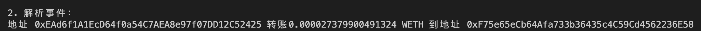

# Ethers极简入门: 7. 检索事件

我最近在重新学`ethers.js`，巩固一下细节，也写一个`WTF Ethers极简入门`，供小白们使用。

**推特**：[@0xAA_Science](https://twitter.com/0xAA_Science)

**WTF Academy社群：** [官网 wtf.academy](https://wtf.academy) | [WTF Solidity教程](https://github.com/AmazingAng/WTF-Solidity) | [discord](https://discord.gg/5akcruXrsk) | [微信群申请](https://docs.google.com/forms/d/e/1FAIpQLSe4KGT8Sh6sJ7hedQRuIYirOoZK_85miz3dw7vA1-YjodgJ-A/viewform?usp=sf_link)

所有代码和教程开源在github: [github.com/WTFAcademy/WTFEthers](https://github.com/WTFAcademy/WTF-Ethers)

-----

提示：本教程基于ethers.js 6.3.0 ，如果你使用的是v5，可以参考[ethers.js v5文档](https://docs.ethers.io/v5/)。

这一讲，我们将介绍如何使用`ethers.js`读取智能合约释放的事件。如果你不了解`Solidity`的事件，可以阅读WTF Solidity极简教程中[第12讲：事件](https://github.com/AmazingAng/WTFSolidity/blob/main/12_Event/readme.md)。

具体可参考[ethers.js文档](https://docs.ethers.org/v6/api/contract/#ContractEvent)。

## 事件 Event

智能合约释放出的事件存储于以太坊虚拟机的日志中。日志分为两个主题`topics`和数据`data`部分，其中事件哈希和`indexed`变量存储在`topics`中，作为索引方便以后搜索；没有`indexed`变量存储在`data`中，不能被直接检索，但可以存储更复杂的数据结构。

以ERC20代币中的`Transfer`转账事件为例，在合约中它是这样声明的：

```solidity
event Transfer(address indexed from, address indexed to, uint256 amount);
```

它共记录了3个变量`from`，`to`和`amount`，分别对应代币的发出地址，接收地址和转账数量，其中`from`和`to`前面带有`indexed`关键字。转账时，`Transfer`事件会被记录，可以在`etherscan`中[查到](https://rinkeby.etherscan.io/tx/0x8cf87215b23055896d93004112bbd8ab754f081b4491cb48c37592ca8f8a36c7)。


从上图中可以看到，`Transfer`事件被记录到了EVM的日志中，其中`Topics`包含3个数据，分别对应事件哈希，发出地址`from`，和接收地址`to`；而`Data`中包含一个数据，对应转账数额`amount`。

## 检索事件

我们可以利用`Ethers`中合约类型的`queryFilter()`函数读取合约释放的事件。

```js
const transferEvents = await contract.queryFilter('事件名', 起始区块, 结束区块)
```

`queryFilter()`包含3个参数，分别是事件名（必填），起始区块（选填），和结束区块（选填）。检索结果会以数组的方式返回。

**注意**：要检索的事件必须包含在合约的`abi`中。

## 例子：检索`WETH`合约中的`Transfer`事件

1. 创建`provider`。
    ```js
    import { ethers } from "ethers";
    // 利用Alchemy的rpc节点连接以太坊网络
    // 准备 alchemy API 可以参考https://github.com/AmazingAng/WTFSolidity/blob/main/Topics/Tools/TOOL04_Alchemy/readme.md 
    const ALCHEMY_GOERLI_URL = 'https://eth-goerli.alchemyapi.io/v2/GlaeWuylnNM3uuOo-SAwJxuwTdqHaY5l';
    const provider = new ethers.JsonRpcProvider(ALCHEMY_GOERLI_URL);
    ```

2. 创建包含检索事件的`abi`。
    ```js
    // WETH ABI，只包含我们关心的Transfer事件
    const abiWETH = [
        "event Transfer(address indexed from, address indexed to, uint amount)"
    ];
    ```

3. 声明`WETH`合约实例。

    ```js
    // 测试网WETH地址
    const addressWETH = '0xb4fbf271143f4fbf7b91a5ded31805e42b2208d6'
    // 声明合约实例
    const contract = new ethers.Contract(addressWETH, abiWETH, provider)
    ```

4. 获取过去10个区块内的`Transfer`事件，并打印出1个。我们可以看到，`topics`中有3个数据，对应事件哈希，`from`，和`to`；而`data`中只有一个数据`amount`。另外，`ethers`还会根据`ABI`自动解析事件，结果显示在`args`成员中。
    ```js
    // 得到当前block
    const block = await provider.getBlockNumber()
    console.log(`当前区块高度: ${block}`);
    console.log(`打印事件详情:`);
    const transferEvents = await contract.queryFilter('Transfer', block - 10, block)
    // 打印第1个Transfer事件
    console.log(transferEvents[0])
    ```

    

5. 读取事件的解析结果。

    ```
    // 解析Transfer事件的数据（变量在args中）
    console.log("\n2. 解析事件：")
    const amount = ethers.formatUnits(ethers.getBigInt(transferEvents[0].args["amount"]), "ether");
    console.log(`地址 ${transferEvents[0].args["from"]} 转账${amount} WETH 到地址 ${transferEvents[0].args["to"]}`)
    ```

    

## 总结

这一讲，我们回顾了`Solidity`中的事件，并介绍如何用`ethers`检索智能合约释放的事件。要注意的一点：要检索的事件必须包含在合约`abi`中。
