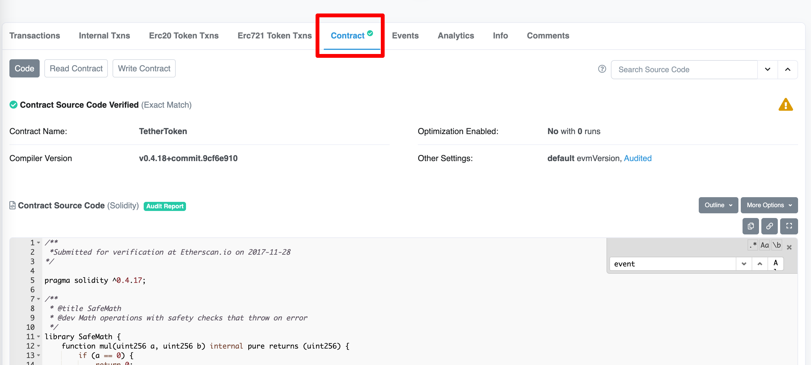
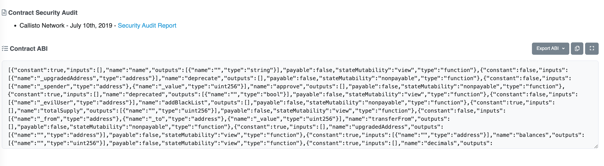

# Ethers极简入门: 5. 合约交互

我最近在重新学`ethers.js`，巩固一下细节，也写一个`WTF Ethers极简入门`，供小白们使用。

**推特**：[@0xAA_Science](https://twitter.com/0xAA_Science)

**WTF Academy社群：** [官网 wtf.academy](https://wtf.academy) | [WTF Solidity教程](https://github.com/AmazingAng/WTFSolidity) | [discord](https://discord.wtf.academy) | [微信群申请](https://docs.google.com/forms/d/e/1FAIpQLSe4KGT8Sh6sJ7hedQRuIYirOoZK_85miz3dw7vA1-YjodgJ-A/viewform?usp=sf_link)

所有代码和教程开源在github: [github.com/WTFAcademy/WTFEthers](https://github.com/WTFAcademy/WTFEthers)

-----

这一讲，我们将介绍如何监听合约，实现监听USDT合约，并使用布隆过滤提高效率，过滤固定信息。

## ethers
ethers入门的话可以看 [GitHub - WTFAcademy/WTFEthers](https://github.com/WTFAcademy/WTFEthers) 
官方文档：[Documentation](https://docs.ethers.io/v5/)
如何通过ethers实现监听呢？在ethersjs中，我们可以通过合约对象来实现监听。合约对象有一个`contract.on`的监听方法。
## Contract 合约对象
合约是已部署到区块链上的代码的抽象。
一个合约可以被发送交易，这将触发其代码在交易数据的输入下运行。

### 创建合约对象

创建合约对象需要三个参数
* `address` :合约的地址
* `abi`:合约的abi
* `provider`:ethers的provider
```js
new ethers.Contract( address , abi , signerOrProvider )
```

### 合约类的事件
合约类有很多事件，具体的可以自己直接看文档：[Contract - events](https://docs.ethers.io/v5/api/contract/contract/#Contract--events)

这次主要了解一下`cnotract.on`就好了，只需要一个合约对象，就可以监听对应的事件了。
```js
contract.on( event , listener )
```

## 查找ABI
### 通过etherscan.io查找abi
因为我们新建`contract`对象对时候需要三个参数，其中provider和address我们都可以很容易获得，ABI参数有2种方法可以获得。
### 一、通过开源合约代码获得ABI
首先打开[Tether: USDT Stablecoin | Address 0xdac17f958d2ee523a2206206994597c13d831ec7 | Etherscan](https://etherscan.io/address/0xdac17f958d2ee523a2206206994597c13d831ec7#code)USDT的合约地址，切换到合约`Contract`



搜索合约代码中的监听`event Transfer`

```js
/**
 * @title ERC20Basic
 * @dev Simpler version of ERC20 interface
 * @dev see https://github.com/ethereum/EIPs/issues/20
 */
contract ERC20Basic {
    uint public _totalSupply;
    function totalSupply() public constant returns (uint);
    function balanceOf(address who) public constant returns (uint);
    function transfer(address to, uint value) public;
    event Transfer(address indexed from, address indexed to, uint value);
}

```

可以看到`Transfer`事件，那么我们就可以直接拿来嵌入ethersjs生成对应的ABI

```js
const abi = [
  "event Transfer(address indexed from, address indexed to, uint value)"
];
```

### 二、通过etherscan网站获得abi

你可以通过etherscan获得具体的ABI



## 实现监听完整代码
```js
// 获取alchealchemy的节点
const config = require('dotenv').config().parsed
const {ethers} = require('ethers');

// 连接主网的提供者
const provider = new ethers.providers.JsonRpcProvider(config.ALCHEMY_MAINNET_URL);
// USDT的合约地址
const contractAddress = '0xdac17f958d2ee523a2206206994597c13d831ec7'

// 构建USDT的Transfer的ABI
const abi = [
  "event Transfer(address indexed from, address indexed to, uint value)"
];
// 生成USDT合约对象
const contractUSDT = new ethers.Contract(contractAddress, abi, provider);


(async ()=>{
  try{
  // 监听USDT合约
    contractUSDT.on('Transfer', (from, to, value)=>{
      console.log(
        `${from} -> ${to} ${ethers.BigNumber.from(value).toString()}`
      )
    })
  }catch(e){
    console.log(e);
  } 
})()
```


## 实现布隆过滤
默认的监听是会监听全网所有跟该合约地址交互的信息，但是有时候我们就只想监听固定的from或者to地址的操作，这个时候就可以使用创建过滤器来实现了。
详细的过滤可以看官方文档：[Events](https://docs.ethers.io/v5/concepts/events/#events--filters)
这里我列举几个常用的方式
### 构建过滤器
你可以通过如下方法构建一个过滤器
1.过滤来自`myAddress`地址的线上广播事件
```js
contract.filters.Transfer(myAddress)
```

2.过滤所有发给 `myAddress`地址的线上广播事件
```js
contract.filters.Transfer(null, myAddress)
```

3.过滤所有由 `myAddress`地址发给`otherAddress`的线上广播事件
```js
contract.filters.Transfer(myAddress, otherAddress)
```

4.过滤的时候你可以传入数组，过滤监听多个账号
```js
contract.filters.Transfer(null, [ myAddress, otherAddress ])
```

## 监听交易所地址的USDT信息
监听ethers之前，我们需要先看懂一条hash的交易状态，以及如何看懂该hash的`topics`,我们是通过`topics`的结构来创建过滤器的。

### 通过etherscan查看事件
查看该hash[0xab1f7b575600c4517a2e479e46e3af98a95ee84dd3f46824e02ff4618523fff5](https://etherscan.io/tx/0xab1f7b575600c4517a2e479e46e3af98a95ee84dd3f46824e02ff4618523fff5)

该条hash做了一件事：从 `binance14` 这个地址 将USDT转给了 `0x354de44bedba213d612e92d3248b899de17b0c58` 这个地址


查看该事件日志信息
`address` 为USDT合约地址
`topics[0]`为keccak256("Transfer(address,address,uint256)")
`topics[1]` 为from地址 就是 `binance14`交易所的地址
`topics[2]` 为to地址 就是接受USDT的地址
`data` 为发送的数量


### 通过ethers查看一条交易信息
已知一条交易hash为：`0xab1f7b575600c4517a2e479e46e3af98a95ee84dd3f46824e02ff4618523fff5`
通过代码从区块链上看该代码的信息
```js
const provider = new ethers.providers.JsonRpcProvider(config.ALCHEMY_MAINNET_URL);
  const receipt =  await provider.getTransactionReceipt('0xab1f7b575600c4517a2e479e46e3af98a95ee84dd3f46824e02ff4618523fff5');
  console.group('receipt');
  console.log(receipt);
  console.groupEnd();
  console.group('receipt.logs');
  console.log(receipt.logs);
  console.groupEnd();
```

通过上述代码得到如下结构：

`receipt`的详细信息
看如下信息：
`from`:为发起地址
`to`: 为接收地址，一般是erc20的合约地址，如果是nft的话，就是nft的合约地址

```json
receipt
  {
    to: '0xdAC17F958D2ee523a2206206994597C13D831ec7',
    from: '0x28C6c06298d514Db089934071355E5743bf21d60',
    contractAddress: null,
    transactionIndex: 93,
    gasUsed: BigNumber { _hex: '0xf6e9', _isBigNumber: true },
    logsBloom: '0x00000000000000000000000000000000000000000000000000000000000000000000000000000000000001000000010000000000000000000000000000010000000000000000000000000008000000000000000000000000000000000000000000000000000000000000000000000000000000000000000802000010000000000000000000000000000000000000000000000000000000000000000000100000000000000000000000000080000000000000000000000000000000020000000000000002000000000000000000000000000000000000000000000000000000000000000000000020000000000000000000000000000000000000000000000000',
    blockHash: '0x36c70a48ba9cff240854327f0d373d6bd295d9798b26dcf5cfff88d93d356de4',
    transactionHash: '0xab1f7b575600c4517a2e479e46e3af98a95ee84dd3f46824e02ff4618523fff5',
    logs: [
      {
        transactionIndex: 93,
        blockNumber: 15382657,
        transactionHash: '0xab1f7b575600c4517a2e479e46e3af98a95ee84dd3f46824e02ff4618523fff5',
        address: '0xdAC17F958D2ee523a2206206994597C13D831ec7',
        topics: [Array],
        data: '0x00000000000000000000000000000000000000000000000000000000b1ae7340',
        logIndex: 84,
        blockHash: '0x36c70a48ba9cff240854327f0d373d6bd295d9798b26dcf5cfff88d93d356de4'
      }
    ],
    blockNumber: 15382657,
    confirmations: 224,
    cumulativeGasUsed: BigNumber { _hex: '0x4163fe', _isBigNumber: true },
    effectiveGasPrice: BigNumber { _hex: '0xf1a1e025', _isBigNumber: true },
    status: 1,
    type: 2,
    byzantium: true
  }
```

`logs`中的信息展开
`address` 为USDT合约地址
`topics[0]`为keccak256("Transfer(address,address,uint256)")
`topics[1]` 为from地址 就是 `binance14`交易所的地址
`topics[2]` 为to地址 就是接受USDT的地址
`data` 为发送的数量
```json
receipt.logs  ============= logs 信息
  [
    {
      transactionIndex: 93,
      blockNumber: 15382657,
      transactionHash: '0xab1f7b575600c4517a2e479e46e3af98a95ee84dd3f46824e02ff4618523fff5',
      address: '0xdAC17F958D2ee523a2206206994597C13D831ec7',
      topics: [
        '0xddf252ad1be2c89b69c2b068fc378daa952ba7f163c4a11628f55a4df523b3ef',
        '0x00000000000000000000000028c6c06298d514db089934071355e5743bf21d60',
        '0x000000000000000000000000354de44bedba213d612e92d3248b899de17b0c58'
      ],
      data: '0x00000000000000000000000000000000000000000000000000000000b1ae7340',
      logIndex: 84,
      blockHash: '0x36c70a48ba9cff240854327f0d373d6bd295d9798b26dcf5cfff88d93d356de4'
    }
  ]
```

### 完整代码
```js
const config = require('dotenv').config().parsed
const { ethers } = require('ethers');

const provider = new ethers.providers.JsonRpcProvider(config.ALCHEMY_MAINNET_URL);
// 合约地址
const contractAddress = '0xdac17f958d2ee523a2206206994597c13d831ec7'
// 交易所地址
const balanceAccount = '0x28C6c06298d514Db089934071355E5743bf21d60'
// 构建ABI
const abi = [
  "event Transfer(address indexed from, address indexed to, uint value)"
];
// 构建合约对象
const contractUSDT = new ethers.Contract(contractAddress, abi, provider);


(async () => {
  try {
    console.log('start');
    // 创建过滤器，监听转移USDT进交易所
    let filterBinanceIn = contractUSDT.filters.Transfer(null, balanceAccount);
    console.log(filterBinanceIn);
	// 创建过滤器，监听交易所转出USDT
    let filterToBinanceOut = contractUSDT.filters.Transfer(balanceAccount, null);
    console.log(filterToBinanceOut);
    console.log('In');
    contractUSDT.on(filterBinanceIn, (from, to, value) => {
      console.log('---------监听USDT进入交易所--------');
      console.log(
        `${from} -> ${to} ${ethers.BigNumber.from(value).toString()}`
      )
    }).on('error', (error) => {
      console.log(error)
    })
    console.log('out');
    contractUSDT.on(filterToBinanceOut, (from, to, value) => {
      console.log('---------监听USDT转出交易所--------');
      console.log(
        `${from} -> ${to} ${ethers.BigNumber.from(value).toString()}`
      )
    }
    ).on('error', (error) => {
      console.log(error)
    });
  } catch (e) {
    console.log(e);
  }
})()
```

## 总结
至此我们就完成了最简单的监听eth链上交易所的监听，你可以通过该代码监听交易所上的大额转入转出，你也可以拓展该代码监听NFT的各种信息等。