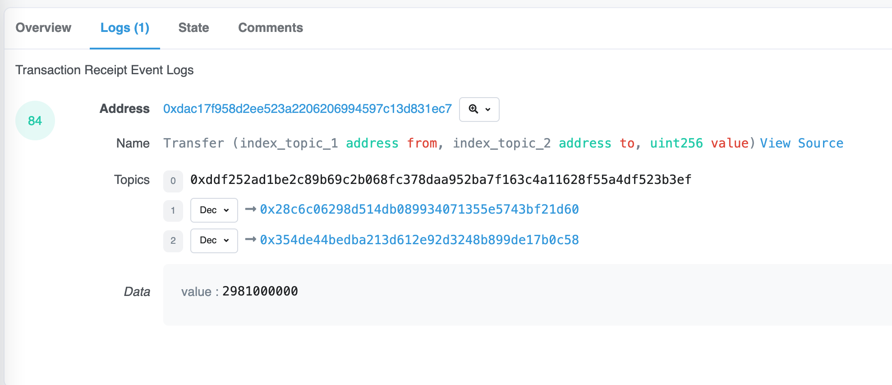

# Ethers极简入门: 8. 过滤合约监听

我最近在重新学`ethers.js`，巩固一下细节，也写一个`WTF Ethers极简入门`，供小白们使用。

**推特**：[@0xAA_Science](https://twitter.com/0xAA_Science)

**WTF Academy社群：** [官网 wtf.academy](https://wtf.academy) | [WTF Solidity教程](https://github.com/AmazingAng/WTFSolidity) | [discord](https://discord.wtf.academy) | [微信群申请](https://docs.google.com/forms/d/e/1FAIpQLSe4KGT8Sh6sJ7hedQRuIYirOoZK_85miz3dw7vA1-YjodgJ-A/viewform?usp=sf_link)

所有代码和教程开源在github: [github.com/WTFAcademy/WTFEthers](https://github.com/WTFAcademy/WTFEthers)

-----

在上一讲 [Ethers极简入门: 8. 合约监听](https://github.com/WTFAcademy/WTFEthers/tree/main/08_ContractListener) 的基础上，我们拓展一下合约监听，在监听的过程中增加过滤器，以便我们可以监听指定的`from`或者`to`地址。

## 实现布隆过滤
默认的监听是会监听全网所有跟该合约地址交互的信息，但是有时候我们就只想监听固定的`from`或者`to`地址的操作，这个时候就可以使用创建过滤器来实现了。

详细的过滤可以看官方文档：[Events](https://docs.ethers.io/v5/concepts/events/#events--filters)

这里我列举几个常用的方式
### 构建过滤器
你可以通过如下方法构建一个过滤器
1.过滤来自`myAddress`地址的线上广播事件
```js
contract.filters.Transfer(myAddress)
```

2.过滤所有发给 `myAddress`地址的线上广播事件
```js
contract.filters.Transfer(null, myAddress)
```

3.过滤所有由 `myAddress`地址发给`otherAddress`的线上广播事件
```js
contract.filters.Transfer(myAddress, otherAddress)
```

4.过滤的时候你可以传入数组，过滤监听多个账号
```js
contract.filters.Transfer(null, [ myAddress, otherAddress ])
```

## 监听交易所地址的USDT信息
监听USDT合约之前，我们需要先看懂一条hash的交易状态，以及如何看懂该hash的`topics`,我们是通过`topics`的结构来创建过滤器的。

### 通过etherscan查看事件
查看该hash[0xab1f7b575600c4517a2e479e46e3af98a95ee84dd3f46824e02ff4618523fff5](https://etherscan.io/tx/0xab1f7b575600c4517a2e479e46e3af98a95ee84dd3f46824e02ff4618523fff5)

该条hash做了一件事：从 `binance14` 这个地址 将USDT转给了 `0x354de44bedba213d612e92d3248b899de17b0c58` 这个地址


查看该事件日志信息

- `address` 为USDT合约地址
- `topics[0]`为keccak256("Transfer(address,address,uint256)")
- `topics[1]` 为from地址 就是 `binance14`交易所的地址
- `topics[2]` 为to地址 就是接受USDT的地址
- `data` 为发送的数量



### 通过ethers查看一条交易信息
已知一条交易hash为：`0xab1f7b575600c4517a2e479e46e3af98a95ee84dd3f46824e02ff4618523fff5`
通过代码从区块链上看该代码的信息
```js
const provider = new ethers.providers.JsonRpcProvider(config.ALCHEMY_MAINNET_URL);
  const receipt =  await provider.getTransactionReceipt('0xab1f7b575600c4517a2e479e46e3af98a95ee84dd3f46824e02ff4618523fff5');
  console.group('receipt');
  console.log(receipt);
  console.groupEnd();
  console.group('receipt.logs');
  console.log(receipt.logs);
  console.groupEnd();
```

通过上述代码得到如下结构：

`receipt`的详细信息
看如下信息：
- `from`:为发起地址
- `to`: 为接收地址，一般是erc20的合约地址，如果是nft的话，就是nft的合约地址

```
  {
    to: '0xdAC17F958D2ee523a2206206994597C13D831ec7',
    from: '0x28C6c06298d514Db089934071355E5743bf21d60',
    contractAddress: null,
    transactionIndex: 93,
    gasUsed: BigNumber { _hex: '0xf6e9', _isBigNumber: true },
    logsBloom: '0x00000000000000000000000000000000000000000000000000000000000000000000000000000000000001000000010000000000000000000000000000010000000000000000000000000008000000000000000000000000000000000000000000000000000000000000000000000000000000000000000802000010000000000000000000000000000000000000000000000000000000000000000000100000000000000000000000000080000000000000000000000000000000020000000000000002000000000000000000000000000000000000000000000000000000000000000000000020000000000000000000000000000000000000000000000000',
    blockHash: '0x36c70a48ba9cff240854327f0d373d6bd295d9798b26dcf5cfff88d93d356de4',
    transactionHash: '0xab1f7b575600c4517a2e479e46e3af98a95ee84dd3f46824e02ff4618523fff5',
    logs: [
      {
        transactionIndex: 93,
        blockNumber: 15382657,
        transactionHash: '0xab1f7b575600c4517a2e479e46e3af98a95ee84dd3f46824e02ff4618523fff5',
        address: '0xdAC17F958D2ee523a2206206994597C13D831ec7',
        topics: [Array],
        data: '0x00000000000000000000000000000000000000000000000000000000b1ae7340',
        logIndex: 84,
        blockHash: '0x36c70a48ba9cff240854327f0d373d6bd295d9798b26dcf5cfff88d93d356de4'
      }
    ],
    blockNumber: 15382657,
    confirmations: 224,
    cumulativeGasUsed: BigNumber { _hex: '0x4163fe', _isBigNumber: true },
    effectiveGasPrice: BigNumber { _hex: '0xf1a1e025', _isBigNumber: true },
    status: 1,
    type: 2,
    byzantium: true
  }
```

`logs`中的信息展开

- `address` 为USDT合约地址
- `topics[0]`为keccak256("Transfer(address,address,uint256)")
- `topics[1]` 为from地址 就是 `binance14`交易所的地址
- `topics[2]` 为to地址 就是接受USDT的地址
- `data` 为发送的数量

`receipt.logs`展开信息
```
  [
    {
      transactionIndex: 93,
      blockNumber: 15382657,
      transactionHash: '0xab1f7b575600c4517a2e479e46e3af98a95ee84dd3f46824e02ff4618523fff5',
      address: '0xdAC17F958D2ee523a2206206994597C13D831ec7',
      topics: [
        '0xddf252ad1be2c89b69c2b068fc378daa952ba7f163c4a11628f55a4df523b3ef',
        '0x00000000000000000000000028c6c06298d514db089934071355e5743bf21d60',
        '0x000000000000000000000000354de44bedba213d612e92d3248b899de17b0c58'
      ],
      data: '0x00000000000000000000000000000000000000000000000000000000b1ae7340',
      logIndex: 84,
      blockHash: '0x36c70a48ba9cff240854327f0d373d6bd295d9798b26dcf5cfff88d93d356de4'
    }
  ]
```

注意观察上述信息我们可以得到如下 `address`和`topics`部分

```
      address: '0xdAC17F958D2ee523a2206206994597C13D831ec7',
      topics: [
        '0xddf252ad1be2c89b69c2b068fc378daa952ba7f163c4a11628f55a4df523b3ef',
        '0x00000000000000000000000028c6c06298d514db089934071355e5743bf21d60',
        '0x000000000000000000000000354de44bedba213d612e92d3248b899de17b0c58'
      ],
      data: '0x00000000000000000000000000000000000000000000000000000000b1ae7340',
```

我们需要根据这部分构建过滤信息。通过如下代码，我们会构件出一个类似上边的过滤结构。

```js
let filterBinanceIn = contractUSDT.filters.Transfer(null, balanceAccount);
/** 打印`filterBinanceIn`得到如下信息
{
  address: '0xdac17f958d2ee523a2206206994597c13d831ec7',
  topics: [
    '0xddf252ad1be2c89b69c2b068fc378daa952ba7f163c4a11628f55a4df523b3ef',
    null,
    '0x00000000000000000000000028c6c06298d514db089934071355e5743bf21d60'
  ]
}
 */
```

上述就是生成了一个完整的过滤结构，最后带入监听即可。

```js
contractUSDT.on(filterBinanceIn, (from, to, value) => {
  console.log('---------监听USDT进入交易所--------');
  console.log(
    `${from} -> ${to} ${ethers.BigNumber.from(value).toString()}`
  )
})

```

### 完整代码

通过该代码你可以实现监听USDT的合约转账事件，并指定事件发起者和接受的者。

```js
import { ethers } from "ethers";

//准备 alchemy API  可以参考https://github.com/AmazingAng/WTFSolidity/blob/main/Topics/Tools/TOOL04_Alchemy/readme.md 
const ALCHEMY_MAINNET_URL = 'YOUR_ALCHEMY_MAINNET_URL';

const provider = new ethers.providers.JsonRpcProvider(config.ALCHEMY_MAINNET_URL);
// 合约地址
const contractAddress = '0xdac17f958d2ee523a2206206994597c13d831ec7'
// 交易所地址
const balanceAccount = '0x28C6c06298d514Db089934071355E5743bf21d60'
// 构建ABI
const abi = [
  "event Transfer(address indexed from, address indexed to, uint value)"
];
// 构建合约对象
const contractUSDT = new ethers.Contract(contractAddress, abi, provider);


(async () => {
  try {
    console.log('start');
    // 创建过滤器，监听转移USDT进交易所
    let filterBinanceIn = contractUSDT.filters.Transfer(null, balanceAccount);
    console.log(filterBinanceIn);
	// 创建过滤器，监听交易所转出USDT
    let filterToBinanceOut = contractUSDT.filters.Transfer(balanceAccount, null);
    console.log(filterToBinanceOut);
    console.log('In');
    contractUSDT.on(filterBinanceIn, (from, to, value) => {
      console.log('---------监听USDT进入交易所--------');
      console.log(
        `${from} -> ${to} ${ethers.BigNumber.from(value).toString()}`
      )
    }).on('error', (error) => {
      console.log(error)
    })
    console.log('out');
    contractUSDT.on(filterToBinanceOut, (from, to, value) => {
      console.log('---------监听USDT转出交易所--------');
      console.log(
        `${from} -> ${to} ${ethers.BigNumber.from(value).toString()}`
      )
    }
    ).on('error', (error) => {
      console.log(error)
    });
  } catch (e) {
    console.log(e);
  }
})()
```

## 总结

至此，通过添加过滤器，你可以通过该代码监听指定合约下的指定事件，并且过滤指定的`from`或者`to`地址，你也可以拓展该代码监听NFT的各种信息等。