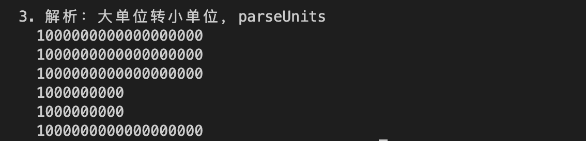

# Ethers极简入门: 10. BigNumber和单位转换

我最近在重新学`ethers.js`，巩固一下细节，也写一个`WTF Ethers极简入门`，供小白们使用。

**推特**：[@0xAA_Science](https://twitter.com/0xAA_Science)

**WTF Academy社群：** [官网 wtf.academy](https://wtf.academy) | [WTF Solidity教程](https://github.com/AmazingAng/WTF-Solidity) | [discord](https://discord.gg/5akcruXrsk) | [微信群申请](https://docs.google.com/forms/d/e/1FAIpQLSe4KGT8Sh6sJ7hedQRuIYirOoZK_85miz3dw7vA1-YjodgJ-A/viewform?usp=sf_link)

所有代码和教程开源在github: [github.com/WTFAcademy/WTFEthers](https://github.com/WTFAcademy/WTF-Ethers)

-----

提示：本教程基于ethers.js 6.3.0 ，如果你使用的是v5，可以参考[ethers.js v5文档](https://docs.ethers.io/v5/)。

这一讲，我们介绍`BigNumber`类和单位转换。

## `BigInt`

以太坊中，许多计算都对超出`JavaScript`整数的安全值（js中最大安全整数为`9007199254740991`）。因此，`ethers.js`使用 JavaScript ES2020 版本原生的 `BigInt` 类 安全地对任何数量级的数字进行数学运算。在`ethers.js`中，大多数需要返回值的操作将返回 `BigInt`，而接受值的参数也会接受它们。

### 创建`BigInt`实例

你可以利用`ethers.getBigInt()`函数将`string`，`number`等类型转换为`BigInt`。

**注意**，超过js最大安全整数的数值将不能转换。

```js
const oneGwei = ethers.getBigInt("1000000000"); // 从十进制字符串生成
console.log(oneGwei)
console.log(ethers.getBigInt("0x3b9aca00")) // 从hex字符串生成
console.log(ethers.getBigInt(1000000000)) // 从数字生成
// 不能从js最大的安全整数之外的数字生成BigNumber，下面代码会报错
// ethers.getBigInt(Number.MAX_SAFE_INTEGER);
console.log("js中最大安全整数：", Number.MAX_SAFE_INTEGER)
```


### `BigInt`运算

`BigInt`支持很多运算，例如加减乘除、取模`mod`，幂运算`pow`，绝对值`abs`等运算:
> 注意：数值带后缀`n`会自动转换成`BigInt`

```js
// 运算
console.log("加法：", oneGwei + 1n)
console.log("减法：", oneGwei - 1n)
console.log("乘法：", oneGwei * 2n)
console.log("除法：", oneGwei / 2n)
// 比较
console.log("是否相等：", oneGwei == 1000000000n)
```


## 单位转换

在以太坊中，`1 ether`等于`10^18 wei`。下面列出了一些常用的单位：


在应用中，我们经常将数值在用户可读的字符串（以`ether`为单位）和机器可读的数值（以`wei`为单位）之间转换。例如，钱包可以为用户界面指定余额（以`ether`为单位）和`gas`价格（以`gwei`为单位），但是在发送交易时，两者都必须转换成以`wei`为单位的数值。`ethers.js`提供了一些功能函数，方便这类转换。

- `formatUnits(变量, 单位)`：格式化，小单位转大单位，比如`wei` -> `ether`，在显示余额时很有用。参数中，单位填位数（数字）或指定的单位（字符串）。

    ```js
    //代码参考：https://docs.ethers.org/v6/api/utils/#about-units
    console.group('\n2. 格式化：小单位转大单位，formatUnits');
    console.log(ethers.formatUnits(oneGwei, 0));
    // '1000000000'
    console.log(ethers.formatUnits(oneGwei, "gwei"));
    // '1.0'
    console.log(ethers.formatUnits(oneGwei, 9));
    // '1.0'
    console.log(ethers.formatUnits(oneGwei, "ether"));
    // `0.000000001`
    console.log(ethers.formatUnits(1000000000, "gwei"));
    // '1.0'
    console.log(ethers.formatEther(oneGwei));
    // `0.000000001` 等同于formatUnits(value, "ether")
    console.groupEnd();
    ```

    

- `parseUnits`：解析，大单位转小单位，比如`ether` -> `wei`，在将用户输入的值转为`wei`为单位的数值很有用。参数中，单位填位数（数字）或指定的单位（字符串）。

    ```js
    // 3. 解析：大单位转小单位
    // 例如将ether转换为wei：parseUnits(变量, 单位),parseUnits默认单位是 ether
    // 代码参考：https://docs.ethers.org/v6/api/utils/#about-units
    console.group('\n3. 解析：大单位转小单位，parseUnits');
    console.log(ethers.parseUnits("1.0").toString());
    // { BigNumber: "1000000000000000000" }
    console.log(ethers.parseUnits("1.0", "ether").toString());
    // { BigNumber: "1000000000000000000" }
    console.log(ethers.parseUnits("1.0", 18).toString());
    // { BigNumber: "1000000000000000000" }
    console.log(ethers.parseUnits("1.0", "gwei").toString());
    // { BigNumber: "1000000000" }
    console.log(ethers.parseUnits("1.0", 9).toString());
    // { BigNumber: "1000000000" }
    console.log(ethers.parseEther("1.0").toString());
    // { BigNumber: "1000000000000000000" } 等同于parseUnits(value, "ether")
    console.groupEnd();
    ```

    

## 总结

这一讲，我们介绍了`BigNumber`类，以太坊中的常用单位，以及单位转换。
