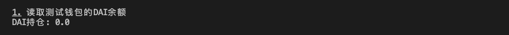
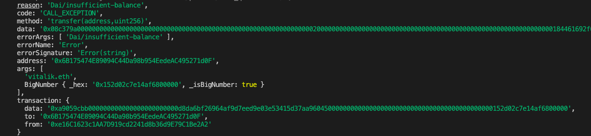

# Ethers极简入门: 11. StaticCall

我最近在重新学`ethers.js`，巩固一下细节，也写一个`WTF Ethers极简入门`，供小白们使用。

**推特**：[@0xAA_Science](https://twitter.com/0xAA_Science)

**WTF Academy社群：** [官网 wtf.academy](https://wtf.academy) | [WTF Solidity教程](https://github.com/AmazingAng/WTFSolidity) | [discord](https://discord.gg/5akcruXrsk) | [微信群申请](https://docs.google.com/forms/d/e/1FAIpQLSe4KGT8Sh6sJ7hedQRuIYirOoZK_85miz3dw7vA1-YjodgJ-A/viewform?usp=sf_link)

所有代码和教程开源在github: [github.com/WTFAcademy/WTFEthers](https://github.com/WTFAcademy/WTFEthers)

-----

这一讲，我们介绍合约类的`staticCall`方法，在发送交易之前检查交易是否会失败，节省大量gas。

`staticCall`方法是属于```ethers.Contract```类的编写方法分析，同类的还有`populateTransaction`和`estimateGas`方法。

## 可能失败的交易

在以太坊上发交易需要付昂贵的`gas`，并且有失败的风险，发送失败的交易并不会把`gas`返还给你。因此，在发送交易前知道哪些交易可能会失败非常重要。如果你用过`metamask`小狐狸钱包，那对下图不会陌生。


如果你的交易将失败，小狐狸会告诉你`this transaction may fail`，翻译过来就是“这笔交易可能失败”。当用户看到这个红字提示，就知道要取消这笔交易了，除非他想尝尝失败的滋味。

它是怎么做到的呢？这是因为以太坊节点有一个`eth_call`方法，让用户可以模拟一笔交易，并返回可能的交易结果，但不真正在区块链上执行它（交易不上链）。

## `staticCall`

在`ethers.js`中你可以利用`contract`对象的`staticCall()`来调用以太坊节点的`eth_call`。如果调用成功，则返回`true`；如果失败，则报错并返回失败原因。方法：

```js
    const tx = await contract.函数名.staticCall( 参数, {override})
    console.log(`交易会成功吗？：`, tx)
```

- 函数名：为模拟调用的函数名。
- 参数：调用函数的参数。
- {override}：选填，可包含一下参数：
    - `from`：执行时的`msg.sender`，也就是你可以模拟任何一个人的调用，比如V神。
    - `value`：执行时的`msg.value`。
    - `blockTag`：执行时的区块高度。
    - `gasPrice`
    - `gasLimit`
    - `nonce`

## 用`staticCall`模拟`DAI`转账

1. 创建`provider`和`wallet`对象。
    ```js
    import { ethers } from "ethers";

    //准备 alchemy API 可以参考https://github.com/AmazingAng/WTFSolidity/blob/main/Topics/Tools/TOOL04_Alchemy/readme.md 
    const ALCHEMY_MAINNET_URL = 'https://eth-mainnet.g.alchemy.com/v2/oKmOQKbneVkxgHZfibs-iFhIlIAl6HDN';
    const provider = new ethers.JsonRpcProvider(ALCHEMY_MAINNET_URL);

    // 利用私钥和provider创建wallet对象
    const privateKey = '0x227dbb8586117d55284e26620bc76534dfbd2394be34cf4a09cb775d593b6f2b'
    const wallet = new ethers.Wallet(privateKey, provider)
    ```

2. 创建`DAI`合约对象，注意，这里生成合约时要用`provider`而不是`wallet`，不然则不能更改`staticCall`方法中的`from`（可能是bug，也可能是feature）。

    ```js
    // DAI的ABI
    const abiDAI = [
        "function balanceOf(address) public view returns(uint)",
        "function transfer(address, uint) public returns (bool)",
    ];
    // DAI合约地址（主网）
    const addressDAI = '0x6B175474E89094C44Da98b954EedeAC495271d0F' // DAI Contract
    // 创建DAI合约实例
    const contractDAI = new ethers.Contract(addressDAI, abiDAI, provider)
    ```

3. 查看钱包中`DAI`余额，为0。

    ```js
    const address = await wallet.getAddress()
    console.log("\n1. 读取测试钱包的DAI余额")
    const balanceDAI = await contractDAI.balanceOf(address)
    console.log(`DAI持仓: ${ethers.formatEther(balanceDAI)}\n`)
    ```
    

4. 用`staticCall`调用`transfer()`函数，将`from`参数填为V神地址，模拟V神转账`10000 DAI`。这笔交易将成功，因为V神钱包有充足的`DAI`。

    ```js
    console.log("\n2.  用staticCall尝试调用transfer转账1 DAI，msg.sender为V神地址")
    // 发起交易
    const tx = await contractDAI.transfer.staticCall("vitalik.eth", ethers.parseEther("10000"), {from: "vitalik.eth"})
    console.log(`交易会成功吗？：`, tx)
    ```
    

4. 用`staticCall`调用`transfer()`函数，将`from`参数填为测试钱包地址，模拟转账`10000 DAI`。这笔交易将失败，报错，并返回原因`Dai/insufficient-balance`。

    ```js
    console.log("\n3.  用staticCall尝试调用transfer转账1 DAI，msg.sender为测试钱包地址")
    const tx2 = await contractDAI.transfer.staticCall("vitalik.eth", ethers.parseEther("10000"), {from: address})
    console.log(`交易会成功吗？：`, tx)
    ```
    

## 总结
`ethers.js`将`eth_call`封装在`staticCall`方法中，方便开发者模拟交易的结果，并避免发送可能失败的交易。我们利用`staticCall`模拟了V神和测试钱包的转账。当然，这个方法还有更多用处，比如计算土狗币的交易滑点。开动你的想象力，你会将`staticCall`用在什么地方呢？
