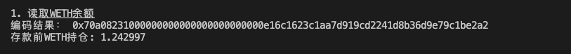

# Ethers极简入门: 13. 编码calldata

我最近在重新学`ethers.js`，巩固一下细节，也写一个`WTF Ethers极简入门`，供小白们使用。

**推特**：[@0xAA_Science](https://twitter.com/0xAA_Science)

**WTF Academy社群：** [官网 wtf.academy](https://wtf.academy) | [WTF Solidity教程](https://github.com/AmazingAng/WTFSolidity) | [discord](https://discord.gg/5akcruXrsk) | [微信群申请](https://docs.google.com/forms/d/e/1FAIpQLSe4KGT8Sh6sJ7hedQRuIYirOoZK_85miz3dw7vA1-YjodgJ-A/viewform?usp=sf_link)

所有代码和教程开源在github: [github.com/WTFAcademy/WTFEthers](https://github.com/WTFAcademy/WTFEthers)

-----

这一讲，我们将介绍`ethers.js`中的接口类，并利用它编码`calldata`。

## 接口类 Interface

`ethers.js`的接口类抽象了与以太坊网络上的合约交互所需的`ABI`编码和解码。`ABI`（Application Binary Interface）与`API`类似，是一格式，用于对合约可以处理的各种类型的数据进行编码，以便它们可以交互。更多内容见[WTF Solidity教程第27讲 ABI编码](https://github.com/AmazingAng/WTFSolidity/tree/main/27_ABIEncode)。

我们可以利用`abi`生成或者直接从合约中获取`interface`变量：

```js
// 利用abi生成
const interface = ethers.Interface(abi)
// 直接从contract中获取
const interface2 = contract.interface
```

接口类封装了一些编码解码的方法。与一些特殊的合约交互时（比如代理合约），你需要编码参数、解码返回值：

**注意**：相关函数必须包含在`abi`中。

- `getSighash()`：获取函数选择器（function selector），参数为函数名或函数签名。

    ```js
    interface.getSighash("balanceOf");
    // '0xddf252ad1be2c89b69c2b068fc378daa952ba7f163c4a11628f55a4df523b3ef'
    ```
- `encodeDeploy()`：编码构造器的参数，然后可以附在合约字节码的后面。
    ```js
    interface.encodeDeploy("Wrapped ETH", "WETH");
    ```

- `encodeFunctionData()`：编码函数的`calldata`。

    ```js
    interface.encodeFunctionData("balanceOf", ["0xc778417e063141139fce010982780140aa0cd5ab"]);
    ```
- `decodeFunctionResult()`：解码函数的返回值。
    ```js
    interface.decodeFunctionResult("balanceOf", resultData)
    ```

## 例子：与测试网`WETH`合约交互

这里，我们利用接口类编码`calldata`的方法，重复[第5讲](https://github.com/WTFAcademy/WTFEthers/blob/main/05_WriteContract/readme.md)中与测试网`WETH`合约交互的例子。

1. 创建`provider`，`wallet`变量。

    ```js
    //准备 alchemy API 可以参考https://github.com/AmazingAng/WTFSolidity/blob/main/Topics/Tools/TOOL04_Alchemy/readme.md 
    const ALCHEMY_GOERLI_URL = 'https://eth-rinkeby.alchemyapi.io/v2/GlaeWuylnNM3uuOo-SAwJxuwTdqHaY5l';
    const provider = new ethers.JsonRpcProvider(ALCHEMY_GOERLI_URL);

    // 利用私钥和provider创建wallet对象
    const privateKey = '0x227dbb8586117d55284e26620bc76534dfbd2394be34cf4a09cb775d593b6f2b'
    const wallet = new ethers.Wallet(privateKey, provider)
    ```

2. 创建`WETH`合约实例
    ```js
    // WETH的ABI
    const abiWETH = [
        "function balanceOf(address) public view returns(uint)",
        "function deposit() public payable",
    ];
    // WETH合约地址（Goerli测试网）
    const addressWETH = '0xb4fbf271143f4fbf7b91a5ded31805e42b2208d6'
    // 声明WETH合约
    const contractWETH = new ethers.Contract(addressWETH, abiWETH, wallet)
    ```

3. 调用`balanceOf()`函数，读取钱包地址`address`的`WETH`余额。

    ```js
    const address = await wallet.getAddress()
    // 1. 读取WETH合约的链上信息（WETH abi）
    console.log("\n1. 读取WETH余额")
    // 编码calldata
    const param1 = contractWETH.interface.encodeFunctionData(
        "balanceOf",
        [address]
      );
    console.log(`编码结果： ${param1}`)
    // 创建交易
    const tx1 = {
        to: addressWETH,
        data: param1
    }
    // 发起交易，可读操作（view/pure）可以用 provider.call(tx)
    const balanceWETH = await provider.call(tx1)
    console.log(`存款前WETH持仓: ${ethers.formatEther(balanceWETH)}\n`)
    ```
    

4. 调用`deposit()`函数，将`0.001 ETH`转换为`0.001 WETH`，打印交易详情和余额。可以看到余额变化。

    ```js
    // 编码calldata
    const param2 = contractWETH.interface.encodeFunctionData(
        "deposit"          
        );
    console.log(`编码结果： ${param2}`)
    // 创建交易
    const tx2 = {
        to: addressWETH,
        data: param2,
        value: ethers.parseEther("0.001")}
    // 发起交易，写入操作需要 wallet.sendTransaction(tx)
    const receipt1 = await wallet.sendTransaction(tx2)
    // 等待交易上链
    await receipt1.wait()
    console.log(`交易详情：`)
    console.log(receipt1)
    const balanceWETH_deposit = await contractWETH.balanceOf(address)
    console.log(`存款后WETH持仓: ${ethers.formatEther(balanceWETH_deposit)}\n`)
    ```
    

## 总结

这一讲，我们介绍了`ethers.js`中的接口类，并利用它编码`calldata`与`WETH`合约交互。与一些特殊的合约交互时（比如代理合约），你需要用这类方法编码参数，然后解码返回值。