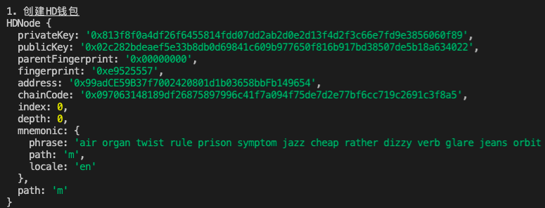

# Ethers极简入门: 15. 批量转账

我最近在重新学`ethers.js`，巩固一下细节，也写一个`WTF Ethers极简入门`，供小白们使用。

**推特**：[@0xAA_Science](https://twitter.com/0xAA_Science)

**WTF Academy社群：** [官网 wtf.academy](https://wtf.academy) | [WTF Solidity教程](https://github.com/AmazingAng/WTF-Solidity) | [discord](https://discord.gg/5akcruXrsk) | [微信群申请](https://docs.google.com/forms/d/e/1FAIpQLSe4KGT8Sh6sJ7hedQRuIYirOoZK_85miz3dw7vA1-YjodgJ-A/viewform?usp=sf_link)

所有代码和教程开源在github: [github.com/WTFAcademy/WTF-Ethers](https://github.com/WTFAcademy/WTF-Ethers)

-----

这一讲，我们将介绍用`ethers.js`进行批量转账。通过调用[WTF Solidity极简入门第33讲：空投](https://github.com/AmazingAng/WTF-Solidity/blob/main/33_Airdrop/readme.md)中的`Airdrop`合约，可以在一笔交易中实现批量转账，节省gas费。

## Airdrop合约

这里简单介绍下`Airdrop`合约，细节可以去Solidity教程中看。我们会用到`2`个函数：

- `multiTransferETH()`：批量发送`ETH`，包含`2`个参数：
    - `_addresses`：接收空投的用户地址数组（`address[]`类型）
    - `_amounts`：空投数量数组，对应`_addresses`里每个地址的数量（`uint[]`类型）


- `multiTransferToken()`函数：批量发送`ERC20`代币，包含`3`个参数：
    - `_token`：代币合约地址（`address`类型）
    - `_addresses`：接收空投的用户地址数组（`address[]`类型）
    - `_amounts`：空投数量数组，对应`_addresses`里每个地址的数量（`uint[]`类型）

我们在`Goerli`测试网部署了一个`Airdrop`合约，地址为：
```
0x71C2aD976210264ff0468d43b198FD69772A25fa
```

## 批量转账

下面我们写一个脚本，调用`Airdrop`合约将`ETH`（原生代币）和`WETH`（ERC20代币）转账给`20`个地址。

1. 创建HD钱包，用于批量生成地址。
    ```js
    console.log("\n1. 创建HD钱包")
    // 通过助记词生成HD钱包
    const mnemonic = `air organ twist rule prison symptom jazz cheap rather dizzy verb glare jeans orbit weapon universe require tired sing casino business anxiety seminar hunt`
    const hdNode = ethers.HDNodeWallet.fromPhrase(mnemonic)
    console.log(hdNode);
    ```
    

2. 利用HD钱包，生成20个钱包地址。
    ```js
    console.log("\n2. 通过HD钱包派生20个钱包")
    const numWallet = 20
    // 派生路径：m / purpose' / coin_type' / account' / change / address_index
    // 我们只需要切换最后一位address_index，就可以从hdNode派生出新钱包
    let basePath = "m/44'/60'/0'/0";
    let addresses = [];
    for (let i = 0; i < numWallet; i++) {
        let hdNodeNew = hdNode.derivePath(basePath + "/" + i);
        let walletNew = new ethers.Wallet(hdNodeNew.privateKey);
        addresses.push(walletNew.address);
    }
    console.log(addresses)
    const amounts = Array(20).fill(ethers.parseEther("0.0001"))
    console.log(`发送数额：${amounts}`)
    ```
    

3. 创建provider和wallet，发送代币用。

    ```js
    //准备 alchemy API 可以参考https://github.com/AmazingAng/WTF-Solidity/blob/main/Topics/Tools/TOOL04_Alchemy/readme.md 
    const ALCHEMY_GOERLI_URL = 'https://eth-goerli.alchemyapi.io/v2/GlaeWuylnNM3uuOo-SAwJxuwTdqHaY5l';
    const provider = new ethers.JsonRpcProvider(ALCHEMY_GOERLI_URL);

    // 利用私钥和provider创建wallet对象
    // 如果这个钱包没goerli测试网ETH了
    // 请使用自己的小号钱包测试，钱包地址: 0x338f8891D6BdC58eEB4754352459cC461EfD2a5E ,请不要给此地址发送任何ETH
    // 注意不要把自己的私钥上传到github上
    const privateKey = '0x21ac72b6ce19661adf31ef0d2bf8c3fcad003deee3dc1a1a64f5fa3d6b049c06'
    const wallet = new ethers.Wallet(privateKey, provider)
    ```

4. 创建Airdrop合约。
    ```js
    // Airdrop的ABI
    const abiAirdrop = [
        "function multiTransferToken(address,address[],uint256[]) external",
        "function multiTransferETH(address[],uint256[]) public payable",
    ];
    // Airdrop合约地址（Goerli测试网）
    const addressAirdrop = '0x71C2aD976210264ff0468d43b198FD69772A25fa' // Airdrop Contract
    // 声明Airdrop合约
    const contractAirdrop = new ethers.Contract(addressAirdrop, abiAirdrop, wallet)
    ```
5. 创建WETH合约。
    ```js
    // WETH的ABI
    const abiWETH = [
        "function balanceOf(address) public view returns(uint)",
        "function transfer(address, uint) public returns (bool)",
        "function approve(address, uint256) public returns (bool)"
    ];
    // WETH合约地址（Goerli测试网）
    const addressWETH = '0xB4FBF271143F4FBf7B91A5ded31805e42b2208d6' // WETH Contract
    // 声明WETH合约
    const contractWETH = new ethers.Contract(addressWETH, abiWETH, wallet)
    ```

6. 读取一个地址的ETH和WETH余额。
    ```js
    console.log("\n3. 读取一个地址的ETH和WETH余额")
    //读取WETH余额
    const balanceWETH = await contractWETH.balanceOf(addresses[10])
    console.log(`WETH持仓: ${ethers.formatEther(balanceWETH)}\n`)
    //读取ETH余额
    const balanceETH = await provider.getBalance(addresses[10])
    console.log(`ETH持仓: ${ethers.formatEther(balanceETH)}\n`)
    ```
    


7. 调用`multiTransferETH()`函数，给每个钱包转`0.0001 ETH`，可以看到发送后余额发生变化。
    ```js
    console.log("\n4. 调用multiTransferETH()函数，给每个钱包转 0.0001 ETH")
    // 发起交易
    const tx = await contractAirdrop.multiTransferETH(addresses, amounts, {value: ethers.parseEther("0.002")})
    // 等待交易上链
    await tx.wait()
    // console.log(`交易详情：`)
    // console.log(tx)
    const balanceETH2 = await provider.getBalance(addresses[10])
    console.log(`发送后该钱包ETH持仓: ${ethers.formatEther(balanceETH2)}\n`)
    ```
    

8. 调用multiTransferToken()函数，给每个钱包转 `0.0001 WETH`，可以看到发送后余额发生变化。

    ```js
    console.log("\n5. 调用multiTransferToken()函数，给每个钱包转 0.001 WETH")
    // 先approve WETH给Airdrop合约
    const txApprove = await contractWETH.approve(addressAirdrop, ethers.parseEther("1"))
    await txApprove.wait()
    // 发起交易
    const tx2 = await contractAirdrop.multiTransferToken(addressWETH, addresses, amounts)
    // 等待交易上链
    await tx2.wait()
    // console.log(`交易详情：`)
    // console.log(tx2)
    // 读取WETH余额
    const balanceWETH2 = await contractWETH.balanceOf(addresses[10])
    console.log(`发送后该钱包WETH持仓: ${ethers.formatEther(balanceWETH2)}\n`)
    ```
    

## 总结

这一讲，我们介绍了如何利用`ethers.js`调用`Airdrop`合约进行批量转账。在例子中，我们将`ETH`和`WETH`发送给了`20`个不同地址，省事且省钱（gas费）。
