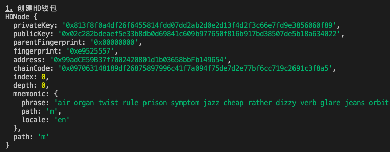
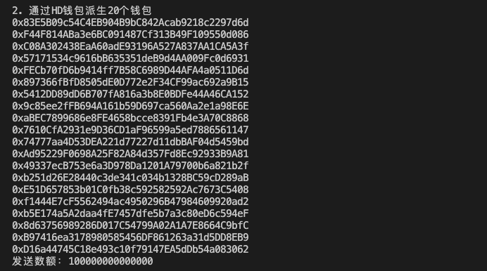
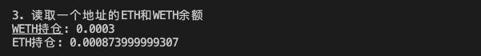
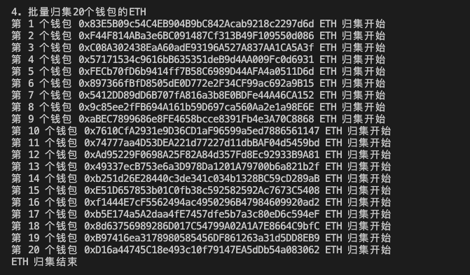
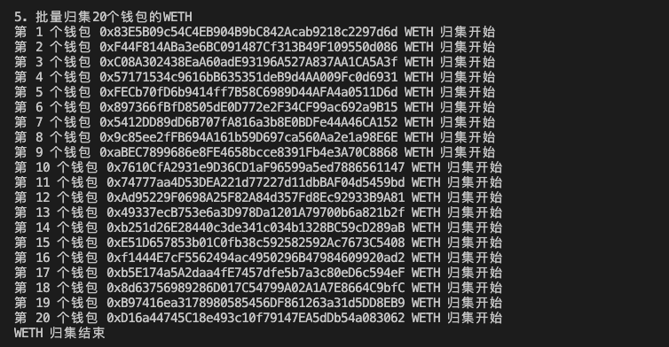

# Ethers极简入门: 16. 批量归集

我最近在重新学`ethers.js`，巩固一下细节，也写一个`WTF Ethers极简入门`，供小白们使用。

**推特**：[@0xAA_Science](https://twitter.com/0xAA_Science)

**WTF Academy社群：** [官网 wtf.academy](https://wtf.academy) | [WTF Solidity教程](https://github.com/AmazingAng/WTF-Solidity) | [discord](https://discord.gg/5akcruXrsk) | [微信群申请](https://docs.google.com/forms/d/e/1FAIpQLSe4KGT8Sh6sJ7hedQRuIYirOoZK_85miz3dw7vA1-YjodgJ-A/viewform?usp=sf_link)

所有代码和教程开源在github: [github.com/WTFAcademy/WTF-Ethers](https://github.com/WTFAcademy/WTF-Ethers)

-----

这一讲，我们介绍如何使用`ethers.js`将多个钱包的`ETH`和代币归集到一个钱包中。

## 批量归集

在链上交互、撸毛之后，就需要将多个钱包的资产进行归集管理。你可以用[HD钱包](https://github.com/WTFAcademy/WTF-Ethers/blob/main/14_HDwallet/readme.md)或者保存多份密钥的方式操作多个钱包，然后用`ethers.js`脚本完成归集。下面我们分别示范归集`ETH`（原生代币）和`WETH`（ERC20代币）。

1. 创建`provider`和`wallet`，其中`wallet`是接收资产的钱包。

    ```js
    // 准备 alchemy API 可以参考https://github.com/AmazingAng/WTF-Solidity/blob/main/Topics/Tools/TOOL04_Alchemy/readme.md 
    const ALCHEMY_GOERLI_URL = 'https://eth-goerli.alchemyapi.io/v2/GlaeWuylnNM3uuOo-SAwJxuwTdqHaY5l';
    const provider = new ethers.JsonRpcProvider(ALCHEMY_GOERLI_URL);
    // 利用私钥和provider创建wallet对象
    const privateKey = '0x21ac72b6ce19661adf31ef0d2bf8c3fcad003deee3dc1a1a64f5fa3d6b049c06'
    const wallet = new ethers.Wallet(privateKey, provider)
    ```

2. 声明WETH合约。
    ```js
    // WETH的ABI
    const abiWETH = [
        "function balanceOf(address) public view returns(uint)",
        "function transfer(address, uint) public returns (bool)",
    ];
    // WETH合约地址（Goerli测试网）
    const addressWETH = '0xB4FBF271143F4FBf7B91A5ded31805e42b2208d6' // WETH Contract
    // 声明WETH合约
    const contractWETH = new ethers.Contract(addressWETH, abiWETH, wallet)
    ```

3. 创建`HD`钱包，用于管理多个钱包。

    ```js
    console.log("\n1. 创建HD钱包")
    // 通过助记词生成HD钱包
    const mnemonic = `air organ twist rule prison symptom jazz cheap rather dizzy verb glare jeans orbit weapon universe require tired sing casino business anxiety seminar hunt`
    const hdNode = ethers.HDNodeWallet.fromPhrase(mnemonic)
    console.log(hdNode);
    ```
    

4. 通过`HD`钱包衍生`20`个钱包，这些钱包上需要有资产。

    ```js
    const numWallet = 20
    // 派生路径：m / purpose' / coin_type' / account' / change / address_index
    // 我们只需要切换最后一位address_index，就可以从hdNode派生出新钱包
    let basePath = "m/44'/60'/0'/0";
    let wallets = [];
    for (let i = 0; i < numWallet; i++) {
        let hdNodeNew = hdNode.derivePath(basePath + "/" + i);
        let walletNew = new ethers.Wallet(hdNodeNew.privateKey);
        wallets.push(walletNew);
        console.log(walletNew.address)
    }
    // 定义发送数额
    const amount = ethers.parseEther("0.0001")
    console.log(`发送数额：${amount}`)
    ```
    

5. 读取一个地址的ETH和WETH余额。

    ```js
    console.log("\n3. 读取一个地址的ETH和WETH余额")
    //读取WETH余额
    const balanceWETH = await contractWETH.balanceOf(wallets[19])
    console.log(`WETH持仓: ${ethersfromPhrase.formatEther(balanceWETH)}`)
    //读取ETH余额
    const balanceETH = await provider.getBalance(wallets[19])
    console.log(`ETH持仓: ${ethersfromPhrase.formatEther(balanceETH)}\n`)
    ```
    

6. 利用钱包类的`sendTransaction()`发送交易，归集每个钱包中的`ETH`。

    ```js
    // 6. 批量归集钱包的ETH
    console.log("\n4. 批量归集20个钱包的ETH")
    const txSendETH = {
        to: wallet.address,
        value: amount
    }
    for (let i = 0; i < numWallet; i++) {
        // 将钱包连接到provider
        let walletiWithProvider = wallets[i].connect(provider)
        var tx = await walletiWithProvider.sendTransaction(txSendETH)
        console.log(`第 ${i+1} 个钱包 ${walletiWithProvider.address} ETH 归集开始`)
    }
    await tx.wait()
    console.log(`ETH 归集结束`)
    ```
    

7. 将`WETH`合约连接到新的钱包，然后调用`transfer()`方法归集每个钱包的`WETH`。

    ```js
    for (let i = 0; i < numWallet; i++) {
        // 将钱包连接到provider
        let walletiWithProvider = wallets[i].connect(provider)
        // 将合约连接到新的钱包
        let contractConnected = contractWETH.connect(walletiWithProvider)
        var tx = await contractConnected.transfer(wallet.address, amount)
        console.log(`第 ${i+1} 个钱包 ${wallets[i].address} WETH 归集开始`)
    }
    await tx.wait()
    console.log(`WETH 归集结束`)
    ```
    

8. 读取一个地址在归集后的ETH和WETH余额，可以看到`ETH`和`WETH`余额减少，归集成功！
    ```js
    console.log("\n6. 读取一个地址在归集后的ETH和WETH余额")
    // 读取WETH余额
    const balanceWETHAfter = await contractWETH.balanceOf(wallets[19])
    console.log(`归集后WETH持仓: ${ethersfromPhrase.formatEther(balanceWETHAfter)}`)
    // 读取ETH余额
    const balanceETHAfter = await provider.getBalance(wallets[19])
    console.log(`归集后ETH持仓: ${ethersfromPhrase.formatEther(balanceETHAfter)}\n`)
    ```
    

## 总结

这一讲，我们介绍了批量归集，并用`ethers.js`脚本将`20`个钱包的`ETH`和`WETH`归集到一个钱包中。