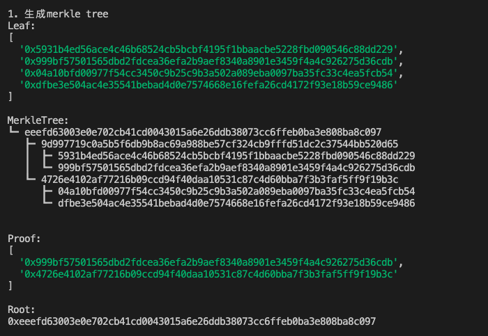
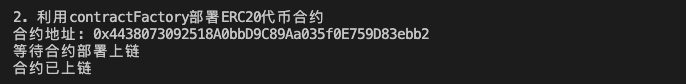
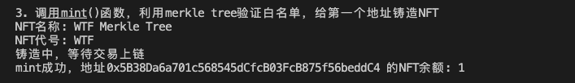

# Ethers极简入门: 17. MerkleTree脚本

我最近在重新学`ethers.js`，巩固一下细节，也写一个`WTF Ethers极简入门`，供小白们使用。

**推特**：[@0xAA_Science](https://twitter.com/0xAA_Science)

**WTF Academy社群：** [官网 wtf.academy](https://wtf.academy) | [WTF Solidity教程](https://github.com/AmazingAng/WTF-Solidity) | [discord](https://discord.gg/5akcruXrsk) | [微信群申请](https://docs.google.com/forms/d/e/1FAIpQLSe4KGT8Sh6sJ7hedQRuIYirOoZK_85miz3dw7vA1-YjodgJ-A/viewform?usp=sf_link)

所有代码和教程开源在github: [github.com/WTFAcademy/WTF-Ethers](https://github.com/WTFAcademy/WTF-Ethers)

-----

这一讲我们写一个利用`Merkle Tree`白名单铸造`NFT`的脚本，如果你对`Merkle Tree`合约不熟悉，请看[WTF Solidity极简教程第37讲：Merkle Tree](https://github.com/AmazingAng/WTF-Solidity/blob/main/36_MerkleTree/readme.md)。

## Merkle Tree
`Merkle Tree`，也叫默克尔树或哈希树，是区块链的底层加密技术，被比特币和以太坊区块链广泛采用。`Merkle Tree`是一种自下而上构建的加密树，每个叶子是对应数据的哈希，而每个非叶子为它的`2`个子节点的哈希。


`Merkle Tree`允许对大型数据结构的内容进行有效和安全的验证（`Merkle Proof`）。对于有`N`个叶子结点的`Merkle Tree`，在已知`root`根值的情况下，验证某个数据是否有效（属于`Merkle Tree`叶子结点）只需要`log(N)`个数据（也叫`proof`），非常高效。如果数据有误，或者给的`proof`错误，则无法还原出`root`根植。下面的例子中，叶子`L1`的`Merkle proof`为`Hash 0-1`和`Hash 1`：知道这两个值，就能验证`L1`的值是不是在`Merkle Tree`的叶子中。


## `Merkle Tree`合约简述

[WTF Solidity极简教程第36讲：Merkle Tree](https://github.com/AmazingAng/WTF-Solidity/blob/main/36_MerkleTree/readme.md)中的`MerkleTree`合约利用`Merkle Tree`验证白名单铸造`NFT`。我们简单讲下这里用到的两个函数：

1. 构造函数：初始化NFT的名称，代号，和`Merkle Tree`的`root`。

2. `mint()`：利用`Merkle Proof`验证白名单地址并铸造。参数为白名单地址`account`，铸造的`tokenId`，和`proof`。

## `MerkleTree.js`

`MerkleTree.js`是构建`Merkle Tree`和`Merkle Proof`的Javascript包（[Github连接](https://github.com/miguelmota/merkletreejs)）。你可以用`npm`安装他：

```shell
npm install merkletreejs
```

这里，我们演示如何生成叶子数据包含`4`个白名单地址的`Merkle Tree`。

1. 创建白名单地址数组。
    ```js
    import { MerkleTree } from "merkletreejs";
    // 白名单地址
    const tokens = [
        "0x5B38Da6a701c568545dCfcB03FcB875f56beddC4", 
        "0xAb8483F64d9C6d1EcF9b849Ae677dD3315835cb2",
        "0x4B20993Bc481177ec7E8f571ceCaE8A9e22C02db",
        "0x78731D3Ca6b7E34aC0F824c42a7cC18A495cabaB"
    ];
    ```

2. 将数据进行`keccak256`哈希（与solidity使用的哈希函数匹配），创建叶子结点。

    ```js
    const leaf = tokens.map(x => ethers.keccak256(x))
    ```

3. 创建`Merkle Tree`，哈希函数仍然选择`keccak256`，可选参数`sortPairs: true`（[constructor函数文档](https://github.com/miguelmota/merkletreejs/blob/master/docs/classes/_src_merkletree_.merkletree.md#constructor)），与`Merkle Tree`合约处理方式保持一致。

    ```js
    const merkletree = new MerkleTree(leaf, ethers.keccak256, { sortPairs: true });
    ```

4. 获得`Merkle Tree`的`root`。
    ```js
    const root = merkletree.getHexRoot()
    ```

5. 获得第`0`个叶子节点的`proof`。
    ```js
    const proof = merkletree.getHexProof(leaf[0]);
    ```

## `Merkle Tree`白名单铸造`NFT`

这里，我们举个例子，利用`MerkleTree.js`和`ethers.js`验证白名单并铸造`NFT`。

1. 生成`Merkle Tree`。

    ```js
    // 1. 生成merkle tree
    console.log("\n1. 生成merkle tree")
    // 白名单地址
    const tokens = [
        "0x5B38Da6a701c568545dCfcB03FcB875f56beddC4", 
        "0xAb8483F64d9C6d1EcF9b849Ae677dD3315835cb2",
        "0x4B20993Bc481177ec7E8f571ceCaE8A9e22C02db",
        "0x78731D3Ca6b7E34aC0F824c42a7cC18A495cabaB"
    ];
    // leaf, merkletree, proof
    const leaf       = tokens.map(x => ethers.keccak256(x))
    const merkletree = new MerkleTree(leaf, ethers.keccak256, { sortPairs: true });
    const proof      = merkletree.getHexProof(leaf[0]);
    const root = merkletree.getHexRoot()
    console.log("Leaf:")
    console.log(leaf)
    console.log("\nMerkleTree:")
    console.log(merkletree.toString())
    console.log("\nProof:")
    console.log(proof)
    console.log("\nRoot:")
    console.log(root)
    ```
    

2. 创建provider和wallet

    ```js
    // 准备 alchemy API 可以参考https://github.com/AmazingAng/WTF-Solidity/blob/main/Topics/Tools/TOOL04_Alchemy/readme.md 
    const ALCHEMY_GOERLI_URL = 'https://eth-goerli.alchemyapi.io/v2/GlaeWuylnNM3uuOo-SAwJxuwTdqHaY5l';
    const provider = new ethers.JsonRpcProvider(ALCHEMY_GOERLI_URL);
    // 利用私钥和provider创建wallet对象
    const privateKey = '0x227dbb8586117d55284e26620bc76534dfbd2394be34cf4a09cb775d593b6f2b'
    const wallet = new ethers.Wallet(privateKey, provider)
    ```

3. 创建合约工厂，为部署合约做准备。

    ```js
    // 3. 创建合约工厂
    // NFT的abi
    const abiNFT = [
        "constructor(string memory name, string memory symbol, bytes32 merkleroot)",
        "function name() view returns (string)",
        "function symbol() view returns (string)",
        "function mint(address account, uint256 tokenId, bytes32[] calldata proof) external",
        "function ownerOf(uint256) view returns (address)",
        "function balanceOf(address) view returns (uint256)",
    ];
    // 合约字节码，在remix中，你可以在两个地方找到Bytecode
    // i. 部署面板的Bytecode按钮
    // ii. 文件面板artifact文件夹下与合约同名的json文件中
    // 里面"object"字段对应的数据就是Bytecode，挺长的，608060起始
    // "object": "608060405260646000553480156100...
    const bytecodeNFT = contractJson.default.object;
    const factoryNFT = new ethers.ContractFactory(abiNFT, bytecodeNFT, wallet);
    ```

4. 利用contractFactory部署NFT合约

    ```js
    console.log("\n2. 利用contractFactory部署NFT合约")
    // 部署合约，填入constructor的参数
    const contractNFT = await factoryNFT.deploy("WTF Merkle Tree", "WTF", root)
    console.log(`合约地址: ${contractNFT.target}`);
    console.log("等待合约部署上链")
    await contractNFT.waitForDeployment()
    console.log("合约已上链")
    ```
    

5. 调用`mint()`函数，利用`merkle tree`验证白名单，并给第`0`个地址铸造`NFT`。在`mint`成功后可以看到`NFT`余额变为`1`。
    ```js
    console.log("\n3. 调用mint()函数，利用merkle tree验证白名单，给第一个地址铸造NFT")
    console.log(`NFT名称: ${await contractNFT.name()}`)
    console.log(`NFT代号: ${await contractNFT.symbol()}`)
    let tx = await contractNFT.mint(tokens[0], "0", proof)
    console.log("铸造中，等待交易上链")
    await tx.wait()
    console.log(`mint成功，地址${tokens[0]} 的NFT余额: ${await contractNFT.balanceOf(tokens[0])}\n`)
    ```
    

## 用于生产环境

在生产环境使用`Merkle Tree`验证白名单发行`NFT`主要有以下步骤：

1. 确定白名单列表。
2. 在后端生成白名单列表的`Merkle Tree`。
3. 部署`NFT`合约，并将`Merkle Tree`的`root`保存在合约中。
4. 用户铸造时，向后端请求地址对应的`proof`。
5. 用户调用`mint()`函数进行铸造`NFT`。

## 总结

这一讲，我们简单介绍了`Merkle Tree`，并利用`MerkleTree.js`和`ethers.js`创建、验证白名单，铸造`NFT`。
