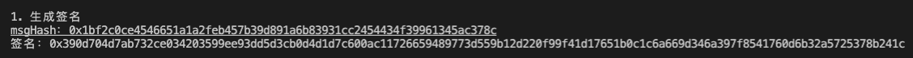

# Ethers极简入门: 18. 数字签名脚本

我最近在重新学`ethers.js`，巩固一下细节，也写一个`WTF Ethers极简入门`，供小白们使用。

**推特**：[@0xAA_Science](https://twitter.com/0xAA_Science)

**WTF Academy社群：** [官网 wtf.academy](https://wtf.academy) | [WTF Solidity教程](https://github.com/AmazingAng/WTF-Solidity) | [discord](https://discord.gg/5akcruXrsk) | [微信群申请](https://docs.google.com/forms/d/e/1FAIpQLSe4KGT8Sh6sJ7hedQRuIYirOoZK_85miz3dw7vA1-YjodgJ-A/viewform?usp=sf_link)

所有代码和教程开源在github: [github.com/WTFAcademy/WTF-Ethers](https://github.com/WTFAcademy/WTF-Ethers)

-----

这一讲，我们介绍一个利用链下签名作为白名单发放`NFT`的方法。如果你对`ECDSA`合约不熟悉，请看[WTF Solidity极简教程第37讲：数字签名](https://github.com/AmazingAng/WTF-Solidity/blob/main/37_Signature/readme.md)。

## 数字签名

如果你用过`opensea`交易`NFT`，对签名就不会陌生。下图是小狐狸（`metamask`）钱包进行签名时弹出的窗口，它可以证明你拥有私钥的同时不需要对外公布私钥。


以太坊使用的数字签名算法叫双椭圆曲线数字签名算法（`ECDSA`），基于双椭圆曲线“私钥-公钥”对的数字签名算法。它主要起到了[三个作用](https://en.wikipedia.org/wiki/Digital_signature)：

1. **身份认证**：证明签名方是私钥的持有人。
2. **不可否认**：发送方不能否认发送过这个消息。
3. **完整性**：消息在传输过程中无法被修改。

## 数字签名合约简述

[WTF Solidity极简教程第37讲：数字签名](https://github.com/AmazingAng/WTF-Solidity/blob/main/37_Signature/readme.md)中的`SignatureNFT`合约利用`ECDSA`验证白名单铸造`NFT`。我们讲下两个重要的函数：

1. 构造函数：初始化NFT的名称，代号，和签名公钥`signer`。

2. `mint()`：利用`ECDSA`验证白名单地址并铸造。参数为白名单地址`account`，铸造的`tokenId`，和签名`signature`。

## 生成数字签名

1. 打包消息：在以太坊的`ECDSA`标准中，被签名的`消息`是一组数据的`keccak256`哈希，为`bytes32`类型。我们可以利用`ethers.js`提供的`solidityKeccak256()`函数，把任何想要签名的内容打包并计算哈希。等效于`solidity`中的`keccak256(abi.encodePacked())`。
    
    在下面的代码中，我们将一个`address`类型变量和一个`uint256`类型变量打包后哈希，得到`消息`：
    ```js
    // 创建消息
    const account = "0x5B38Da6a701c568545dCfcB03FcB875f56beddC4"
    const tokenId = "0"
    // 等效于Solidity中的keccak256(abi.encodePacked(account, tokenId))
    const msgHash = ethers.solidityKeccak256(
        ['address', 'uint256'],
        [account, tokenId])
    console.log(`msgHash：${msgHash}`)
    // msgHash：0x1bf2c0ce4546651a1a2feb457b39d891a6b83931cc2454434f39961345ac378c
    ```

2. 签名：为了避免用户误签了恶意交易，`EIP191`提倡在`消息`前加上`"\x19Ethereum Signed Message:\n32"`字符，再做一次`keccak256`哈希得到`以太坊签名消息`，然后再签名。`ethers.js`的钱包类提供了`signMessage()`函数进行符合`EIP191`标准的签名。注意，如果`消息`为`string`类型，则需要利用`arrayify()`函数处理下。例子：
    ```js
    // 签名
    const messageHashBytes = ethers.getBytes(msgHash)
    const signature = await wallet.signMessage(messageHashBytes);
    console.log(`签名：${signature}`)
    // 签名：0x390d704d7ab732ce034203599ee93dd5d3cb0d4d1d7c600ac11726659489773d559b12d220f99f41d17651b0c1c6a669d346a397f8541760d6b32a5725378b241c
    ```

## 链下签名白名单铸造`NFT`

1. 创建`provider`和`wallet`，其中`wallet`是用于签名的钱包。

    ```js
    // 准备 alchemy API 可以参考https://github.com/AmazingAng/WTF-Solidity/blob/main/Topics/Tools/TOOL04_Alchemy/readme.md 
    const ALCHEMY_GOERLI_URL = 'https://eth-goerli.alchemyapi.io/v2/GlaeWuylnNM3uuOo-SAwJxuwTdqHaY5l';
    const provider = new ethers.JsonRpcProvider(ALCHEMY_GOERLI_URL);
    // 利用私钥和provider创建wallet对象
    const privateKey = '0x227dbb8586117d55284e26620bc76534dfbd2394be34cf4a09cb775d593b6f2b'
    const wallet = new ethers.Wallet(privateKey, provider)
    ```

2. 根据白名单地址和他们能铸造的`tokenId`生成`消息`并签名。
    ```js
    // 创建消息
    const account = "0x5B38Da6a701c568545dCfcB03FcB875f56beddC4"
    const tokenId = "0"
    // 等效于Solidity中的keccak256(abi.encodePacked(account, tokenId))
    const msgHash = ethers.solidityPackedKeccak256(
        ['address', 'uint256'],
        [account, tokenId])
    console.log(`msgHash：${msgHash}`)
    // 签名
    const messageHashBytes = ethers.getBytes(msgHash)
    const signature = await wallet.signMessage(messageHashBytes);
    console.log(`签名：${signature}`)
    ```
    

3. 创建合约工厂，为部署`NFT`合约做准备。
    ```js
    // NFT的人类可读abi
    const abiNFT = [
        "constructor(string memory _name, string memory _symbol, address _signer)",
        "function name() view returns (string)",
        "function symbol() view returns (string)",
        "function mint(address _account, uint256 _tokenId, bytes memory _signature) external",
        "function ownerOf(uint256) view returns (address)",
        "function balanceOf(address) view returns (uint256)",
    ];
    // 合约字节码，在remix中，你可以在两个地方找到Bytecode
    // i. 部署面板的Bytecode按钮
    // ii. 文件面板artifact文件夹下与合约同名的json文件中
    // 里面"object"字段对应的数据就是Bytecode，挺长的，608060起始
    // "object": "608060405260646000553480156100...
    const bytecodeNFT = contractJson.default.object;
    const factoryNFT = new ethers.ContractFactory(abiNFT, bytecodeNFT, wallet);
    ```
4. 利用合约工厂部署NFT合约。

    ```js
    // 部署合约，填入constructor的参数
    const contractNFT = await factoryNFT.deploy("WTF Signature", "WTF", wallet.address)
    console.log(`合约地址: ${contractNFT.target}`);
    console.log("等待合约部署上链")
    await contractNFT.waitForDeployment()
    // 也可以用 contractNFT.deployTransaction.wait()
    console.log("合约已上链")
    ```
    

5. 调用`NFT`合约的`mint()`函数，利用链下签名验证白名单，为`account`地址铸造`NFT`。

    ```js
    console.log(`NFT名称: ${await contractNFT.name()}`)
    console.log(`NFT代号: ${await contractNFT.symbol()}`)
    let tx = await contractNFT.mint(account, tokenId, signature)
    console.log("铸造中，等待交易上链")
    await tx.wait()
    console.log(`mint成功，地址${account} 的NFT余额: ${await contractNFT.balanceOf(account)}\n`)
    ```
    

## 用于生产环境

在生产环境使用数字签名验证白名单发行`NFT`主要有以下步骤：

1. 确定白名单列表。
2. 在后端维护一个签名钱包，生成每个白名单对应的`消息`和`签名`。
3. 部署`NFT`合约，并将签名钱包的公钥`signer`保存在合约中。
4. 用户铸造时，向后端请求地址对应的`签名`。
5. 用户调用`mint()`函数进行铸造`NFT`。

## 总结

这一讲，我们介使用`ethers.js`配合智能合约，以链下数字签名的方式验证白名单并发行`NFT`。`Merkle Tree`和链下数字签名是目前最主流也最经济的发放白名单方式。如果合约部署的时候已经确定好白名单列表，那么建议用`Merkle Tree`；如果在合约部署之后要不断添加白名单，例如Galaxy Project的`OAT`，那么建议用链下签名的方式，不然就要不断更新合约中`Merkle Tree`的`root`，耗费更多的gas。