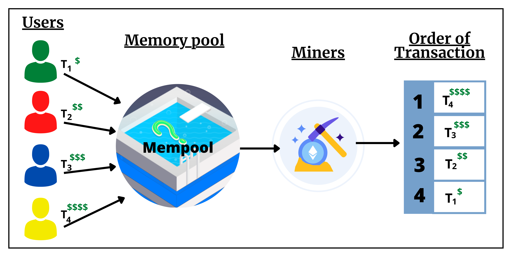

# Ethers极简入门: 19. 监听Mempool

我最近在重新学`ethers.js`，巩固一下细节，也写一个`WTF Ethers极简入门`，供小白们使用。

**推特**：[@0xAA_Science](https://twitter.com/0xAA_Science)

**WTF Academy社群：** [官网 wtf.academy](https://wtf.academy) | [WTF Solidity教程](https://github.com/AmazingAng/WTF-Solidity) | [discord](https://discord.gg/5akcruXrsk) | [微信群申请](https://docs.google.com/forms/d/e/1FAIpQLSe4KGT8Sh6sJ7hedQRuIYirOoZK_85miz3dw7vA1-YjodgJ-A/viewform?usp=sf_link)

所有代码和教程开源在github: [github.com/WTFAcademy/WTF-Ethers](https://github.com/WTFAcademy/WTF-Ethers)

-----

这一讲，我们将介绍如何读取`mempool`（交易内存池）中的交易。

## MEV

`MEV`（Maximal Extractable Value，最大可提取价值）是个令人着迷的话题。大部分人对它很陌生，因为在支持智能合约的区块链被发明之前它并不存在。它是科学家的盛宴，矿场的友人，散户的噩梦。

在区块链中，矿工可以通过打包、排除或重新排序他们产生的区块中的交易来获得一定的利润，而`MEV`是衡量这种利润的指标。

## Mempool

在用户的交易被矿工打包进以太坊区块链之前，所有交易会汇集到Mempool（交易内存池）中。矿工也是在这里寻找费用高的交易优先打包，实现利益最大化。通常来说，gas price越高的交易，越容易被打包。

同时，一些`MEV`机器人也会搜索`mempool`中有利可图的交易。比如，一笔滑点设置过高的`swap`交易可能会被三明治攻击：通过调整gas，机器人会在这笔交易之前插一个买单，之后发送一个卖单，等效于把把代币以高价卖给用户（抢跑）。



## 监听mempool

你可以利用`ethers.js`的`Provider`类提供的方法，监听`mempool`中的`pending`（未决，待打包）交易：

```js
provider.on("pending", listener)
```

## 监听mempool脚本

下面，我们写一个监听`mempool`脚本。

1. 创建`provider`和`wallet`。这次我们用的`provider`是WebSocket Provider，更持久的监听交易。因此，我们需要将`url`换成`wss`的。

    ```js
    console.log("\n1. 连接 wss RPC")
    // 准备 alchemy API 可以参考https://github.com/AmazingAng/WTF-Solidity/blob/main/Topics/Tools/TOOL04_Alchemy/readme.md 
    const ALCHEMY_MAINNET_WSSURL = 'wss://eth-mainnet.g.alchemy.com/v2/oKmOQKbneVkxgHZfibs-iFhIlIAl6HDN';
    const provider = new ethers.WebSocketProvider(ALCHEMY_MAINNET_WSSURL);
    ```

2. 因为`mempool`中的未决交易很多，每秒上百个，很容易达到免费`rpc`节点的请求上限，因此我们需要用`throttle`限制请求频率。

    ```js
    function throttle(fn, delay) {
        let timer;
        return function(){
            if(!timer) {
                fn.apply(this, arguments)
                timer = setTimeout(()=>{
                    clearTimeout(timer)
                    timer = null
                },delay)
            }
        }
    }
    ```

3. 监听`mempool`的未决交易，并打印交易哈希。

    ```js
    let i = 0
    provider.on("pending", async (txHash) => {
        if (txHash && i < 100) {
            // 打印txHash
            console.log(`[${(new Date).toLocaleTimeString()}] 监听Pending交易 ${i}: ${txHash} \r`);
            i++
            }
    });
    ```
    

4. 通过未决交易的哈希，获取交易详情。我们看到交易还未上链，它的`blockHash`，`blockNumber`，和`transactionIndex`都为空。但是我们可以获取到交易的发送者地址`from`，燃料费`gasPrice`，目标地址`to`，发送的以太数额`value`，发送数据`data`等等信息。机器人就是利用这些信息进行`MEV`挖掘的。

    ```js
    let j = 0
    provider.on("pending", throttle(async (txHash) => {
        if (txHash && j >= 100) {
            // 获取tx详情
            let tx = await provider.getTransaction(txHash);
            console.log(`\n[${(new Date).toLocaleTimeString()}] 监听Pending交易 ${j}: ${txHash} \r`);
            console.log(tx);
            j++
            }
    }, 1000));
    ```
    

## 总结

这一讲，我们简单介绍了`MEV`和`mempool`，并写了个脚本监听`mempool`的未决交易。
