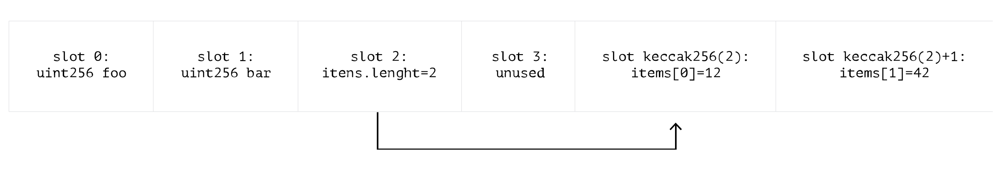

# Ethers极简入门: 22. 读取任意数据

我最近在重新学`ethers.js`，巩固一下细节，也写一个`WTF Ethers极简入门`，供小白们使用。

推特：[@0xAA_Science](https://twitter.com/0xAA_Science)｜[@WTFAcademy_](https://twitter.com/WTFAcademy_)

WTF Academy 社群：[Discord](https://discord.gg/5akcruXrsk)｜[微信群](https://docs.google.com/forms/d/e/1FAIpQLSe4KGT8Sh6sJ7hedQRuIYirOoZK_85miz3dw7vA1-YjodgJ-A/viewform?usp=sf_link)｜[官网 wtf.academy](https://wtf.academy)

所有代码和教程开源在 github: [github.com/WTFAcademy/WTFEthers](https://github.com/WTFAcademy/WTF-Ethers)

---

以太坊所有数据都是公开的，因此 `private` 变量并不私密。这一讲，我们将介绍如何读取智能合约的任意数据。

## 智能合约存储布局

以太坊智能合约的存储是一个 `uint256 -> uint256` 的映射。`uint256` 大小为 `32 bytes`，这个固定大小的存储空间被称为 `slot` （插槽）。智能合约的数据就被存在一个个的 `slot` 中，从 `slot 0` 开始依次存储。每个基本数据类型占一个`slot`，例如`uint`，`address`，等等；而数组和映射这类复杂结构则会更复杂，详见[网址](https://docs.soliditylang.org/en/v0.8.17/internals/layout_in_storage.html?highlight=Layout%20of%20State%20Variables%20in%20Storage)。



因此，即使是没有 `getter` 函数的 `private` 变量，你依然可以通过 `slot` 索引来读取它的值。

## `getStorageAt`

`ethersjs` 提供了 `getStorageAt()` 方便开发者读取特定 `slot` 的值：

```js
const value = await provider.getStorageAt(contractAddress, slot)
```

`getStorageAt()` 有两个参数，分别是合约地址 `contractAddress` 和 想读取变量的 `slot` 索引。

## 读取任意数据脚本

下面，我们写一个脚本，利用 `getStorageAt()` 函数来读取 `Arbitrum` 跨链桥的合约所有者。该跨链桥为可升级代理合约，将 `owner` 存在了特定的 `slot` 避免发生变量碰撞，并且没有读取它的函数。这里，我们就可以利用`getStorageAt()` 来读取它。

```solidity
合约地址: 0x8315177aB297bA92A06054cE80a67Ed4DBd7ed3a
slot索引: 0xb53127684a568b3173ae13b9f8a6016e243e63b6e8ee1178d6a717850b5d6103
```

运行结果：


代码：

```js
import { ethers } from "ethers";

//准备 alchemy API 可以参考https://github.com/AmazingAng/WTFSolidity/blob/main/Topics/Tools/TOOL04_Alchemy/readme.md 
const ALCHEMY_MAINNET_URL = 'https://eth-mainnet.g.alchemy.com/v2/oKmOQKbneVkxgHZfibs-iFhIlIAl6HDN';
const provider = new ethers.JsonRpcProvider(ALCHEMY_MAINNET_URL);

// 目标合约地址: Arbitrum ERC20 bridge（主网）
const addressBridge = '0x8315177aB297bA92A06054cE80a67Ed4DBd7ed3a' // DAI Contract
// 合约所有者 slot
const slot = `0xb53127684a568b3173ae13b9f8a6016e243e63b6e8ee1178d6a717850b5d6103`

const main = async () => {
    console.log("开始读取特定slot的数据")
    const privateData = await provider.getStorage(addressBridge, slot)
    console.log("读出的数据（owner地址）: ", ethers.getAddress(ethers.dataSlice(privateData, 12)))    
}

main()
```

## 总结

这一讲，我们介绍了如何读取智能合约中的任意数据，包括私密数据。由于以太坊是公开透明的，大家不要将秘密存在智能合约中！