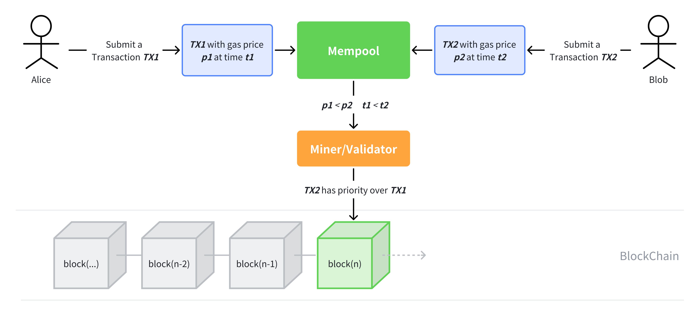
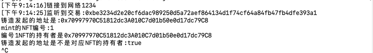
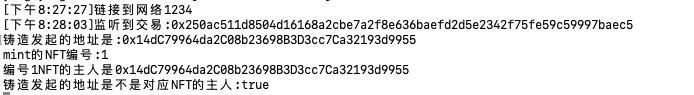
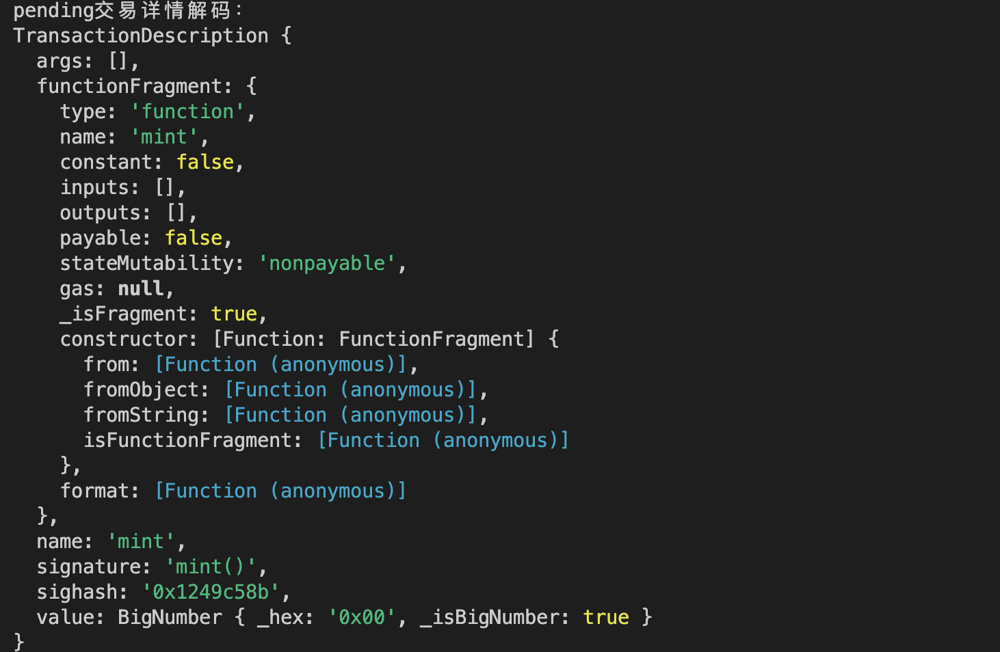
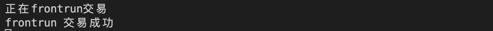

# Ethers极简入门: 23. 抢先交易脚本

我最近在重新学`ethers.js`，巩固一下细节，也写一个`WTF Ethers极简入门`，供小白们使用。

推特：[@0xAA_Science](https://twitter.com/0xAA_Science)｜[@WTFAcademy_](https://twitter.com/WTFAcademy_)

WTF Academy 社群：[Discord](https://discord.gg/5akcruXrsk)｜[微信群](https://docs.google.com/forms/d/e/1FAIpQLSe4KGT8Sh6sJ7hedQRuIYirOoZK_85miz3dw7vA1-YjodgJ-A/viewform?usp=sf_link)｜[官网 wtf.academy](https://wtf.academy)

所有代码和教程开源在 github: [github.com/WTFAcademy/WTFEthers](https://github.com/WTFAcademy/WTF-Ethers)

---

这一讲，我们将介绍抢先交易（Front-running，抢跑）的脚本。据统计，以太坊上的套利者通过三明治攻击（sandwich attack）[共获利12亿美元](https://dune.com/chorus_one/ethereum-mev-data)。在学习之前，请先阅读[WTF Solidity教程 合约安全S11: 抢先交易](https://github.com/AmazingAng/WTFSolidity/blob/main/S11_Frontrun/readme.md)。



## Freemint NFT合约

我们要抢跑的目标合约是一个ERC721标准的NFT合约`Frontrun.sol`，它拥有一个`mint()`函数进行免费铸造。

```solidity
// SPDX-License-Identifier: MIT
// By 0xAA
pragma solidity ^0.8.4;
import "@openzeppelin/contracts/token/ERC721/ERC721.sol";

// 我们尝试frontrun一笔Free mint交易
contract FreeMint is ERC721 {
    uint256 public totalSupply;

    // 构造函数，初始化NFT合集的名称、代号
    constructor() ERC721("Free Mint NFT", "FreeMint"){}

    // 铸造函数
    function mint() external {
        _mint(msg.sender, totalSupply); // mint
        totalSupply++;
    }
}
```

为了简化测试环境，我们将上述合约部署在foundry本地测试网，然后监听在`mempool`中的未决交易，筛选出符合标准的交易进行抢跑。

如果你不了解 `foundry`，可以阅读WTF Solidity中的[Foundry教程](https://github.com/AmazingAng/WTF-Solidity/blob/main/Topics/Tools/TOOL07_Foundry/readme.md)。安装好 foundry 后，在命令行输入以下命令就可以启动本地测试网:

```shell
anvil
```

## 抢跑脚本

下面，我们详解一下抢跑脚本`frontrun.js`，这个脚本会监听链上的`mint()`交易，并发送一个gas更高的相同交易，进行抢跑。

1. 创建连接到foundry本地测试网的`provider`对象，用于监听和发送交易。foundry本地测试网默认url：`"http://127.0.0.1:8545"`。
    ```js
    import { ethers } from "ethers";

    // 1. 创建provider
    var url = "http://127.0.0.1:8545";
    const provider = new ethers.WebSocketProvider(url);
    let network = provider.getNetwork()
    network.then(res => console.log(`[${(new Date).toLocaleTimeString()}] 连接到 chain ID ${res.chainId}`));
    ```

2. 创建一个包含我们感兴趣的`mint()`函数的`interface`对象，用于解码交易。如果你不了解它，可以阅读[WTF Ethers极简教程第20讲：解码交易](https://github.com/WTFAcademy/WTFEthers/blob/main/20_DecodeTx/readme.md)。
    ```js
    // 2. 创建interface对象，用于解码交易详情。
    const iface = new ethers.Interface([
        "function mint() external",
    ])
    ```

3. 创建测试钱包，用于发送抢跑交易，私钥是foundry测试网提供的，里面有10000 ETH测试币。

    ```js
    // 3. 创建钱包，用于发送抢跑交易
    const privateKey = '0x5de4111afa1a4b94908f83103eb1f1706367c2e68ca870fc3fb9a804cdab365a'
    const wallet = new ethers.Wallet(privateKey, provider)
    ```

4. 我们利用`provider.on`方法监听mempool中的未决交易，当交易出现时，我们会利用交易哈希`txHash`来读取交易详情`tx`，并筛选出调用了`mint()`函数且发送方不是自己钱包地址的交易（如果不筛选，会自己抢跑自己的交易，陷入死循环）。然后，再打印筛选出的交易哈希。

    ```js
    provider.on("pending", async (txHash) => {
        if (txHash) {
            // 获取tx详情
            let tx = await provider.getTransaction(txHash);
            if (tx) {
                // filter pendingTx.data
                if (tx.data.indexOf(iface.getFunction("mint").selector) !== -1 && tx.from != wallet.address ) {
                    // 打印txHash
                    console.log(`\n[${(new Date).toLocaleTimeString()}] 监听Pending交易: ${txHash} \r`);
    ```
    

5. 打印筛选出的未决交易详情

    ```js
    // 打印原始交易
    console.log("raw transaction")
    console.log(tx);
    ```   
    

6. 打印解码后的交易详情，可以看到该交易调用的是`mint()`函数。 

    ```js
    // 打印交易解码后结果
    let parsedTx = iface.parseTransaction(tx)
    console.log("pending交易详情解码：")
    console.log(parsedTx);
    ```
    

7. 构建抢跑交易`txFrontrun`，原交易的目标地址`to`，发送以太坊数额`value`和发送数据`data`保持不变，然后将`gas`拉高：`maxPriorityFeePerGas` 和 `maxFeePerGas` 改为原先的 1.2 倍，`gasLimit`最高设为原先的 2 倍。然后通过 `sendTransaction()` 将交易发送到链上，完成抢跑！

    ```js
    // 构建抢跑tx
    const txFrontrun = {
        to: tx.to,
        value: tx.value,
        maxPriorityFeePerGas: tx.maxPriorityFeePerGas * 2n,
        maxFeePerGas: tx.maxFeePerGas * 2n,
        gasLimit: tx.gasLimit * 2,
        data: tx.data
    }
    // 发送抢跑交易
    var txResponse = await wallet.sendTransaction(txFrontrun)
    console.log(`正在frontrun交易`)
    await txResponse.wait()
    console.log(`frontrun 交易成功`)   
    ```

    

## 总结

这一讲，我们介绍了一个简单的抢先交易脚本。你可以在这个脚本的基础上加入你想要的功能，开启币圈科学家之路！
