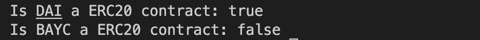

# Ethers极简入门: 24. 识别ERC20合约

我最近在重新学`ethers.js`，巩固一下细节，也写一个`WTF Ethers极简入门`，供小白们使用。

推特：[@0xAA_Science](https://twitter.com/0xAA_Science)｜[@WTFAcademy_](https://twitter.com/WTFAcademy_)

WTF Academy 社群：[Discord](https://discord.gg/5akcruXrsk)｜[微信群](https://docs.google.com/forms/d/e/1FAIpQLSe4KGT8Sh6sJ7hedQRuIYirOoZK_85miz3dw7vA1-YjodgJ-A/viewform?usp=sf_link)｜[官网 wtf.academy](https://wtf.academy)

所有代码和教程开源在 github: [github.com/WTFAcademy/WTFEthers](https://github.com/WTFAcademy/WTF-Ethers)

---

这一讲，我们介绍如何用`ether.js`识别一个合约是否为`ERC20`标准，你会在链上分析，识别貔貅，抢开盘等场景用到它。

## `ERC20`

`ERC721` 是以太坊上最常用的代币标准，如果对这个标准不熟悉，可以阅读[WTF Solidity第31讲 ERC20](https://github.com/AmazingAng/WTF-Solidity/blob/main/31_ERC20/readme.md)。`ERC20` 标准包含以下函数和事件:
```solidity
interface IERC20 {
    event Transfer(address indexed from, address indexed to, uint256 value);

    event Approval(address indexed owner, address indexed spender, uint256 value);

    function totalSupply() external view returns (uint256);

    function balanceOf(address account) external view returns (uint256);

    function transfer(address to, uint256 amount) external returns (bool);

    function allowance(address owner, address spender) external view returns (uint256);

    function approve(address spender, uint256 amount) external returns (bool);

    function transferFrom(address from, address to, uint256 amount) external returns (bool);
}
```

## 识别 `ERC20` 合约
在之前的[教程](https://github.com/WTFAcademy/WTF-Ethers/blob/main/12_ERC721Check/readme.md)中，我们讲了如何基于 `ERC165` 识别 `ERC721` 合约。但是由于 `ERC20` 的发布早于 `ERC165`（20 < 165），因此我们没法用相同的办法识别 `ERC20` 合约，只能另找办法。

区块链是公开的，我们能获取任意合约地址上的代码（bytecode）。因此，我们可以先获取合约代码，然后对比其是否包含 `ERC20` 标准中的函数就可以了。

首先，我们用 `provider` 的 `getCode()` 函数来取得对应地址的 `bytecode`：
```js
let code = await provider.getCode(contractAddress)
```

接下来我们要检查合约 `bytecode` 是否包含 `ERC20` 标准中的函数。合约 `bytecode` 中存储了相应的[函数选择器]：如果合约包含 `transfer(address, uint256)` 函数，那么 `bytecode` 就会包含 `a9059cbb`；如果合约包含 `totalSupply()`，那么 `bytecode` 就会包含 `18160ddd`。如果你不了解函数选择器，可以阅读 WTF Solidity的[相应章节](https://github.com/AmazingAng/WTF-Solidity/blob/main/29_Selector/readme.md)。如果想更深入的了解 `bytecode`，可以阅读[深入EVM](https://github.com/AmazingAng/WTFSolidity/blob/main/Topics/Translation/DiveEVM2017)。

这里，我们仅需检测  `transfer(address, uint256)` 和 `totalSupply()` 两个函数，而不用检查全部6个，这是因为：
1. `ERC20`标准中只有 `transfer(address, uint256)` 不包含在 `ERC721`标准、`ERC1155`和`ERC777`标准中。因此如果一个合约包含 `transfer(address, uint256)` 的选择器，就能确定它是 `ERC20` 代币合约，而不是其他。
2. 额外检测 `totalSupply()` 是为了防止[选择器碰撞](https://github.com/AmazingAng/WTFSolidity/blob/main/S01_ReentrancyAttack/readme.md)：一串随机的字节码可能和 `transfer(address, uint256)` 的选择器（4字节）相同。

代码如下
```js
async function erc20Checker(addr){
    // 获取合约bytecode
    let code = await provider.getCode(addr)
    // 非合约地址的bytecode是0x
    if(code != "0x"){
        // 检查bytecode中是否包含transfer函数和totalSupply函数的selector
        if(code.includes("a9059cbb") && code.includes("18160ddd")){
            // 如果有，则是ERC20
            return true
        }else{
            // 如果没有，则不是ERC20
            return false
        }
    }else{
        return null;
    }
}
```

## 测试脚本

下面，我们利用 `DAI`（ERC20）和 `BAYC`（ERC72）合约来测试脚本是否能正确识别 `ERC20` 合约。

```js
// DAI address (mainnet)
const daiAddr = "0x6b175474e89094c44da98b954eedeac495271d0f"
// BAYC address (mainnet)
const baycAddr = "0xbc4ca0eda7647a8ab7c2061c2e118a18a936f13d"

const main = async () => {
    // 检查DAI合约是否为ERC20
    let isDaiERC20 = await erc20Checker(daiAddr)
    console.log(`1. Is DAI a ERC20 contract: ${isDaiERC20}`)

    // 检查BAYC合约是否为ERC20
    let isBaycERC20 = await erc20Checker(baycAddr)
    console.log(`2. Is BAYC a ERC20 contract: ${isBaycERC20}`)
}

main()
```

输出如下：



脚本成功检测出 `DAI` 合约是 `ERC20` 合约，而 `BAYC` 合约不是 `ERC20` 合约。

## 总结

这一讲，我们介绍了如何通过合约地址获取合约 `bytecode`，并且利用函数选择器来检测合约是否为 `ERC20` 合约。脚本能成功检测出 `DAI` 合约是 `ERC20` 合约，而 `BAYC` 合约不是 `ERC20` 合约。你会将它用在什么场景呢？
