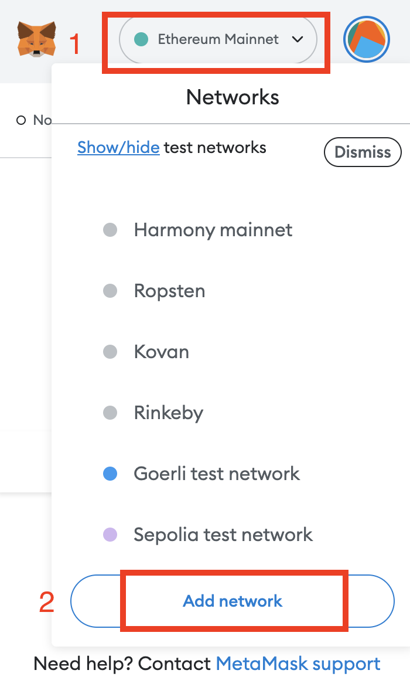
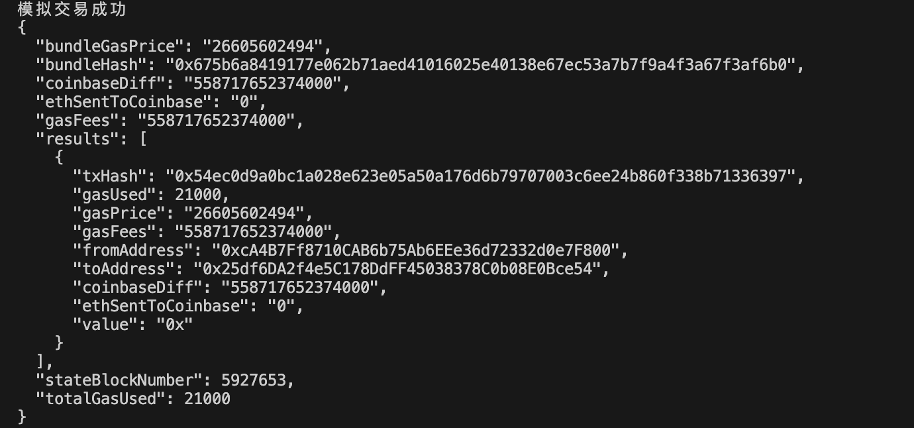
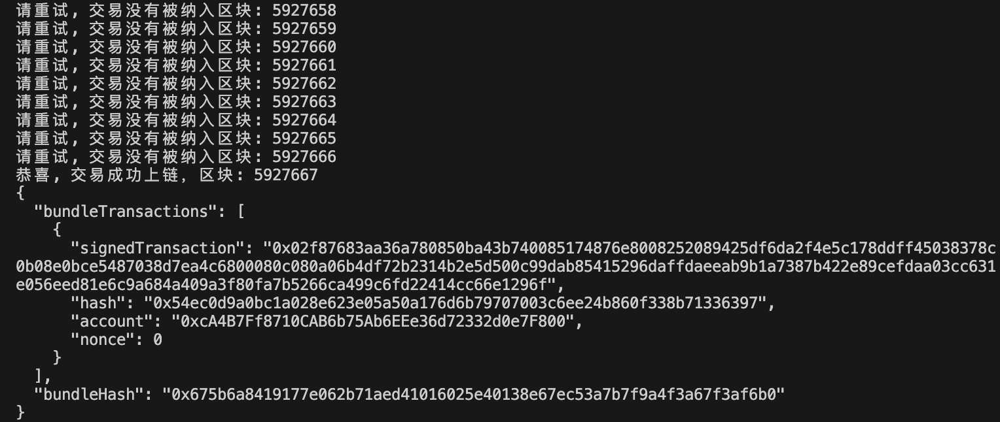

# Ethers极简入门: 25. Flashbots

我最近在重新学`ethers.js`，巩固一下细节，也写一个`WTF Ethers极简入门`，供小白们使用。

推特：[@0xAA_Science](https://twitter.com/0xAA_Science)｜[@WTFAcademy_](https://twitter.com/WTFAcademy_)

WTF Academy 社群：[Discord](https://discord.gg/5akcruXrsk)｜[微信群](https://docs.google.com/forms/d/e/1FAIpQLSe4KGT8Sh6sJ7hedQRuIYirOoZK_85miz3dw7vA1-YjodgJ-A/viewform?usp=sf_link)｜[官网 wtf.academy](https://wtf.academy)

所有代码和教程开源在 github: [github.com/WTFAcademy/WTFEthers](https://github.com/WTFAcademy/WTFEthers)

---

> 目前 Flashbots Bundle 仅支持 ethers.js v5 版本。

在以太坊转为 POS 之后，有超过 60% 的区块都是 flashbots 产出的，非常惊人，但是很多人并不了解它。这一讲，我们将介绍 Flashbots，包括:
1. 什么是 Flashbots?
2. 普通用户如何连接 Flashbots 节点发送隐私交易。
3. 开发者如何使用 Flashbots Bundle 打包多笔交易。

## Flashbots

Flashbots 是致力于减轻 MEV（最大可提取价值）对区块链造成危害的研究组织。目前有以下几款产品: 
1. Flashbots RPC: 保护以太坊用户受到有害 MEV（三明治攻击）的侵害。
2. Flashbots Bundle: 帮助 MEV 搜索者（Searcher）在以太坊上提取 MEV。
3. mev-boost: 帮助以太坊 POS 节点通过 MEV 获取更多的 ETH 奖励。

本教程中，我们主要介绍前两个产品。

## Flashbots RPC

Flashbots RPC 是一款面向以太坊普通用户的免费产品，你只需要在加密的钱包中将 RPC（网络节点）设置为Flashbots RPC，就可以将交易发送到Flashbots的私有交易缓存池（mempool）而非公开的，从而免受抢先交易/三明治攻击的损害。如果你不了解mempool或抢先交易，可以阅读之前的 [mempool](https://github.com/WTFAcademy/WTFEthers/blob/main/19_Mempool/readme.md) 和 [抢先交易](https://github.com/WTFAcademy/WTFEthers/blob/main/23_Frontrun/readme.md) 教程

下面我们演示一下如何用 Metamask 钱包连接 Flashbots RPC。
1. 点击 Metamask 顶部的网络按钮（默认显示 `Ethereum Mainnet`），然后点击底部的 `Add network` 按钮添加网络节点（新版 Metamask 还需要在下一个页面点击 `Add a network manually` 按钮）。



2. 依次输入网络参数:

```
Network name: Flashbots RPC
New RPC URL: https://rpc.flashbots.net
Chain ID: 1
Currency Symbol: ETH
Block Explorer URL: https://etherscan.io
```


完成这两步，你的加密钱包就成功的连接到了 Flashbots RPC，之后你只需要像往常一样操作钱包就可以避免三明治攻击了！

## Flashbots Bundle

在区块链上搜索 MEV 机会的开发者被称为`搜索者`。Flashbots Bundle（交易包）是一款帮助搜索者提取以太坊交易中 MEV 的工具。搜索者可以利用它将多笔交易组合在一起，按照指定的顺序执行。

举个例子，搜索者在公共`mempool`发现一笔在 `Uniswap` 买入PEOPLE代币的交易有被三明治攻击的机会，他可以在这币交易前后各插入一笔买入和卖出的交易，组成交易 Bundle 发送给 Flashbots。在些交易将在指定的区块执行，不会改变顺序，且不用担心被别的MEV机器人攻击。


## Flashbots Bundle 脚本

Flashbots 提供了 [ethers-provider-flashbots-bundle](https://github.com/flashbots/ethers-provider-flashbots-bundle)，一个建立在 `ethers.js` 之上帮助搜索者连接 flashbots provider 并发送 flashbots bundle 的 JavaScript 库。你可以通过 `npm` 命令安装它。

```shell
npm install --save @flashbots/ethers-provider-bundle
```

下面，我们利用它写一个脚本，给大家演示如何在 Goerli 测试网发送 Flashbots Bundle。代码开源在 [WTF-Ethers repo](https://github.com/WTFAcademy/WTF-Ethers)。

1. 创建一个连接到非Flashbots RPC的普通provider，这里我们使用 Alchemy 提供的 Goerli 测试网节点。
    ```js
    // 1. 普通rpc （非flashbots rpc）
    const ALCHEMY_GOERLI_URL = 'https://eth-goerli.alchemyapi.io/v2/GlaeWuylnNM3uuOo-SAwJxuwTdqHaY5l';
    const provider = new ethers.providers.JsonRpcProvider(ALCHEMY_GOERLI_URL);
    ```

2. 创建 Flashbots `声誉私钥`，用于建立“声誉”，[详情](https://docs.flashbots.net/flashbots-auction/searchers/advanced/reputation)
    > 注意: 这个账户不要储存资金，它不是flashbots主私钥。
    ```js
    const authKey = '0x227dbb8586117d55284e26620bc76534dfbd2394be34cf4a09cb775d593b6f2c'
    const authSigner = new ethers.Wallet(authKey, provider)
    ```

3. 创建 Flashbots RPC (测试网），用于发送交易，这里用到了普通provider和声誉私钥。
    ```js
    const flashbotsProvider = await FlashbotsBundleProvider.create(
        provider,
        authSigner,
        // 使用主网 Flashbots，需要把下面两行删去
        'https://relay-goerli.flashbots.net/', 
        'goerli'
        );
    ```

4. 创建一笔符合 `EIP1559` 标准的交易，交易内容: 发送 0.001 ETH 测试币到 WTF Academy 地址。这里用到了钱包私钥（含资产）以及普通provider

    ```js
    const privateKey = '0x227dbb8586117d55284e26620bc76534dfbd2394be34cf4a09cb775d593b6f2c'
    const wallet = new ethers.Wallet(privateKey, provider)
    // EIP 1559 transaction
    const transaction0 = {
    chainId: CHAIN_ID,
    type: 2,
    to: "0x25df6DA2f4e5C178DdFF45038378C0b08E0Bce54",
    value: ethers.utils.parseEther("0.001"),
    maxFeePerGas: GWEI * 100n
    }
    ```

5. 创建交易Bundle，这里我们只打包了一笔交易，实际使用中可以打包多笔签名过或未签名的交易。

    ```js
    const transactionBundle = [
        {
            signer: wallet, // ethers signer
            transaction: transaction0 // ethers populated transaction object
        }
        // 也可以加入mempool中签名好的交易（可以是任何人发送的）
        // ,{
        //     signedTransaction: SIGNED_ORACLE_UPDATE_FROM_PENDING_POOL // serialized signed transaction hex
        // }
    ]
    ```

6. 模拟交易并打印交易详情。bundle 要模拟成功后才能被执行。这里用到了flashbots provider的 `signBundle()` 和 `simulate()` 方法。注意，`simulate()` 方法需要指定交易执行的目标区块高度，这里用的下一个区块。

    
    ```js
    // 签名交易
    const signedTransactions = await flashbotsProvider.signBundle(transactionBundle)
    // 设置交易的目标执行区块（在哪个区块执行）
    const targetBlockNumber = (await provider.getBlockNumber()) + 1
    // 模拟
    const simulation = await flashbotsProvider.simulate(signedTransactions, targetBlockNumber)
    // 检查模拟是否成功
    if ("error" in simulation) {
        console.log(`模拟交易出错: ${simulation.error.message}`);
    } else {
        console.log(`模拟交易成功`);
        console.log(JSON.stringify(simulation, null, 2))
    }
    ```

7. 发送交易 Bundle 上链。由于 Flashbots Bundle 需要指定执行的区块高度，且测试网Flashbots的节点很少，需要尝试很多次才能成功上链，所以我们用了一个循环，让 bundle 在未来的 100 个区块内依次尝试执行。我们用到了 flashbots provider 的 `sendRawBundle()` 方法发送 bundle。交易结果有三种状态：
    - `BundleIncluded`: bundle 成功上链。
    - `BlockPassedWithoutInclusion`: bunddle 未成功上链，需要继续尝试。
    - `AccountNonceTooHigh`: Nonce 设置有错。
    
    从下图可以看到，我们提交的 bundle 在5次尝试后成功上链。
    

    ```js
    for (let i = 1; i <= 100; i++) {
        let targetBlockNumberNew = targetBlockNumber + i - 1;
        // 发送交易
        const res = await flashbotsProvider.sendRawBundle(signedTransactions, targetBlockNumberNew);
        if ("error" in res) {
        throw new Error(res.error.message);
        }
        // 检查交易是否上链
        const bundleResolution = await res.wait();
        // 交易有三个状态: 成功上链/没有上链/Nonce过高。
        if (bundleResolution === FlashbotsBundleResolution.BundleIncluded) {
        console.log(`恭喜, 交易成功上链，区块: ${targetBlockNumberNew}`);
        console.log(JSON.stringify(res, null, 2));
        process.exit(0);
        } else if (
        bundleResolution === FlashbotsBundleResolution.BlockPassedWithoutInclusion
        ) {
        console.log(`请重试, 交易没有被纳入区块: ${targetBlockNumberNew}`);
        } else if (
        bundleResolution === FlashbotsBundleResolution.AccountNonceTooHigh
        ) {
        console.log("Nonce 太高，请重新设置");
        process.exit(1);
        }
    }
    ```

## 总结

这一讲，我们介绍了 Flashbots 的几款产品，并着重介绍了保护普通用户免受恶意 MEV 侵害的的 Flashbots RPC网络节点和面向开发者的 Flashbots Bundle，最后写了一个发送 Flashbots Bundle 的脚本。希望这篇教程让你更加了解 MEV 和 Flashbots。你会用他们做些什么呢？