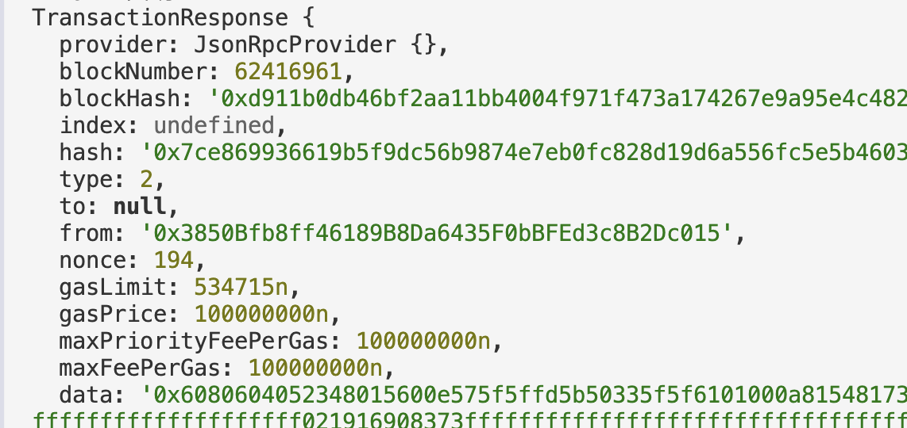
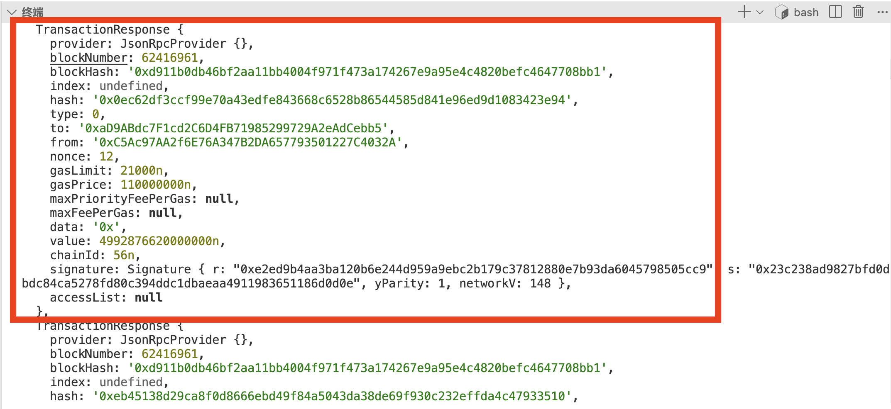
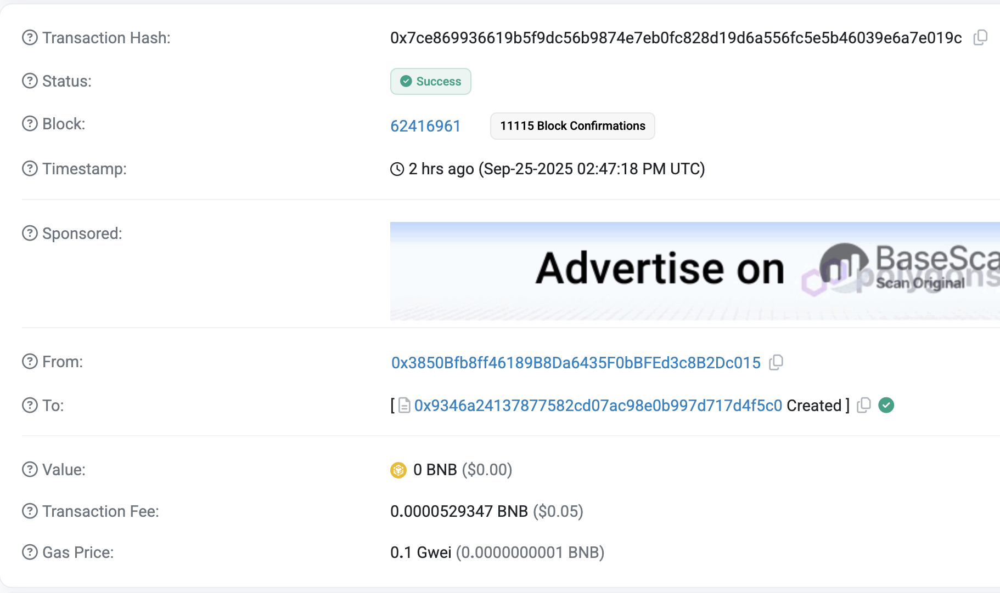

# WTF Ethers: 27. 检测合约创建1

我最近在重新学习`ethers.js`，巩固一下细节，也写一个`WTF Ethers`极简入门，供小白们使用。

**推特**：[@0xAA_Science](https://twitter.com/0xAA_Science)

**社区**：[Website wtf.academy](https://wtf.academy) | [WTF Solidity](https://github.com/AmazingAng/WTFSolidity) | [discord](https://discord.gg/5akcruXrsk) | [微信群申请](https://docs.google.com/forms/d/e/1FAIpQLSe4KGT8Sh6sJ7hedQRuIYirOoZK_85miz3dw7vA1-YjodgJ-A/viewform?usp=sf_link)

所有代码和教程开源在github: [github.com/WTFAcademy/WTF-Ethers](https://github.com/WTFAcademy/WTF-Ethers)

-----

监听区块链新部署的合约可以让我们第一时间发现新的投资机会。在以太坊上，检测合约创建交易主要有两种方法。这一讲，我们先介绍其中简单的一种。

## 1. 合约创建交易的特征

在以太坊中，用户的合约创建交易具有以下特征：

1. **目标地址为空**：`to` 字段为 `null`
2. **包含字节码**：`data` 字段包含合约的字节码（通常很长）
3. **计算合约地址**：合约地址可以通过部署者地址和nonce计算得出

> 还有另外一种方法是通过合约进行合约创建，检测方法有所不同，会在下一讲介绍。



## 2. 检测方法

首先，我们判断交易的 `to` 地址是否为空，并且 `tx.data` 长度大于 `2`（不是0x）：

```js
function isContractCreationAttempt(tx) {
    return tx.to === null && tx.data && tx.data.length > 2;
}
```

经过上面的条件，我们可以筛选掉大部分的交易。接下来我们可以获取这些交易的 receipt，判断 `receipt.contractAddress`（创建的合约地址）是否为空：如果不为空，则该交易有新合约创建。

```
const receipt = await provider.getTransactionReceipt(tx.hash);

if (!receipt || receipt.status !== 1 || !receipt.contractAddress) {
    return { 
        success: false, 
        reason: !receipt ? '无回执' : receipt.status !== 1 ? '执行失败' : '无合约地址' 
    };
}
```

我们可以利用 `provider.getBlock(blockNumber, true)` 方法来拉取指定区块的所有交易，进行检查（交易详情包含在 `prefetchedTransactions` 中）。

```js
const block = await provider.getBlock(blockNumber, true);

if (!block || !block.prefetchedTransactions) {
    console.log('   无法获取区块数据');
    return [];
}

console.log(`   区块 ${block.number} (${block.hash})`);
console.log(`   交易数量: ${block.prefetchedTransactions.length}`);
console.log(`   时间戳: ${new Date(block.timestamp * 1000).toLocaleString('zh-CN')}`);

// 1. 筛选合约创建尝试
const attempts = block.prefetchedTransactions.filter(isContractCreationAttempt);
```




## 3. 运行结果

我们用 BSC 的 62416961 区块为例，验证其中是否有交易创建了新合约。

```shell
合约创建验证
=========================================

🔍 分析区块 62416961 的成功合约创建

   区块 62416961 (0xd911b0db46bf2aa11bb4004f971f473a174267e9a95e4c4820befc4647708bb1)
   交易数量: 160
   时间戳: 2025/9/25 22:47:18

发现 1 个合约创建尝试

1. 验证交易: 0x7ce869936619b5f9dc56b9874e7eb0fc828d19d6a556fc5e5b46039e6a7e019c
      成功创建合约
      合约地址: 0x9346A24137877582cD07AC98E0b997d717d4F5C0
      Gas使用: 529347
      代码长度: 4210 字符

 统计结果:
   合约创建尝试: 1
   成功创建: 1
   成功率: 100.0%

 成功创建的合约:
1. 0x9346A24137877582cD07AC98E0b997d717d4F5C0 (0x7ce869936619b5f9dc56b9874e7eb0fc828d19d6a556fc5e5b46039e6a7e019c)
```

我们可以看到，程序成功的识别出了该区块中有一笔交易创建了新合约，[详情](https://bscscan.com/tx/0x7ce869936619b5f9dc56b9874e7eb0fc828d19d6a556fc5e5b46039e6a7e019c)。



## 4. 完整代码：

```js
// 验证合约创建1 - 检查 receipt 确认成功
// 使用方法: node ContractCreationValidation.js [区块号]
import { ethers } from "ethers";

const RPC_URL = 'https://bsc-rpc.publicnode.com';
const provider = new ethers.JsonRpcProvider(RPC_URL);

// 检查是否为合约创建尝试
function isContractCreationAttempt(tx) {
    return tx.to === null && tx.data && tx.data.length > 2;
}

// 完整验证合约创建是否成功，返回详细信息
async function validateContractCreation(tx) {
    // 1. 基本检查
    if (!isContractCreationAttempt(tx)) {
        return { success: false, reason: '不是合约创建' };
    }
    
    try {
        // 2. 获取交易回执
        const receipt = await provider.getTransactionReceipt(tx.hash);
        
        // 3. 检查执行状态和合约地址
        if (!receipt || receipt.status !== 1 || !receipt.contractAddress) {
            return { 
                success: false, 
                reason: !receipt ? '无回执' : receipt.status !== 1 ? '执行失败' : '无合约地址' 
            };
        }
        
        console.log(tx)

        // 4. 获取合约地址的代码
        const code = await provider.getCode(receipt.contractAddress);
        
        // 5. 返回成功信息
        return {
            success: true,
            receipt,
            code,
            contractAddress: receipt.contractAddress,
            gasUsed: receipt.gasUsed?.toString(),
            codeLength: code.length
        };
        
    } catch (error) {
        return { success: false, reason: `验证出错: ${error.message}` };
    }
}

// 分析区块中的成功合约创建
async function analyzeSuccessfulContractCreations(blockNumber) {
    console.log(`🔍 分析区块 ${blockNumber} 的成功合约创建\n`);
    
    try {
        const block = await provider.getBlock(blockNumber, true);
        
        if (!block || !block.prefetchedTransactions) {
            console.log('   无法获取区块数据');
            return [];
        }
        
        console.log(`   区块 ${block.number} (${block.hash})`);
        console.log(`   交易数量: ${block.prefetchedTransactions.length}`);
        console.log(`   时间戳: ${new Date(block.timestamp * 1000).toLocaleString('zh-CN')}`);
        
        // 1. 筛选合约创建尝试
        const attempts = block.prefetchedTransactions.filter(isContractCreationAttempt);
        console.log(`\n发现 ${attempts.length} 个合约创建尝试`);
        
        if (attempts.length === 0) {
            console.log('该区块中没有合约创建尝试');
            return [];
        }
        
        // 2. 验证哪些成功了
        const successfulCreations = [];
        
        for (let i = 0; i < attempts.length; i++) {
            const tx = attempts[i];
            console.log(`\n${i + 1}. 验证交易: ${tx.hash}`);
            
            const validation = await validateContractCreation(tx);
            
            if (validation.success) {
                // 使用验证函数返回的信息，避免重复RPC调用
                const creation = {
                    txHash: tx.hash,
                    from: tx.from,
                    contractAddress: validation.contractAddress,
                    gasUsed: validation.gasUsed,
                    gasLimit: tx.gasLimit?.toString(),
                    gasPrice: ethers.formatUnits(tx.gasPrice || 0, 'gwei'),
                    codeLength: validation.codeLength,
                    dataLength: tx.data.length
                };
                
                successfulCreations.push(creation);
                
                console.log(`      成功创建合约`);
                console.log(`      合约地址: ${creation.contractAddress}`);
                console.log(`      Gas使用: ${creation.gasUsed}`);
                console.log(`      代码长度: ${creation.codeLength} 字符`);
            } else {
                console.log(`      创建失败: ${validation.reason}`);
            }
            
            // 添加延迟
            if (i < attempts.length - 1) {
                await new Promise(resolve => setTimeout(resolve, 100));
            }
        }
        
        console.log(`\n 统计结果:`);
        console.log(`   合约创建尝试: ${attempts.length}`);
        console.log(`   成功创建: ${successfulCreations.length}`);
        console.log(`   成功率: ${attempts.length > 0 ? (successfulCreations.length / attempts.length * 100).toFixed(1) : 0}%`);
        
        if (successfulCreations.length > 0) {
            console.log(`\n 成功创建的合约:`);
            successfulCreations.forEach((creation, index) => {
                console.log(`${index + 1}. ${creation.contractAddress} (${creation.txHash})`);
            });
        }
        
        return successfulCreations;
        
    } catch (error) {
        console.error(` 分析失败:`, error.message);
        return [];
    }
}

// 主函数
async function main() {
    const blockNumber = parseInt(process.argv[2]) || 62416961;
    
    console.log('合约创建验证');
    console.log('=========================================\n');
    
    const creations = await analyzeSuccessfulContractCreations(blockNumber);
}

main().catch(console.error); 
```


## 5. 总结

这一讲，我们介绍了检测链上合约创建的第一个方法：先判断交易 `to == 'null'`，然后获取交易回执看是否有合约地址。这个方法虽然简单，但是并不能识别合约内部调用创建的新合约，比如 Uniswap 工厂合约创建的新LP代币合约。下一讲，我们将会介绍另一个方法，能识别所有合约创建的情况。
