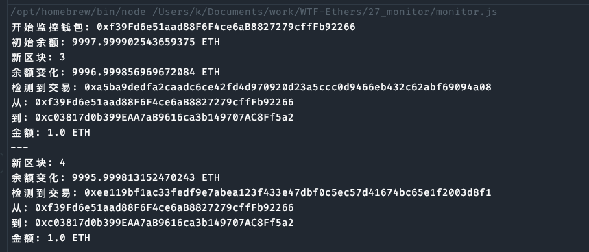

# Ethers极简入门: 27. 聪明钱监控

我最近在重新学`ethers.js`，巩固一下细节，也写一个`WTF Ethers极简入门`，供小白们使用。

推特：[@0xAA_Science](https://twitter.com/0xAA_Science)｜[@WTFAcademy_](https://twitter.com/WTFAcademy_)

WTF Academy 社群：[Discord](https://discord.gg/5akcruXrsk)｜[微信群](https://docs.google.com/forms/d/e/1FAIpQLSe4KGT8Sh6sJ7hedQRuIYirOoZK_85miz3dw7vA1-YjodgJ-A/viewform?usp=sf_link)｜[官网 wtf.academy](https://wtf.academy)

所有代码和教程开源在 github: [github.com/WTFAcademy/WTFEthers](https://github.com/WTFAcademy/WTF-Ethers)

---

在本教程中，我们将介绍如何使用 Ethers.js 完成一个钱包地址监控的脚本

### **什么是聪明钱？**

在加密领域，聪明钱（Smart Money）是指**拥有专业知识、对市场有深入了解以及具有信息优势的专业投资机构或个人投资者**。 聪明钱一直以来都是加密市场中的**关注焦点**，因为这些实体通常可以获得普通交易者不易获得的**信息和资源**，他们有着丰富的交易经验和优异的历史业绩，投资理念成熟，这可能使他们在存在**严重信息不对称**的加密货币市场中占据优势。


因为在区块链中所有数据都是公开的，我们可以看到所有人的交易数据。所以我们可以对历史成绩比较优秀的钱包地址进行监控。第一时间知道这些聪明钱的动向。


## 聪明钱监控

首先配置需要监控的钱包的地址，这里我们监控V神的钱包地址

```js
// 配置
const WALLET_ADDRESS = `0x220866B1A2219f40e72f5c628B65D54268cA3A9D`;

const ALCHEMY_GOERLI_URL = 'https://eth-mainnet.g.alchemy.com/v2/abWt0F-bY-Z4Amf_xOU_QQLftkhLU4cO';
const provider = new ethers.JsonRpcProvider(ALCHEMY_GOERLI_URL);
```

然后获取当前的eth余额记录下了

```js
// 获取初始余额
let previousBalance = await provider.getBalance(WALLET_ADDRESS);
console.log(`初始余额: ${ethers.formatEther(previousBalance)} ETH`);
```

监听链上的新区块，如果有转账或者是合约交互的话进行提醒。

```js
// 监听新区块
provider.on('block', async (blockNumber) => {
    console.log(`新区块: ${blockNumber}`);

    // 检查余额变化
    const currentBalance = await provider.getBalance(WALLET_ADDRESS);
    if (currentBalance !== previousBalance) {
        console.log(`余额变化: ${ethers.formatEther(currentBalance)} ETH`);
        previousBalance = currentBalance;
    }

    // 获取区块
    const block = await provider.getBlock(blockNumber);

    // 检查交易
    if (block && block.transactions) {
        for (const txHash of block.transactions) {
            const tx = await provider.getTransaction(txHash);

            if (!tx) continue;

            if (tx.from && tx.from.toLowerCase() === WALLET_ADDRESS.toLowerCase() ||
                (tx.to && tx.to.toLowerCase() === WALLET_ADDRESS.toLowerCase())) {

                console.log(`检测到交易: ${tx.hash}`);
                console.log(`从: ${tx.from}`);
                console.log(`到: ${tx.to || 'Contract Creation'}`);
                console.log(`金额: ${ethers.formatEther(tx.value)} ETH`);

                // 检查是否是合约交互
                if (tx.data && tx.data !== '0x') {
                    console.log('检测到合约交互');

                    // 获取交易收据以查看事件日志
                    const receipt = await provider.getTransactionReceipt(tx.hash);

                    if (receipt && receipt.logs) {
                        console.log(`事件日志数量: ${receipt.logs.length}`);

                        for (const log of receipt.logs) {
                            console.log(`  事件主题: ${log.topics[0]}`);
                            console.log(`  合约地址: ${log.address}`);
                        }
                    }
                }

                console.log('---');
            }
        }
    }
});
```

效果图



## 总结

在本教程中，我们介绍了如何使用 Ethers.js 对聪明钱包的转账和合约交互进行监控。
