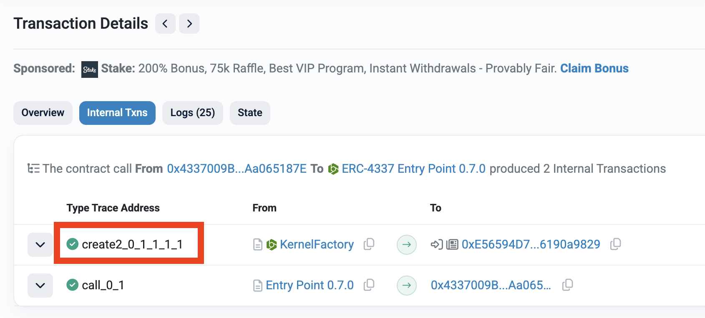
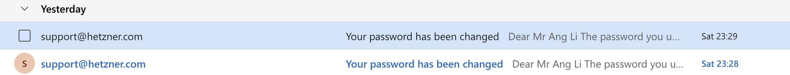

# WTF Ethers: 28. 检测合约创建2

我最近在重新学习`ethers.js`，巩固一下细节，也写一个`WTF Ethers`极简入门，供小白们使用。

**推特**：[@0xAA_Science](https://twitter.com/0xAA_Science)

**社区**：[Website wtf.academy](https://wtf.academy) | [WTF Solidity](https://github.com/AmazingAng/WTFSolidity) | [discord](https://discord.gg/5akcruXrsk) | [微信群申请](https://docs.google.com/forms/d/e/1FAIpQLSe4KGT8Sh6sJ7hedQRuIYirOoZK_85miz3dw7vA1-YjodgJ-A/viewform?usp=sf_link)

所有代码和教程开源在github: [github.com/WTFAcademy/WTF-Ethers](https://github.com/WTFAcademy/WTF-Ethers)

-----

上一讲中，我们介绍了通过检查交易 `to == null` 来识别合约创建。这种方法简单有效，但有局限性：无法检测合约内部调用创建的新合约，比如 Uniswap 工厂合约创建的新LP代币合约。这一讲，我们将学习如何从字节码的层面检测合约创建：通过分析交易的调用追踪（call trace），我们可以检测到所有类型的合约创建。

## 1. 合约创建的本质

在深入检测方法之前，我们需要理解合约创建在字节码层面的本质。在以太坊虚拟机（EVM）中，创建合约本质上是执行以下两种操作码之一：

### CREATE 操作码
- **功能**：根据发送者地址和nonce计算新合约地址
- **地址计算**：`keccak256(rlp([sender_address, nonce]))`
- **特点**：地址可预测，但依赖于部署顺序

### CREATE2 操作码  
- **功能**：根据发送者地址、salt值和合约字节码计算新合约地址
- **地址计算**：`keccak256(0xff + sender_address + salt + keccak256(bytecode))`
- **特点**：地址完全确定，不依赖于部署顺序

无论是用户直接部署合约，还是通过智能合约内部调用创建新合约，最终都会执行 `CREATE` 或 `CREATE2` 操作码：

1. **直接合约创建**：用户直接部署合约（`to == null`），EVM 底层执行 `CREATE` 操作码。
2. **内部合约创建**：用户调用工厂合约，工厂合约内部调用 `CREATE` 或 `CREATE2` 操作码。

比如我们下面这笔[交易](https://bscscan.com/tx/0x553073c1740e608255fc182dc58aa4c2fdfdb7d6d3c5fb8738a5518dc2c996d6#internal)就调用了 `CREATE2` 操作码，通过合约逻辑创建了新的合约：



如果你对 EVM 字节码感兴趣，可以阅读[WTF EVM Opcodes教程](https://github.com/WTFAcademy/WTF-EVM-Opcodes)，里面介绍了EVM中的144个操作码。

## 2. 获取call trace

既然创建合约一定要使用 `CREATE` 或 `CREATE2` 操作码，那么我们从哪里获取交易的操作码信息呢？

答案就是 EVM 的 call trace（调用追踪）:它把一笔交易在 EVM 里的消息调用树复原出来，展示谁（from）调用了谁（to）、传了什么数据（input）、转了多少钱（value）、是否 REVERT、消耗了多少 gas，以及是否在过程中 CREATE/CREATE2 了新合约。它也是区块浏览器中内部交易（Internal Transaction）的数据来源。

call trace 的颗粒度不是 opcode 级别，而是“消息调用”级别，只记录了 `CALL/DELEGATECALL/STATICCALL/CREATE/CREATE2/SELFDESTRUCT` 这6种调用级的 opcode。这里面正好有我们需要的 `CREATE/CREATE2`。

一般的以太坊节点都是用的 GETH，提供了两个 `debug` 接口供开发者获取 call trace:

1. `debug_traceTransaction`: 重放单笔交易，可以用来获取单笔交易的 call trace。

2. `debug_traceBlockByNumber`: 重放整块所有交易，可以用来获取整个区块所有交易的 call trace。

因为 `debug` 接口只是 Geth 客户端的扩展功能，而不是以太坊标准的一部分，因此 ethers.js 并没有支持，我们需要使用 `fetch` 或其他工具调用。另外 `debug` 接口会消耗计算资源和存储空间，大部分公共 RPC 节点会默认关闭，而付费节点也可能关闭或只保留最近128个区块的debug数据。我推荐 ZAN 的接口，公共的RPC就已经支持了 `debug` 接口，但调用频率限制很大，私有节点可以去官网注册 `https://zan.top/`。

下面我们以调用 `debug_traceTransaction` 获取单笔[交易](https://bscscan.com/tx/0x553073c1740e608255fc182dc58aa4c2fdfdb7d6d3c5fb8738a5518dc2c996d6)的 call trace 为例：

```js
// 获取交易的trace调用信息
const RPC_URL = "https://api.zan.top/bsc-mainnet";

// RPC调用函数
async function makeRPCCall(method, params = []) {
  const response = await fetch(RPC_URL, {
    method: 'POST',
    headers: { 'Content-Type': 'application/json' },
    body: JSON.stringify({
      jsonrpc: '2.0',
      method,
      params,
      id: Date.now()
    })
  });

  const data = await response.json();
  
  if (data.error) {
    throw new Error(`RPC错误: ${data.error.message}`);
  }
  
  return data.result;
}

// 递归输出所有调用
function logAllCalls(trace, depth = 0) {
  if (!trace) return;
  
  const indent = '  '.repeat(depth);
  
  console.log(`${indent}📞 调用信息:`);
  console.log(`${indent}   类型: ${trace.type}`);
  console.log(`${indent}   发送者: ${trace.from}`);
  console.log(`${indent}   接收者: ${trace.to}`);
  console.log(`${indent}   Gas: ${trace.gas}`);
  console.log(`${indent}   Gas使用: ${trace.gasUsed}`);
  console.log(`${indent}   值: ${trace.value || '0x0'}`);
  
  if (trace.input && trace.input.length > 10) {
    console.log(`${indent}   输入数据: ${trace.input.substring(0, 42)}...`);
  }
  
  if (trace.output && trace.output.length > 2) {
    console.log(`${indent}   输出数据: ${trace.output.substring(0, 42)}...`);
  }
  
  if (trace.error) {
    console.log(`${indent}   ❌ 错误: ${trace.error}`);
  }
  
  console.log(`${indent}   深度: ${depth}`);
  console.log('');
  
  // 递归处理子调用
  if (trace.calls && Array.isArray(trace.calls)) {
    console.log(`${indent}🔗 子调用 (${trace.calls.length}个):`);
    trace.calls.forEach((call, index) => {
      console.log(`${indent}--- 子调用 ${index + 1} ---`);
      logAllCalls(call, depth + 1);
    });
  }
}

// 主函数
async function traceTransaction() {
  const txHash = '0x553073c1740e608255fc182dc58aa4c2fdfdb7d6d3c5fb8738a5518dc2c996d6';
  
  console.log('🔍 获取交易trace调用信息');
  console.log('============================');
  console.log(`交易哈希: ${txHash}`);
  console.log(`RPC端点: ${RPC_URL}\n`);
  
  try {
    // 获取交易基本信息
    console.log('📋 获取交易基本信息...');
    const tx = await makeRPCCall('eth_getTransactionByHash', [txHash]);
    
    if (!tx) {
      throw new Error('交易未找到');
    }
    
    console.log(`✅ 交易信息:`);
    console.log(`   区块号: ${parseInt(tx.blockNumber, 16)}`);
    console.log(`   发送者: ${tx.from}`);
    console.log(`   接收者: ${tx.to || '合约创建'}`);
    console.log(`   Gas限制: ${parseInt(tx.gas, 16).toLocaleString()}`);
    console.log(`   Gas价格: ${parseInt(tx.gasPrice, 16)} wei`);
    console.log(`   值: ${tx.value} wei`);
    console.log('');
    
    // 获取交易回执
    console.log('📋 获取交易回执...');
    const receipt = await makeRPCCall('eth_getTransactionReceipt', [txHash]);
    
    if (receipt) {
      console.log(`✅ 交易回执:`);
      console.log(`   状态: ${receipt.status === '0x1' ? '✅ 成功' : '❌ 失败'}`);
      console.log(`   Gas使用: ${parseInt(receipt.gasUsed, 16).toLocaleString()}`);
      console.log(`   合约地址: ${receipt.contractAddress || '无'}`);
      console.log(`   日志数量: ${receipt.logs.length}`);
      console.log('');
    }
    
    // 获取trace调用
    console.log('🔍 获取trace调用信息...');
    const traceOptions = {
      tracer: "callTracer",
      timeout: "30s"
    };
    
    const trace = await makeRPCCall('debug_traceTransaction', [txHash, traceOptions]);
    
    console.log('✅ Trace调用信息:');
    console.log('==================\n');
    
    // 输出所有调用
    logAllCalls(trace);
    
    console.log('✅ 分析完成!');
    
  } catch (error) {
    console.error('❌ 错误:', error.message);
  }
}

// 运行
traceTransaction(); 
```

输出如下。可以看到，我们成功获取到了这笔交易的 call trace，并且能看到其中一个子调用使用了 `CREATE2` 字节码，也就是说这笔交易创建了新合约。因此，我们可以用这种方法筛选交易是否包含合约创建，不论直接或间接。

```shell
🔍 获取交易trace调用信息
============================
交易哈希: 0x553073c1740e608255fc182dc58aa4c2fdfdb7d6d3c5fb8738a5518dc2c996d6

📋 获取交易基本信息...
✅ 交易信息:
   区块号: 62635612
   发送者: 0x4337009be43c7ecc9bfbde0f1780553aa065187e
   接收者: 0x0000000071727de22e5e9d8baf0edac6f37da032
   Gas限制: 1,162,316
   Gas价格: 115000000 wei
   值: 0x0 wei

📋 获取交易回执...
✅ 交易回执:
   状态: ✅ 成功
   Gas使用: 765,791
   合约地址: 无
   日志数量: 25

🔍 获取trace调用信息...
✅ Trace调用信息:
==================

📞 调用信息:
   类型: CALL
   发送者: 0x4337009be43c7ecc9bfbde0f1780553aa065187e
   接收者: 0x0000000071727de22e5e9d8baf0edac6f37da032
   Gas: 0x11bc4c
   Gas使用: 0xbaf5f
   值: 0x0
   输入数据: 0x765e827f00000000000000000000000000000000...
   深度: 0

🔗 子调用 (5个):
--- 子调用 1 ---
  📞 调用信息:
     类型: CALL
     发送者: 0x0000000071727de22e5e9d8baf0edac6f37da032
     接收者: 0xefc2c1444ebcc4db75e7613d20c6a62ff67a167c
     Gas: 0x52a0a
     Gas使用: 0x2686b
     值: 0x0
     输入数据: 0x570e1a3600000000000000000000000000000000...
     输出数据: 0x000000000000000000000000e56594d73da2c920...
     深度: 1

  🔗 子调用 (1个):
  --- 子调用 1 ---
    📞 调用信息:
       类型: CALL
       发送者: 0xefc2c1444ebcc4db75e7613d20c6a62ff67a167c
       接收者: 0xd703aae79538628d27099b8c4f621be4ccd142d5
       Gas: 0x50925
       Gas使用: 0x25bc8
       值: 0x0
       输入数据: 0xc5265d5d000000000000000000000000aac5d424...
       输出数据: 0x000000000000000000000000e56594d73da2c920...
       深度: 2

    🔗 子调用 (1个):
    --- 子调用 1 ---
      📞 调用信息:
         类型: CALL
         发送者: 0xd703aae79538628d27099b8c4f621be4ccd142d5
         接收者: 0xaac5d4240af87249b3f71bc8e4a2cae074a3e419
         Gas: 0x4df35
         Gas使用: 0x24462
         值: 0x0
         输入数据: 0xea6d13ac00000000000000000000000000000000...
         输出数据: 0x000000000000000000000000e56594d73da2c920...
         深度: 3

      🔗 子调用 (2个):
      --- 子调用 1 ---
        📞 调用信息:
           类型: CREATE2
           发送者: 0xaac5d4240af87249b3f71bc8e4a2cae074a3e419
           接收者: 0xe56594d73da2c920c07380902dcf1336190a9829
           Gas: 0x44c4f
           Gas使用: 0x8621
           值: 0x0
           输入数据: 0x603d3d8160223d3973bac849bb641841b44e965f...
           输出数据: 0x363d3d373d3d363d7f360894a13ba1a3210667c8...
           深度: 4
...
```

## 3. 批量筛选区块

我们在上一节调用 `debug_traceTransaction` 获取了单笔交易的 call trace，但逐笔调用的效率很低。而 `debug_traceBlockByNumber` 接口可以让我们获得整个区块所有交易的 call trace，这样我们就能一次检测整个区块的合约创建交易：

```js
const blockHex = '0x' + blockNumber.toString(16);

// 获取区块信息
const block = await makeRPCCall('eth_getBlockByNumber', [blockHex, true]);

if (!block) {
    throw new Error('区块未找到');
}

console.log(` 区块 ${blockNumber} - 交易数量: ${block.transactions.length}`);

// 批量追踪整个区块
const traceOptions = {
    tracer: "callTracer",
    timeout: "30s"
};

console.log(' 执行批量追踪...');
const blockTraces = await makeRPCCall('debug_traceBlockByNumber', [blockHex, traceOptions]);
console.log(blockTraces)
```

就会输出整个区块每笔交易的 call traces（内部调用在 calls 数组中，未展开）。

```shell
[
{
    txHash: '0xafc3b025084f3594ed797fb6498e09c31718c66c970e8300b19fef851f7955f4',
    result: {
      from: '0xc3825b451ea33a47b9ef07b00438f3965f0052fe',
      gas: '0x5208',
      gasUsed: '0x5208',
      to: '0xc6109fadbdf24ebb2be604a21fd05b17ccccd712',
      input: '0x',
      value: '0xd8de82cba03ae3',
      type: 'CALL'
    }
  },
  {
    txHash: '0x639500c97c2a22d9f841be96141889cf81bf719bc45d20c8f6faed27884efda7',
    result: {
      from: '0xce5f687f0ae6501605944fcf03a9ce35de80eed0',
      gas: '0x8d9a6',
      gasUsed: '0x4c3f6',
      to: '0x6015126d7d23648c2e4466693b8deab005ffaba8',
      input: '0xb80c2f090000000000000000000000000000000000000000000000000038e7d2b86c2940000000000000000000000000be7e12b2e128bc955a0130ffb168f031d7dd8d58000000000000000000000000eeeeeeeeeeeeeeeeeeeeeeeeeeeeeeeeeeeeeeee00000000000000000000000000000000000000000000000097d4ed04e0fb6000000000000000000000000000000000000000000000000000000471acef840e520000000000000000000000000000000000000000000000000000000068da746b0000000000000000000000000000000000000000000000000000000000000120000000000000000000000000000000000000000000000000000000000000016000000000000000000000000000000000000000000000000000000000000006c0000000000000000000000000000000000000000000000000000000000000000100000000000000000000000000000000000000000000000097d4ed04e0fb6000000000000000000000000000000000000000000000000000000000000000000100000000000000000000000000000000000000000000000000000000000000200000000000000000000000000000000000000000000000000000000000000002000000000000000000000000000000000000000000000000000000000000004000000000000000000000000000000000000000000000000000000000000002a000000000000000000000000000000000000000000000000000000000000000a000000000000000000000000000000000000000000000000000000000000000e000000000000000000000000000000000000000000000000000000000000001200000000000000000000000000000000000000000000000000000000000000160000000000000000000000000be7e12b2e128bc955a0130ffb168f031d7dd8d5800000000000000000000000000000000000000000000000000000000000000010000000000000000000000007a7ad9aa93cd0a2d0255326e5fb145cec14997ff00000000000000000000000000000000000000000000000000000000000000010000000000000000000000007a7ad9aa93cd0a2d0255326e5fb145cec14997ff000000000000000000000000000000000000000000000000000000000000000180000000000000000000271091e4b339d9add120f12e3884e007d8713cd5b70f0000000000000000000000000000000000000000000000000000000000000001000000000000000000000000000000000000000000000000000000000000002000000000000000000000000000000000000000000000000000000000000000a0000000000000000000000000000000000000000000000000000000000000000000000000000000000000000000000000000000000000000000000000000000400000000000000000000000000000000000000000000000000000000000000040000000000000000000000000be7e12b2e128bc955a0130ffb168f031d7dd8d580000000000000000000000008ac76a51cc950d9822d68b83fe1ad97b32cd580d00000000000000000000000000000000000000000000000000000000000000a000000000000000000000000000000000000000000000000000000000000000e0000000000000000000000000000000000000000000000000000000000000012000000000000000000000000000000000000000000000000000000000000001600000000000000000000000008ac76a51cc950d9822d68b83fe1ad97b32cd580d00000000000000000000000000000000000000000000000000000000000000010000000000000000000000007a7ad9aa93cd0a2d0255326e5fb145cec14997ff00000000000000000000000000000000000000000000000000000000000000010000000000000000000000007a7ad9aa93cd0a2d0255326e5fb145cec14997ff0000000000000000000000000000000000000000000000000000000000000001000000000000000000002710f2688fb5b81049dfb7703ada5e770543770612c40000000000000000000000000000000000000000000000000000000000000001000000000000000000000000000000000000000000000000000000000000002000000000000000000000000000000000000000000000000000000000000000a00000000000000000000000000000000000000000000000000000000000000000000000000000000000000000000000000000000000000000000000000000004000000000000000000000000000000000000000000000000000000000000000400000000000000000000000008ac76a51cc950d9822d68b83fe1ad97b32cd580d000000000000000000000000bb4cdb9cbd36b01bd1cbaebf2de08d9173bc095c0000000000000000000000000000000000000000000000000000000000000000000000000000000000000000eeeeeeeeeeeeeeeeeeeeeeeeeeeeeeeeeeeeeeee3ca20afc2bbb00000067c2806ea08ca8f313d860808ef7431fc72c6fbcf4a72d',
      output: '0x00000000000000000000000000000000000000000000000000047574e53f6899',
      calls: [Array],
      value: '0x0',
      type: 'CALL'
    }
  },
  {
    txHash: '0x3b06d1da676bbc5e915851fa8a6e50bf228fb78b42cb8471df8baa0db10901c4',
    result: {
      from: '0x086df1afd0c4049fe92cbb6fc6afaeb9e1299df5',
      gas: '0x1d512',
      gasUsed: '0x6e96',
      to: '0x1b6c409a930a9509590ac09b8a9664f67fd628d6',
      input: '0x43bc4cbf000000000000000000000000fa56e9abcaa45207be5e43cf475ee061768ca915000000000000000000000000000000000000000000000000000167d899498fe1000000000000000000000000000000000000000000000000386e5b225c0686ea',
      calls: [Array],
      value: '0x0',
      type: 'CALL'
    }
  },
...
]
```

然后我们在使用递归的方法，检查每个调用/子调用是否包含 `CREATE` 或 `CREATE2` 字节码就可以筛选出区块中所有合约创建交易：


```js
// 分析调用追踪中的合约创建
function findContractCreations(trace, txHash) {
  const creations = [];
  
  if (!trace) return creations;
  
  // 检查是否为合约创建
  if (trace.type === 'CREATE' || trace.type === 'CREATE2') {
    creations.push({
      txHash: txHash,
      type: trace.type,
      creator: trace.from,
      contractAddress: trace.to,
      gasUsed: trace.gasUsed,
      success: !trace.error
    });
  }
  
  // 递归检查子调用
  if (trace.calls && Array.isArray(trace.calls)) {
    for (const call of trace.calls) {
      creations.push(...findContractCreations(call, txHash));
    }
  }
  
  return creations;
}
```

接下来，我们利用这个方法筛选BSC区块 62889542 中合约创建的交易。从下面的结果我们可以看到，我们成功的从这个区块的149个交易中筛选出了合约创建[交易](https://bscscan.com/tx/0x48d4d6c523996a2c8a82ed6eaefda962b80f05749a2d386032563d5e993f0b06)。从区块浏览器中，我们可以看到这是一个four meme上创建新代币的交易。

```shell
🔍 分析区块 62889542...
 区块 62889542 - 交易数量: 149
 执行批量追踪...
 获取到 149 个交易的追踪数据
🏭 内部合约创建: 0x48d4d6c523996a2c8a82ed6eaefda962b80f05749a2d386032563d5e993f0b06 (1个)

 分析结果:
   直接合约创建: 0
   内部合约创建: 1
   总合约创建: 1

 合约创建列表:
1. internal - 0xc6e0a90b060f2503a8f9e129a13e31d6d57b4444
   创建者: 0x757eba15a64468e6535532fcf093cef90e226f85
   交易: 0x48d4d6c523996a2c8a82ed6eaefda962b80f05749a2d386032563d5e993f0b06

 分析完成!
```




## 4. 注意事项

1. RPC节点支持：并非所有RPC节点都支持 `debug_traceBlockByNumber` 方法，需要付费或自建节点。
2. 历史数据限制：大多数公共RPC节点只保留有限的历史追踪数据，比如最近的128区块。

## 5. 总结

这一讲我们学习了如何使用`debug_traceBlockByNumber` 一次性获取整个区块所有交易的call trace，然后利用它识别合约创建交易。这个方法支持直接创建和内部创建，但是对RPC节点的要求更高。利用这个方法，你可以在第一时间获取链上的新合约，先人一步。