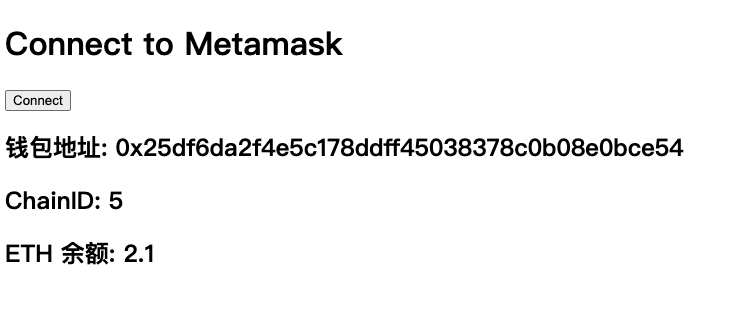

# Ethers极简入门 工具篇: ET01. 连接 Metamask

我最近在重新学`ethers.js`，巩固一下细节，也写一个`WTF Ethers极简入门`，供小白们使用。

**推特**：[@0xAA_Science](https://twitter.com/0xAA_Science)

**WTF Academy社群：** [官网 wtf.academy](https://wtf.academy) | [WTF Solidity教程](https://github.com/AmazingAng/WTFSolidity) | [discord](https://discord.gg/5akcruXrsk) | [微信群申请](https://docs.google.com/forms/d/e/1FAIpQLSe4KGT8Sh6sJ7hedQRuIYirOoZK_85miz3dw7vA1-YjodgJ-A/viewform?usp=sf_link)

所有代码和教程开源在github: [github.com/WTFAcademy/WTFEthers](https://github.com/WTFAcademy/WTFEthers)

-----

这一讲，我们将介绍如何通过 `ethers.js` 在网页上连接小狐狸钱包，读取账户地址，chainID，以及 `ETH` 余额。

## Metamask

Metamask（小狐狸）钱包是以太坊最受欢迎的开源钱包，它可以作为PC端的浏览器插件或移动端（安卓和苹果）的APP使用。

在使用Metamask开发前，你需要先下载它。记住：

**一定要在官网上下载: https://metamask.io/download/**

**一定要在官网上下载: https://metamask.io/download/**

**一定要在官网上下载: https://metamask.io/download/**

重要的事情说三遍。很多多用户钱包被盗，就是下载了盗版的小狐狸钱包之后输入了助记词/私钥。

## 连接metamask

在安装好metamask钱包后，浏览器会给每个页面注入一个`window.ethereum`对象，用于和钱包交互。`ethers.js`提供的 `BrowserProvider` 封装了一个标准的浏览器 Provider，直接在程序中生成一个provider对象，方便使用：

```js
// 获得provider
const provider = new ethers.BrowserProvider(window.ethereum)
```

之后就像 `ethers.js` 中的 `provider` 一样使用就好，下面举几个例子。

首先，我们先写一个简单的HTML页面，因为小狐狸钱包是浏览器插件，必须在浏览器中使用。

```html
<!DOCTYPE html>
<html lang="en">
  <head>
    <meta charset="UTF-8">
    <meta name="viewport" content="width=device-width, initial-scale=1.0">
  </head>
  <body>
    <h1 id="header">Connect to Metamask</h1>
    <button class="connect"> Connect</button>
    <h2>钱包地址: <span class="showAccount"></span></h2>
    <h2>ChainID: <span class="showChainID"></span></h2>
    <h2>ETH 余额: <span class="showETHBalance"></span></h2>
  </body>
</html>
```


然后我们写一些`javascript`脚本嵌入进去。

1. 引入 `ethers.js` 包，获取页面中的按钮和文本变量，给按钮加一个监听器，被点击时会触发 `onClickHandler()` 函数。

    ```js
    import { ethers } from "https://cdnjs.cloudflare.com/ajax/libs/ethers/6.2.3/ethers.js";
    const ethereumButton = document.querySelector('.connect');
    const showAccount = document.querySelector('.showAccount');
    const showChainID = document.querySelector('.showChainID');
    const showETHBalance = document.querySelector('.showETHBalance');

    ethereumButton.addEventListener(`click`, onClickHandler)
    ```

2. 接下来我们写`onClickHandler()` 函数的内容，首先连接metamask，创建`provider`变量。
    ```js
    // 获得provider
    const provider = new ethers.BrowserProvider(window.ethereum)
    ```

3. 获取并打印钱包地址：

    ```js
    // 读取钱包地址
    const accounts = await provider.send("eth_requestAccounts", []);
    const account = accounts[0]
    console.log(`钱包地址: ${account}`)
    showAccount.innerHTML = account;
    ```

4. 获取并打印ChainID：

    ```js
    // 读取chainid
    const { chainId } = await provider.getNetwork()
    console.log(`chainid: ${chainId}`)
    showChainID.innerHTML = chainId;
    ```

5. 读取并打印钱包的 `ETH` 余额：

    ```js
    // 读取ETH余额
    const signer = await provider.getSigner()
    const balance = await provider.getBalance(signer.getAddress());
    console.log(`以太坊余额： ${ethers.formatUnits(balance)}`)
    showETHBalance.innerHTML = ethers.formatUnits(balance);
    ```

6. 在本地运行时，你需要安装`http-server`包，你可以用下面这个命令通过 `npm` 它。
    ```shell
    npm install --global http-server
    ```
    然后切换到相应的文件夹，输入下面命令来运行这个网页。注意，直接点击`.html`文件是不能运行的。
    ```shell
    http-server .
    ```
    如果你看到下面的输出，说明运行成功，打开下面给出的网址就可以打开网页了。
    ```shell
    Starting up http-server, serving .
    Available on:
        http://127.0.0.1:8080
        http://10.6.8.162:8080
    ```



## 总结

这一讲，我们介绍了如何利用`ethers.js`在网页中连接metamask钱包，读取账户地址，chainID，以及 `ETH` 余额。这是构建 DAPP 的基础。