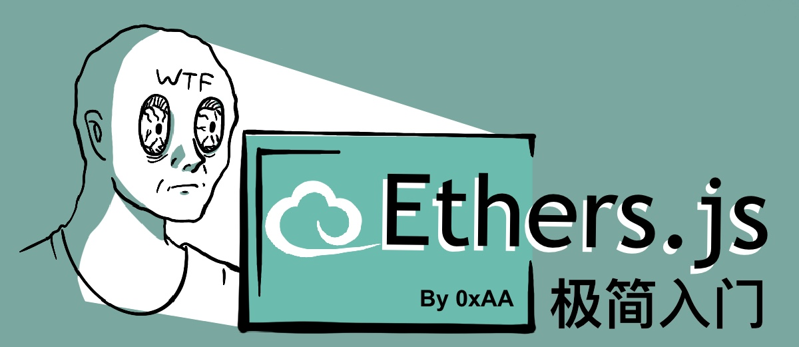

# WTF Ethers
我们最近在重新学ethers.js，巩固一下细节，也写一个“WTF Ethers极简入门”，供小白们使用，每周更新1-3讲。

这是[WTF Solidity极简教程](https://github.com/AmazingAng/WTFSolidity)姊妹篇，由[WTF Academy](https://wtf.academy)社群荣誉出品。

> 注意: 本教程的版本基于最新的 Ethers.js v6版本，之前 v5 版本的教程见 [链接](https://github.com/WTFAcademy/WTF-Ethers/tree/wtf-ethers-v5)。


路线图根据本仓库star数量来定：
- [x] 64 :star: 建立社群：[discord](https://discord.gg/5akcruXrsk) | [微信群](https://docs.google.com/forms/d/e/1FAIpQLSe4KGT8Sh6sJ7hedQRuIYirOoZK_85miz3dw7vA1-YjodgJ-A/viewform)

- [x] 128 :star: 出进阶内容

- [ ] 256 :star: 发课程认证

### VScode运行

需要安装[VSCode](https://code.visualstudio.com/download)和[Node.js](https://nodejs.org/zh-cn/download/)，然后运行：

```shell
npm install
node 01_HelloVitalik/HelloVitalik.js
```
### 在线编辑器运行

`javascript`在线编辑平台：
* [replit.com](https://replit.com/)
* [playcode.io](https://playcode.io)

## 入门
**第1讲：HelloVitalik（6行代码）**：【[Code](https://github.com/WTFAcademy/WTFEthers/blob/main/01_HelloVitalik)】 【[教程](https://github.com/WTFAcademy/WTFEthers/blob/main/01_HelloVitalik/readme.md)】

**第2讲：Provider 提供器**：【[Code](https://github.com/WTFAcademy/WTFEthers/blob/main/02_Provider)】 【[教程](https://github.com/WTFAcademy/WTFEthers/blob/main/02_Provider/readme.md)】

**第3讲：读取合约信息**：【[Code](https://github.com/WTFAcademy/WTFEthers/blob/main/03_ReadContract)】 【[教程](https://github.com/WTFAcademy/WTFEthers/blob/main/03_ReadContract/readme.md)】

**第4讲：发送ETH**：【[Code](https://github.com/WTFAcademy/WTFEthers/blob/main/04_SendETH)】 【[教程](https://github.com/WTFAcademy/WTFEthers/blob/main/04_SendETH/readme.md)】

**第5讲：合约交互**：【[Code](https://github.com/WTFAcademy/WTFEthers/blob/main/05_WriteContract)】 【[教程](https://github.com/WTFAcademy/WTFEthers/blob/main/05_WriteContract/readme.md)】

**第6讲：部署合约**：【[Code](https://github.com/WTFAcademy/WTFEthers/blob/main/06_DeployContract)】 【[教程](https://github.com/WTFAcademy/WTFEthers/blob/main/06_DeployContract/readme.md)】

**第7讲：检索事件**：【[Code](https://github.com/WTFAcademy/WTFEthers/blob/main/07_Event)】 【[教程](https://github.com/WTFAcademy/WTFEthers/blob/main/07_Event/readme.md)】


**第8讲：合约监听**：【[Code](https://github.com/WTFAcademy/WTFEthers/blob/main/08_ContractListener)】 【[教程](https://github.com/WTFAcademy/WTFEthers/blob/main/08_ContractListener/readme.md)】


**第9讲：事件过滤**：【[Code](https://github.com/WTFAcademy/WTFEthers/blob/main/09_EventFilter)】 【[教程](https://github.com/WTFAcademy/WTFEthers/blob/main/09_EventFilter/readme.md)】

**第10讲：单位转换**：【[Code](https://github.com/WTFAcademy/WTFEthers/blob/main/10_Units)】 【[教程](https://github.com/WTFAcademy/WTFEthers/blob/main/10_Units/readme.md)】

## 进阶

**第11讲：CallStatic**：【[Code](https://github.com/WTFAcademy/WTFEthers/blob/main/11_StaticCall)】 【[教程](https://github.com/WTFAcademy/WTFEthers/blob/main/11_StaticCall/readme.md)】

**第12讲：识别ERC721**：【[Code](https://github.com/WTFAcademy/WTFEthers/blob/main/12_ERC721Check)】 【[教程](https://github.com/WTFAcademy/WTFEthers/blob/main/12_ERC721Check/readme.md)】

**第13讲：编码calldata**：【[Code](https://github.com/WTFAcademy/WTFEthers/blob/main/13_EncodeCalldata)】 【[教程](https://github.com/WTFAcademy/WTFEthers/blob/main/13_EncodeCalldata/readme.md)】

**第14讲：批量生成钱包**：【[Code](https://github.com/WTFAcademy/WTFEthers/blob/main/14_HDwallet)】 【[教程](https://github.com/WTFAcademy/WTFEthers/blob/main/14_HDwallet/readme.md)】

**第15讲：批量转账**：【[Code](https://github.com/WTFAcademy/WTFEthers/blob/main/15_MultiTransfer)】 【[教程](https://github.com/WTFAcademy/WTFEthers/blob/main/15_MultiTransfer/readme.md)】

**第16讲：批量归集**：【[Code](https://github.com/WTFAcademy/WTFEthers/blob/main/16_MultiCollect)】 【[教程](https://github.com/WTFAcademy/WTFEthers/blob/main/16_MultiCollect/readme.md)】

**第17讲：MerkleTree脚本**：【[Code](https://github.com/WTFAcademy/WTFEthers/blob/main/17_MerkleTree)】 【[教程](https://github.com/WTFAcademy/WTFEthers/blob/main/17_MerkleTree/readme.md)】

**第18讲：数字签名脚本**：【[Code](https://github.com/WTFAcademy/WTFEthers/blob/main/18_Signature)】 【[教程](https://github.com/WTFAcademy/WTFEthers/blob/main/18_Signature/readme.md)】

**第19讲：监听Mempool**：【[Code](https://github.com/WTFAcademy/WTFEthers/blob/main/19_Mempool)】 【[教程](https://github.com/WTFAcademy/WTFEthers/blob/main/19_Mempool/readme.md)】

**第20讲：解码交易数据**：【[Code](https://github.com/WTFAcademy/WTFEthers/blob/main/20_DecodeTx)】 【[教程](https://github.com/WTFAcademy/WTFEthers/blob/main/20_DecodeTx/readme.md)】

## 应用

**第21讲：靓号生成器**：【[Code](https://github.com/WTFAcademy/WTFEthers/blob/main/21_VanityAddress)】 【[教程](https://github.com/WTFAcademy/WTFEthers/blob/main/21_VanityAddress/readme.md)】

**第22讲：读取任意数据**：【[Code](https://github.com/WTFAcademy/WTFEthers/blob/main/22_ReadAnyData)】 【[教程](https://github.com/WTFAcademy/WTFEthers/blob/main/22_ReadAnyData/readme.md)】

**第23讲：抢先交易脚本**：【[Code](https://github.com/WTFAcademy/WTFEthers/blob/main/23_Frontrun)】 【[教程](https://github.com/WTFAcademy/WTFEthers/blob/main/23_Frontrun/readme.md)】

**第24讲：识别ERC20**：【[Code](https://github.com/WTFAcademy/WTFEthers/blob/main/24_ERC20Check)】 【[教程](https://github.com/WTFAcademy/WTFEthers/blob/main/24_ERC20Check/readme.md)】

**第25讲：Flashbots**：【[Code](https://github.com/WTFAcademy/WTFEthers/blob/main/25_Flashbots)】 【[教程](https://github.com/WTFAcademy/WTFEthers/blob/main/25_Flashbots/readme.md)】

**第26讲：EIP712 签名脚本**：【[Code](https://github.com/WTFAcademy/WTFEthers/blob/main/26_EIP712)】 【[教程](https://github.com/WTFAcademy/WTFEthers/blob/main/26_EIP712/readme.md)】

## 工具

**ET01：连接钱包**：【[Code](https://github.com/WTFAcademy/WTFEthers/blob/main/ET01_Metamask)】 【[教程](https://github.com/WTFAcademy/WTFEthers/blob/main/ET01_Metamask/readme.md)】

**ET02：钱包签名登录**：【[Code](https://github.com/WTFAcademy/WTFEthers/blob/main/ET02_SignInWithEthereum)】 【[教程](https://github.com/WTFAcademy/WTFEthers/blob/main/ET02_SignInWithEthereum/readme.md)】

## WTF Ethers贡献者
<div align="center">
  <h4 align="center">
    贡献者是WTF学院的基石
  </h4>
  <a href="https://github.com/WTFAcademy/WTF-Ethers/graphs/contributors">
    
  </a>
</div>

## 参考
- [Ethers.js Docs](https://docs.ethers.org/v5/)
- [A beginner’s guide: 4 ways to play with Ethers.js](https://dev.to/yakult/a-beginers-guide-four-ways-to-play-with-ethersjs-354a)