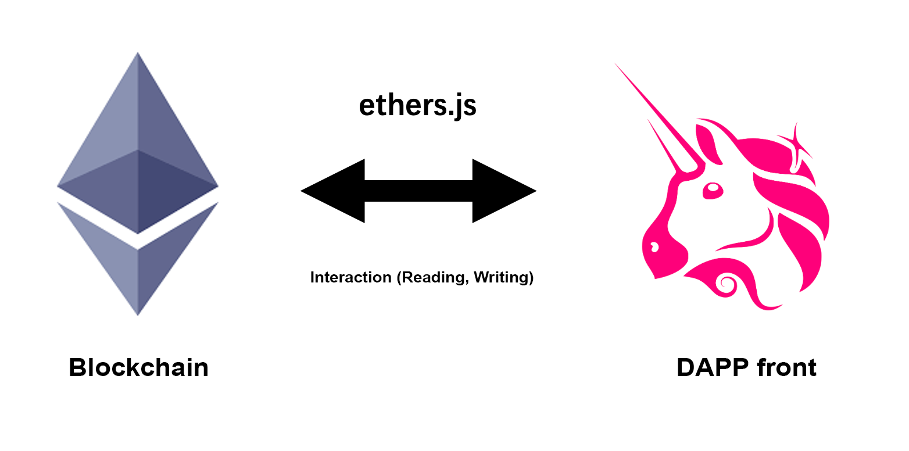
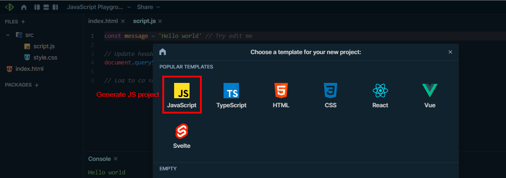
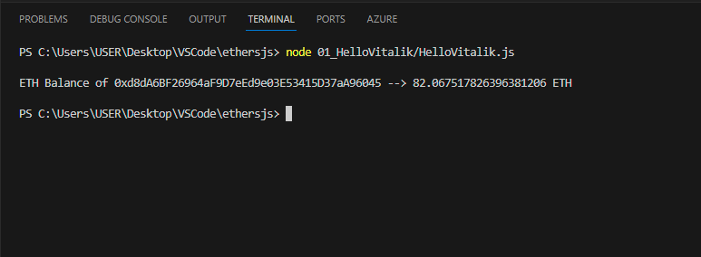

# WTF Ethers: 1. Hello Vitalik

I've been revisiting `ethers.js` recently to refresh my understanding of the details and to write a simple tutorial called "WTF Ethers" for beginners.

**Twitter**: [@0xAA_Science](https://twitter.com/0xAA_Science)

**Community**: [Website wtf.academy](https://wtf.academy) | [WTF Solidity](https://github.com/AmazingAng/WTFSolidity) | [discord](https://discord.gg/5akcruXrsk) | [WeChat Group Application](https://docs.google.com/forms/d/e/1FAIpQLSe4KGT8Sh6sJ7hedQRuIYirOoZK_85miz3dw7vA1-YjodgJ-A/viewform?usp=sf_link)

All the code and tutorials are open-sourced on GitHub: [github.com/WTFAcademy/WTF-Ethers](https://github.com/WTFAcademy/WTF-Ethers)

-----

In this lesson, we will introduce the `ethers.js` library and write our first program, `HelloVitalik`: it will query Vitalik's ETH balance and output it to the console.

> This tutorial uses the latest version of ethers.js, v6, which has significant changes compared to v5. For v5 tutorial, please check [link](https://github.com/WTFAcademy/WTF-Ethers/tree/wtf-ethers-v5).

## Overview of ethers.js

`ethers.js` is a complete and compact open-source library for interacting with the Ethereum blockchain and its ecosystem. If you want to build a frontend for a Dapp or write a script to interact with Ethereum, you will need to use `ethers.js`.

Compared to the earlier library `web3.js`, `ethers.js` has the following advantages:

1. More compact code: `ethers.js` is 116.5 kB, while `web3.js` is 590.6 kB.
2. More secure: `Web3.js` assumes that users will deploy a local Ethereum node, and the private keys and network connectivity are managed by this node (which is not actually the case); in `ethers.js`, the `Provider` class manages network connectivity, while the `Wallet` class manages keys, making it more secure and flexible.
3. Native support for `ENS`.



## Development Tools

### 1. VScode (recommended)

You can use local `vscode` for development. You need to install [Node.js](https://nodejs.org/en/download/), and then use the package manager `npm` to install the `ethers` library:

```shell
npm install ethers --save
```

### 2. Playcode (unstable)


[Playcode](https://playcode.io/) is an online platform for compiling JavaScript. You can run `.js` files without configuring `Nodejs`, which is very convenient.



In this chapter, we will demonstrate using `playcode`. You need to register a free account on the official website, then create a new project with the `Javascript` template by clicking `OPEN PLAYGROUND`, and write the code in the auto-generated `script.js` file. However, `playcode` may not be stable when using `ethers`, so we recommend using VScode.

## HelloVitalik

Now, let's write our first program using `ethers` called `HelloVitalik`: it will query Vitalik's ETH balance and output it to the console. The entire program only requires 6 lines, very simple!

**Note**: When running for the first time on `playcode`, it may prompt `module not found`. This is because the `ethers` library has not been installed, simply click the `install` button to install it. If this does not work, please use VScode locally.


```javascript
import { ethers } from "ethers";
const provider = ethers.getDefaultProvider();
const main = async () => {
    const balance = await provider.getBalance(`vitalik.eth`);
    console.log(`ETH Balance of vitalik: ${ethers.formatEther(balance)} ETH`);
}
main()
```

Let's analyze the program line by line:

### 1. Import `ethers`

The first line imports the installed `ethers` library:
```javascript
import { ethers } from "ethers";
```
If you are using the `playcode` platform where free accounts cannot install external libraries, you can directly import from the `ethers` CDN (for educational purposes only due to security considerations):
```javascript
import { ethers } from "https://cdnjs.cloudflare.com/ajax/libs/ethers/6.2.3/ethers.js";
```

### 2. Connect to Ethereum

In `ethers`, the `Provider` class is an abstract class that provides Ethereum network connectivity. It provides read-only access to the blockchain and its state. We declare a `provider` to connect to the Ethereum network. `ethers` provides some common RPCs for easy connection to Ethereum:

```javascript
const provider = ethers.getDefaultProvider();
```

**Note**: The built-in `rpc` in `ethers` has limitations on access speed and is for testing purposes only. In a production environment, it is recommended to use a personal `rpc`. For example:

```js
const ALCHEMY_MAINNET_URL = 'https://eth-mainnet.g.alchemy.com/v2/oKmOQKbneVkxgHZfibs-iFhIlIAl6HDN';
const provider = new ethers.JsonRpcProvider(ALCHEMY_MAINNET_URL);
```

### 3. Declare an `async` function

Since interactions with the blockchain are not real-time, we need to use the `async/await` syntax in JavaScript. Each call with the blockchain requires the use of `await`, and we wrap these calls in an `async` function.
```javascript
const main = async () => {
    //...
}
main();
```

### 4. Get the `ETH` balance of Vitalik's address

We can use the `getBalance()` function of the `Provider` class to query the `ETH` balance of a specific address. Since `ethers` natively supports `ENS` domain names, we can query the balance of Ethereum founder Vitalik's address using the `ENS` domain name `vitalik.eth`.

```javascript
const balance = await provider.getBalance(`vitalik.eth`);
```

### 5. Convert units and output to the console

The Ethereum balance we obtained from the chain is in `wei`, where `1 ETH = 10^18 wei`. Before printing it to the console, we need to convert the units. `ethers` provides a utility function called `formatEther`, which we can use to convert `wei` to `ETH`.

```javascript
    console.log(`ETH Balance of Vitalik: ${ethers.formatEther(balance)} ETH`);
```

If you are using the VScode development tool, you need to enter the following command in the VScode terminal to run the script:
```shell
node 01_HelloVitalik/HelloVitalik.js
```
This way, you will see Vitalik's `ETH` balance in the console: `1951 ETH`. Of course, this is not his entire holdings. He has multiple wallets, and `vitalik.eth` is likely one of his frequently used hot wallets.




## Summary

This concludes the first lesson of the WTF Ethers tutorial. We introduced `ethers.js` and completed our first program using `ethers`: `HelloVitalik`, which queries Vitalik's wallet balance.

**Post-Class Assignment**: In Figures 4 and 5, Vitalik's `ETH` balance is different. The balance in the first image is `2251 ETH`, while in the second image it becomes `1951 ETH`, a decrease of `300 ETH`. In fact, these two images correspond to Vitalik's holdings on `2022.07.30` and `2022.07.31`. So, what did Vitalik do with `300 ETH` on that day?

## Recommended Readings

[ethers v5 Official Documentation](https://docs.ethers.io/v5/)

[ethers[v6] Official Documentation](https://docs.ethers.io/v6/)