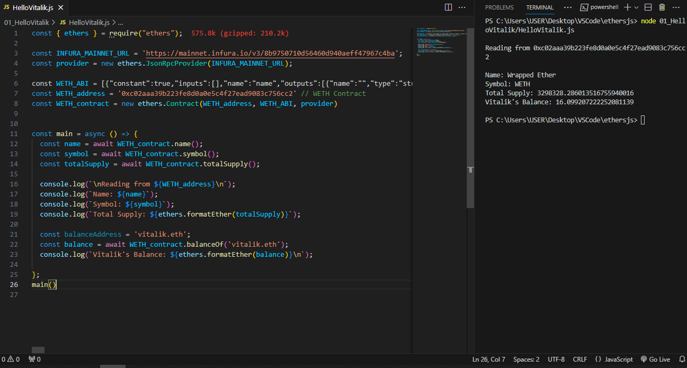
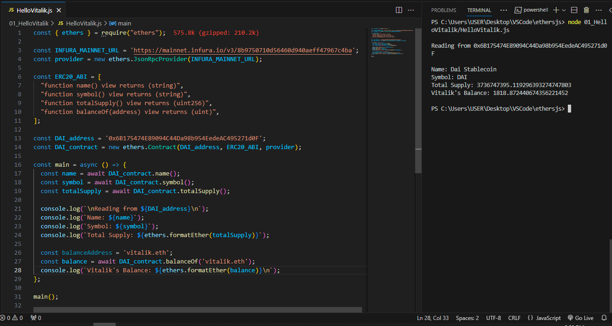

# WTF Ethers: 3. Read Contract Information

I've been revisiting `ethers.js` recently to refresh my understanding of the details and to write a simple tutorial called "WTF Ethers" for beginners.

**Twitter**: [@0xAA_Science](https://twitter.com/0xAA_Science)

**Community**: [Website wtf.academy](https://wtf.academy) | [WTF Solidity](https://github.com/AmazingAng/WTFSolidity) | [discord](https://discord.gg/5akcruXrsk) | [WeChat Group Application](https://docs.google.com/forms/d/e/1FAIpQLSe4KGT8Sh6sJ7hedQRuIYirOoZK_85miz3dw7vA1-YjodgJ-A/viewform?usp=sf_link)

All the code and tutorials are open-sourced on GitHub: [github.com/WTFAcademy/WTF-Ethers](https://github.com/WTFAcademy/WTF-Ethers)

-----

In this lesson, we will introduce the `Contract` class and use it to read information from contracts on Ethereum.

## The `Contract` Class

In `ethers`, the `Contract` class is an abstraction of contracts (EVM bytecode) deployed on the Ethereum network. Through it, developers can easily read (`call`) and transact with contracts, as well as obtain transaction results and events. The power of Ethereum lies in its contracts, so it is essential to have a good understanding of contract operations.

## Creating a `Contract` Variable

### Read-only and Read-write Contracts

`Contract` objects can be divided into two types: read-only and read-write. Read-only `Contract` objects can only read contract information on the chain by executing `call` operations, which involve calling the `view` and `pure` functions in the contract. They cannot perform `transaction` operations. The methods of creating these two types of `Contract` variables are different:

- Read-only `Contract` variable: The parameters are the contract address, contract `abi`, and `provider` variable (read-only).

```javascript
const contract = new ethers.Contract(`address`, `abi`, `provider`);
```

- Read-write `Contract` variable: The parameters are the contract address, contract `abi`, and `signer` variable. The `Signer` is another class in `ethers` that is used for signing transactions, which we will cover later.

```javascript
const contract = new ethers.Contract(`address`, `abi`, `signer`);
```

**Note:** In `ethers`, the `call` operation refers to a read-only operation, which is different from the `call` in `Solidity`.

## Reading Contract Information

### 1. Creating a Provider

We will use the Alchemy node's API Key to create a `Provider`:
```javascript
import { ethers } from "ethers";
// Connect to the Ethereum network using the Alchemy RPC node
// Prepare alchemy API, refer to https://github.com/AmazingAng/WTFSolidity/blob/main/Topics/Tools/TOOL04_Alchemy/readme.md
const ALCHEMY_MAINNET_URL = 'https://eth-mainnet.g.alchemy.com/v2/oKmOQKbneVkxgHZfibs-iFhIlIAl6HDN';
const provider = new ethers.JsonRpcProvider(ALCHEMY_MAINNET_URL);
```

### 2. Creating a Read-only Contract Instance

To create a read-only contract instance, we need to provide three parameters: the contract address, contract `abi`, and `provider` variable. The contract address can be found online, and we have already created the `provider` variable in the previous step. But how do we fill in the `abi`?

`ABI` (Application Binary Interface) is the standard for interacting with Ethereum smart contracts. For more information, refer to [WTF Solidity Tutorials Lesson 27: ABI Encoding](https://github.com/AmazingAng/WTF-Solidity/blob/main/27_ABIEncode/readme.md). `ethers` supports two ways of providing `abi`:

- **Method 1:** Directly input the contract `abi`. You can copy it from the compilation page of Remix, generate it locally when compiling contracts (located in the `artifact` folder), or obtain it from the code page of an open-source contract on Etherscan. We will use this method to create an instance of the `WETH` contract:

```javascript
// Method 1: Copy the full abi
// You can copy the WETH abi from here: https://etherscan.io/token/0xc02aaa39b223fe8d0a0e5c4f27ead9083c756cc2#code
const abiWETH = '[{"constant":true,"inputs":[],"name":"name","outputs":[{"name":"","type":"string"}],"payable":false,"stateMutability":"view",...omitted for brevity...]';
const addressWETH = '0xc02aaa39b223fe8d0a0e5c4f27ead9083c756cc2' // WETH Contract
const contractWETH = new ethers.Contract(addressWETH, abiWETH, provider)

```


- **Method 2:** Since the readability of `abi` is poor, `ethers` introduces an innovative approach called `Human-Readable Abi`. Developers can write `abi` using `function signature` and `event signature`. We will use this method to create an instance of the stable coin `DAI`:

```javascript
// Method 2: Input the functions needed for the program, separated by commas. ethers will automatically convert them into the corresponding abi for you.
// Human-readable abi, using the example of an ERC20 contract
const abiERC20 = [
    "function name() view returns (string)",
    "function symbol() view returns (string)",
    "function totalSupply() view returns (uint256)",
    "function balanceOf(address) view returns (uint)",
];
const addressDAI = '0x6B175474E89094C44Da98b954EedeAC495271d0F' // DAI Contract
const contractDAI = new ethers.Contract(addressDAI, abiERC20, provider)
```

### 3. Reading on-chain information of `WETH` and `DAI`

We can use the read-only `Contract` instance to call the `view` and `pure` functions of the contract to obtain on-chain information:

```javascript
const main = async () => {
    // 1. Reading on-chain information of the WETH contract (WETH abi)
    const nameWETH = await contractWETH.name()
    const symbolWETH = await contractWETH.symbol()
    const totalSupplyWETH = await contractWETH.totalSupply()
    console.log("\n1. Reading WETH contract information")
    console.log(`Contract address: ${addressWETH}`)
    console.log(`Name: ${nameWETH}`)
    console.log(`Symbol: ${symbolWETH}`)
    console.log(`Total supply: ${ethers.formatEther(totalSupplyWETH)}`)
    const balanceWETH = await contractWETH.balanceOf('vitalik.eth')
    console.log(`Vitalik's balance: ${ethers.formatEther(balanceWETH)}\n`)

    // 2. Reading on-chain information of the DAI contract (IERC20 interface contract)
    const nameDAI = await contractDAI.name()
    const symbolDAI = await contractDAI.symbol()
    const totalSupplDAI = await contractDAI.totalSupply()
    console.log("\n2. Retrieve DAI contract information")
    console.log(`Contract Address: ${addressDAI}`)
    console.log(`Name: ${nameDAI}`)
    console.log(`Code: ${symbolDAI}`)
    console.log(`Total Supply: ${ethers.formatEther(totalSupplDAI)}`)
    const balanceDAI = await contractDAI.balanceOf('vitalik.eth')
    console.log(`Vitalik's Balance: ${ethers.formatEther(balanceDAI)}\n`)
}

main()
```

As you can see, instances of contracts created using both methods can successfully interact with the blockchain. Vitalik's wallet contains `0.05 WETH` and `555508 DAI`, as shown in the figure below.




**Explanation:**
We can verify the balance of `WETH` in Vitalik's wallet and whether it matches the one read from the `Contract` using the [Ethereum browser](https://etherscan.io/token/0xc02aaa39b223fe8d0a0e5c4f27ead9083c756cc2#readContract). By using [ENS](https://app.ens.domains/name/vitalik.eth/details), we found that Vitalik's wallet address is `0xd8dA6BF26964aF9D7eEd9e03E53415D37aA96045`. By using the `balanceOf` contract method, we obtained a balance of exactly `0.05 WETH`. The conclusion is consistent!


## Summary

In this lesson, we introduced the `Contract` class in `ethers` and created read-only `Contract` instances for `WETH` and `DAI`. We successfully read Vitalik's balances for these two tokens.