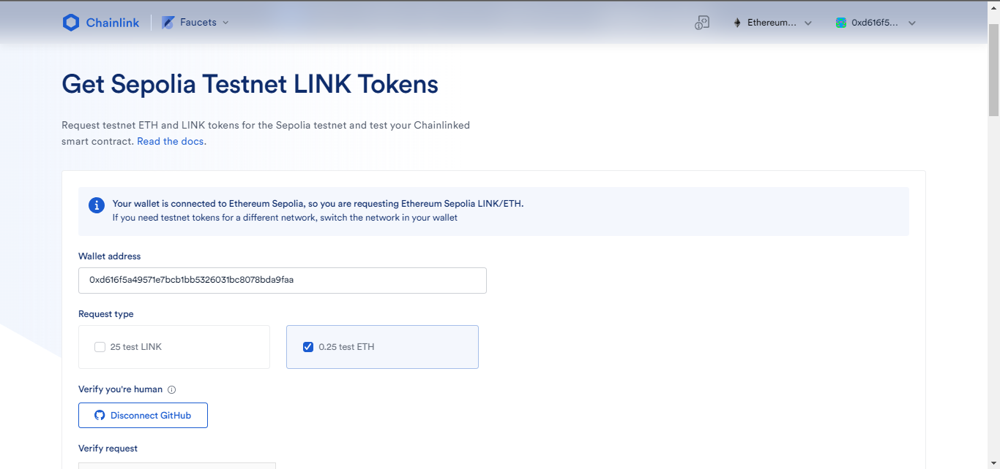
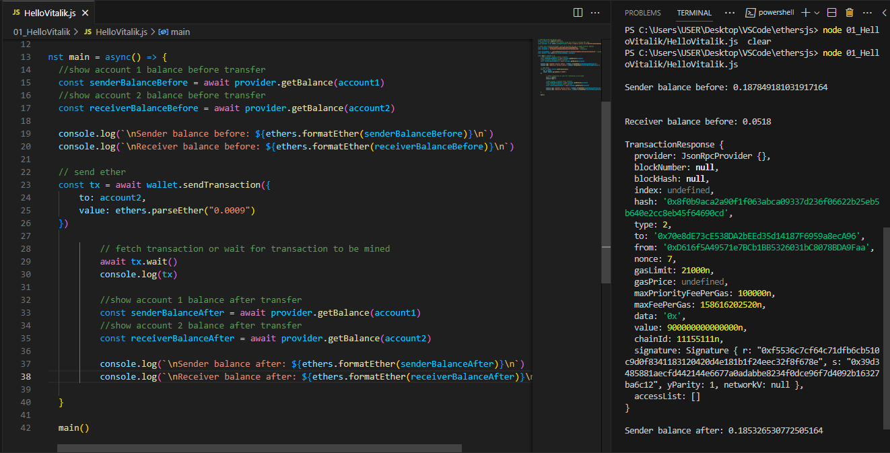
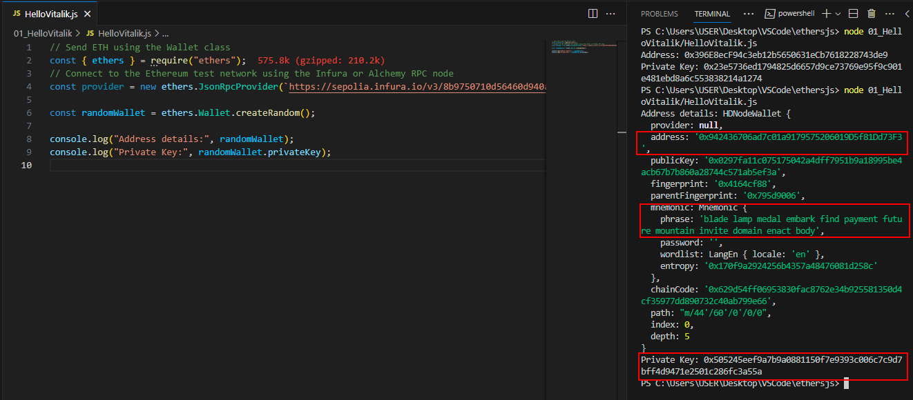
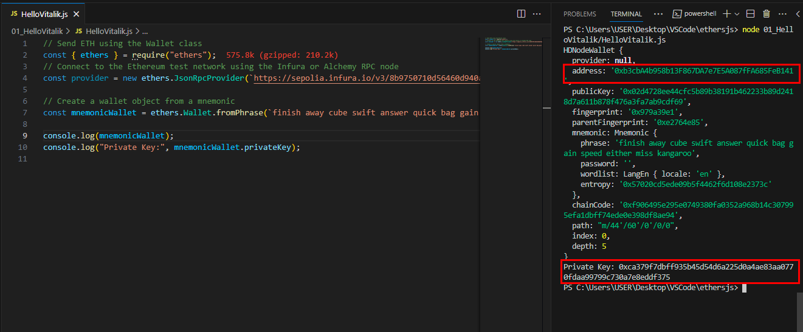

# WTF Ethers: 4. Send ETH

I've been revisiting `ethers.js` recently to refresh my understanding of the details and to write a simple tutorial called "WTF Ethers" for beginners.

**Twitter**: [@0xAA_Science](https://twitter.com/0xAA_Science)

**Community**: [Website wtf.academy](https://wtf.academy) | [WTF Solidity](https://github.com/AmazingAng/WTFSolidity) | [discord](https://discord.gg/5akcruXrsk) | [WeChat Group Application](https://docs.google.com/forms/d/e/1FAIpQLSe4KGT8Sh6sJ7hedQRuIYirOoZK_85miz3dw7vA1-YjodgJ-A/viewform?usp=sf_link)

All the code and tutorials are open-sourced on GitHub: [github.com/WTFAcademy/WTF-Ethers](https://github.com/WTFAcademy/WTF-Ethers)

-----

In this lesson, we will introduce the `Signer` class and its derived class `Wallet`, and use it to send `ETH`.

## `Signer` Class

Unlike `Web3.js`, which assumes that users will deploy Ethereum nodes locally and manage private keys and network connection status through this node (which is not actually the case), `ethers.js` manages network connection status with the `Provider` class, and manages keys securely and flexibly with the `Signer` class or `Wallet` class, separately.

In `ethers`, the `Signer` class is an abstraction of an Ethereum account that can be used to sign messages and transactions, send signed transactions to the Ethereum network, and modify the blockchain state. The `Signer` class is an abstract class and cannot be instantiated directly, so we need to use its subclass: the `Wallet` class.

## `Wallet` Class

The `Wallet` class inherits from the `Signer` class. Developers can use it to sign transactions and messages just like they own an Externally Owned Account (EOA) with a private key.

Below are several ways to create instances of the `Wallet` class:

### Method 1: Creating a wallet object with a random private key

We can use the `ethers.Wallet.createRandom()` function to create a `Wallet` object with a randomly generated private key. The private key is generated from an encrypted secure entropy source. If there is no secure entropy source in the current environment, an error will be thrown (this method cannot be used on the online platform `playcode`).

```javascript
// Create a wallet object with a random private key
const wallet1 = ethers.Wallet.createRandom()
```

### Method 2: Creating a wallet object with a known private key

If we know the private key, we can use the `ethers.Wallet()` function to create a `Wallet` object.

```javascript
// Create a wallet object with a private key and provider
const privateKey = '0x227dbb8586117d55284e26620bc76534dfbd2394be34cf4a09cb775d593b6f2b'
const wallet2 = new ethers.Wallet(privateKey, provider)
```

### Method 3: Creating a wallet object from a mnemonic

If we know the mnemonic, we can use the `ethers.Wallet.fromMnemonic()` function to create a `Wallet` object.

```javascript
// Create a wallet object from a mnemonic
const wallet3 = ethers.Wallet.fromMnemonic(mnemonic.phrase)
```

### Other methods: Creating a wallet object from a JSON file

The above three methods can meet most requirements. However, we can also create a wallet instance by decrypting a JSON wallet file using `ethers.Wallet.fromEncryptedJson`. The JSON file is usually the `keystore` file from wallets like Geth and Parity, which would be familiar to anyone who has set up an Ethereum node using Geth.

## Sending ETH

We can use a `Wallet` instance to send ETH. First, we need to construct a transaction request, declaring the recipient address `to` and the amount of ETH to be sent `value`. The transaction request, of type `TransactionRequest`, can include the sender address `from`, nonce value `nounce`, request data `data`, and other information, which will be explained in more detail in later tutorials.

```javascript
    // Create a transaction request with the recipient address 'to' and the amount of ETH 'value'
    const tx = {
        to: address1,
        value: ethers.parseEther("0.001")
    }
```

Then, we can use the `sendTransaction` method of the `Wallet` class to send the transaction, wait for it to be confirmed on the chain, and get the transaction receipt. It's that simple.

```javascript
    // Send the transaction and get the receipt
    const receipt = await wallet2.sendTransaction(tx)
    await receipt.wait() // Wait for the transaction to be confirmed on the chain
    console.log(receipt) // Print the transaction details
```

## Code Examples

### 1. Create a `Provider` instance

```javascript
// Send ETH using the Wallet class
// Since playcode does not support the ethers.Wallet.createRandom() function, we can only run this code in VScode
import { ethers } from "ethers";

// Connect to the Ethereum test network using the Alchemy RPC node
// For how to prepare Alchemy API, please refer to https://github.com/AmazingAng/WTFSolidity/blob/main/Topics/Tools/TOOL04_Alchemy/readme.md
const ALCHEMY_GOERLI_URL = 'https://eth-goerli.alchemyapi.io/v2/GlaeWuylnNM3uuOo-SAwJxuwTdqHaY5l';
const provider = new ethers.JsonRpcProvider(ALCHEMY_GOERLI_URL);
```

### 2. Create `Wallet` instances using three different methods

- Create a `Wallet` object with a random private key. Wallets created using this method are standalone, and we need to use the `connect(provider)` function to connect to the Ethereum node. Wallets created using this method can be used to obtain a mnemonic phrase.

```javascript
// Create a wallet object with a random private key
const wallet1 = ethers.Wallet.createRandom()
const wallet1WithProvider = wallet1.connect(provider)
const mnemonic = wallet1.mnemonic // Get the mnemonic phrase
```

- Create a `Wallet` object with a private key and `Provider` instance. Wallets created using this method cannot obtain a mnemonic phrase.

```javascript
// Create a wallet object with a private key and provider
const privateKey = '0x227dbb8586117d55284e26620bc76534dfbd2394be34cf4a09cb775d593b6f2b'
const wallet2 = new ethers.Wallet(privateKey, provider)
```

- Create a `Wallet` object with a mnemonic. Here, we use the mnemonic of `wallet1`, so the private key and public key of the created wallet will be the same as `wallet1`.

```javascript
// Create a wallet object from a mnemonic
const wallet3 = ethers.Wallet.fromPhrase(mnemonic.phrase)
```

### 3. Get the wallet addresses

Use the `getAddress()` function to get the wallet addresses.

```javascript
    const address1 = await wallet1.getAddress()
    const address2 = await wallet2.getAddress() 
    const address3 = await wallet3.getAddress() // Get the addresses
    console.log(`1. Get the wallet addresses`);
    console.log(`Address of Wallet 1: ${address1}`);
    console.log(`Address of Wallet 2: ${address2}`);
    console.log(`Address of Wallet 3: ${address3}`);
    console.log(`Are the addresses of Wallet 1 and Wallet 3 the same? ${address1 === address3}`);
    
```



### 4. Get Mnemonic

Get the mnemonic phrase using the `mnemonic.phrase` member of the wallet object:

```javascript
console.log(`Wallet 1 mnemonic: ${wallet1.mnemonic.phrase}`)
```


### 5. Get Private Key
Get the private key using the `privateKey` member of the wallet object:

```javascript
console.log(`Wallet 2 private key: ${wallet2.privateKey}`)
```




### 6. Get Number of Interactions on the Chain for the Wallet

Use the `getTransactionCount()` function to get the number of interactions on the chain for the wallet.

```javascript
    const txCount1 = await provider.getTransactionCount(wallet1WithProvider)
    const txCount2 = await provider.getTransactionCount(wallet2)
    console.log(`Number of transactions sent by Wallet 1: ${txCount1}`)
    console.log(`Number of transactions sent by Wallet 2: ${txCount2}`)
```




### 7. Send `ETH`

We send `0.001 ETH` from `wallet2` to `wallet1` and print the wallet balances before and after the transaction. Since `wallet1` is a newly created random private key wallet, the balance before the transaction is `0`, and after the transaction, it becomes `0.001 ETH`.


```javascript
    // 5. Send ETH
    // If this wallet doesn't have any goerli testnet ETH, get some from a faucet, wallet address: 0xe16C1623c1AA7D919cd2241d8b36d9E79C1Be2A2
    // 1. chainlink faucet: https://faucets.chain.link/goerli
    // 2. paradigm faucet: https://faucet.paradigm.xyz/
    console.log(`\n5. Send ETH (testnet)`);
    // i. Print balance before the transaction
    console.log(`i. Balance before sending`)
    console.log(`Wallet 1: ${ethers.formatEther(await provider.getBalance(wallet1WithProvider))} ETH`)
    console.log(`Wallet 2: ${ethers.formatEther(await provider.getBalance(wallet2))} ETH`)
    // ii. Create transaction request, parameters: to is the receiving address, value is the amount of ETH
    const tx = {
        to: address1,
        value: ethers.parseEther("0.001")
    }
    // iii. Send transaction and get receipt
    console.log(`\nii. Waiting for transaction to be confirmed on the blockchain (may take a few minutes)`)
    const receipt = await wallet2.sendTransaction(tx)
    await receipt.wait() // Wait for the transaction to be confirmed on the chain
    console.log(receipt) // Print transaction details
    // iv. Print balance after the transaction
    console.log(`\niii. Balance after sending`)
    console.log(`Wallet 1: ${ethers.formatEther(await provider.getBalance(wallet1WithProvider))} ETH`)
    console.log(`Wallet 2: ${ethers.formatEther(await provider.getBalance(wallet2))} ETH`)
```


## Summary

In this lesson, we introduced the `Signer` and `Wallet` classes, used the wallet instance to get the address, mnemonic phrase, private key, and number of interactions on the chain, and sent `ETH`.