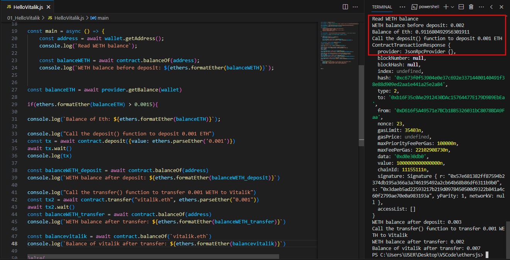
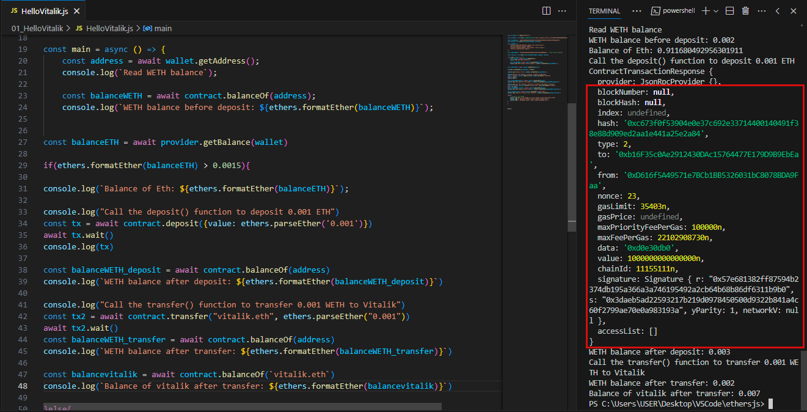
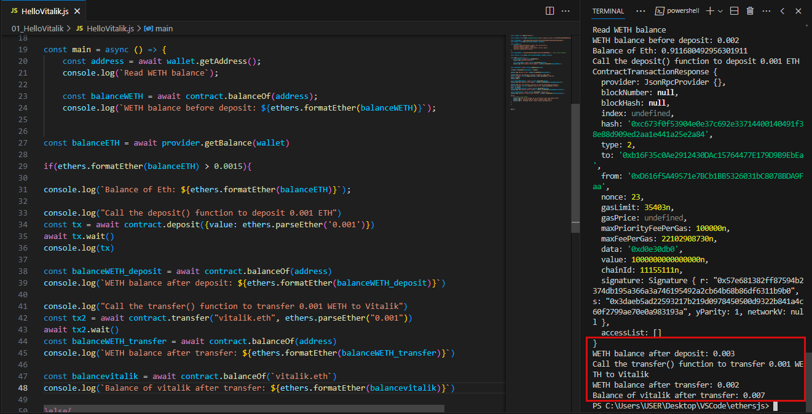

# WTF Ethers: 5. Contract Interaction

I've been revisiting `ethers.js` recently to refresh my understanding of the details and to write a simple tutorial called "WTF Ethers" for beginners.

**Twitter**: [@0xAA_Science](https://twitter.com/0xAA_Science)

**Community**: [Website wtf.academy](https://wtf.academy) | [WTF Solidity](https://github.com/AmazingAng/WTFSolidity) | [discord](https://discord.gg/5akcruXrsk) | [WeChat Group Application](https://docs.google.com/forms/d/e/1FAIpQLSe4KGT8Sh6sJ7hedQRuIYirOoZK_85miz3dw7vA1-YjodgJ-A/viewform?usp=sf_link)

All the code and tutorials are open-sourced on GitHub: [github.com/WTFAcademy/WTF-Ethers](https://github.com/WTFAcademy/WTF-Ethers)

-----

In this lesson, we will learn how to declare a writable `Contract` variable and interact with the `WETH` contract on the test network.

## Creating a Writable `Contract` Variable

The rule for declaring a writable `Contract` variable is as follows:

```js
const contract = new ethers.Contract(address, abi, signer)
```

Here, `address` is the contract address, `abi` is the contract's ABI interface, and `signer` is the `wallet` object. Note that you need to provide a `signer` here, whereas when declaring a readable contract, you only need to provide a `provider`.

You can also convert a readable contract into a writable contract using the following method:
```js
const contract2 = contract.connect(signer)
```

## Contract Interaction

In [Lesson 3](https://github.com/WTFAcademy/WTFEthers/tree/main/en/03_ReadContract/readme.md), we learned how to read contract information. It does not require any gas. Here, we will learn how to write to a contract, which involves building a transaction and paying for gas. This transaction will be validated by every node and miner on the network, and the blockchain state will be changed.

You can interact with a contract using the following methods:
```js
// Send a transaction
const tx = await contract.METHOD_NAME(args [, overrides])
// Wait for the transaction to be confirmed on the chain
await tx.wait()
```

Here, `METHOD_NAME` is the name of the function to be called, `args` is the function's parameters, and `[, overrides]` is optional data that can be passed, including:
- gasPrice: Gas price
- gasLimit: Gas limit
- value: Ether sent during the call (in wei)
- nonce: Nonce

**Note:** This method cannot fetch the return value of the contract. If you need it, you have to use Solidity events to record the value and then query using the transaction receipt.

## Example: Interacting with the Test Network's `WETH` Contract

`WETH` (Wrapped ETH) is a wrapped version of `ETH`. It wraps native Ethereum tokens using a smart contract to conform to the `ERC20` standard. For more detailed content about the `WETH` contract, refer to the [WTF Solidity Tutorial on WETH](https://www.wtf.academy/solidity-application/WETH/).

1. Create the `provider` and `wallet` variables.

    ```js
    import { ethers } from "ethers";

    // Connect to the Ethereum network using Alchemy's RPC node
    const ALCHEMY_GOERLI_URL = 'https://eth-goerli.alchemyapi.io/v2/GlaeWuylnNM3uuOo-SAwJxuwTdqHaY5l';
    const provider = new ethers.JsonRpcProvider(ALCHEMY_GOERLI_URL);

    // Create a wallet object using the private key and provider
    const privateKey = '0x227dbb8586117d55284e26620bc76534dfbd2394be34cf4a09cb775d593b6f2b'
    const wallet = new ethers.Wallet(privateKey, provider)
    ```

2. Create a writable `WETH` contract variable. We include four functions that we will call in the contract's ABI:

    - `balanceOf(address)`: Query the `WETH` balance of an address.
    - `deposit()`: Convert transferred `ETH` to `WETH` within the contract.
    - `transfer(address, uint256)`: Transfer `WETH` to an address.
    - `withdraw(uint256)`: Withdraw funds from the contract.

    ```js
    // WETH ABI
    const abiWETH = [
        "function balanceOf(address) public view returns(uint)",
        "function deposit() public payable",
        "function transfer(address, uint) public returns (bool)",
        "function withdraw(uint) public",
    ];

    // WETH contract address (Goerli Test Network)
    const addressWETH = '0xb4fbf271143f4fbf7b91a5ded31805e42b2208d6' // WETH Contract

    // Declare the writable contract
    const contractWETH = new ethers.Contract(addressWETH, abiWETH, wallet)
    // Alternatively, you can declare a readable contract and then convert it to a writable contract using the `connect(wallet)` function.
    // const contractWETH = new ethers.Contract(addressWETH, abiWETH, provider)
    // contractWETH.connect(wallet)
    ```

3. Read the account's `WETH` balance. You can see that the balance is `1.001997`.

    ```js
    const address = await wallet.getAddress()
    // Read on-chain information of the WETH contract (WETH ABI)
    console.log("\n1. Read WETH balance")
    const balanceWETH = await contractWETH.balanceOf(address)
    console.log(`WETH balance before deposit: ${ethers.formatEther(balanceWETH)}\n`)
    ```

    

4. Call the `deposit()` function of the `WETH` contract to convert `0.001 ETH` into `0.001 WETH`. Print the transaction details and the balance. You can see that the balance becomes `1.002997`.

    ```js
    console.log("\n2. Call the deposit() function to deposit 0.001 ETH")
    // Send the transaction
    const tx = await contractWETH.deposit({value: ethers.parseEther("0.001")})
    // Wait for the transaction to be confirmed
    await tx.wait()
    console.log(`Transaction details:`)
    console.log(tx)
    const balanceWETH_deposit = await contractWETH.balanceOf(address)
    console.log(`WETH balance after deposit: ${ethers.formatEther(balanceWETH_deposit)}\n`)
    ```

    

5. Call the `transfer()` function of the `WETH` contract to transfer `0.001 WETH` to Vitalik. Print the balance. You can see that the balance becomes `1.001997`.

    ```js
    console.log("\n3. Call the transfer() function to transfer 0.001 WETH to Vitalik")
    // Send the transaction
    const tx2 = await contractWETH.transfer("vitalik.eth", ethers.parseEther("0.001"))
    // Wait for the transaction to be confirmed
    await tx2.wait()
    const balanceWETH_transfer = await contractWETH.balanceOf(address)
    console.log(`WETH balance after transfer: ${ethers.formatEther(balanceWETH_transfer)}\n`)
    ```


**Note**: Observe the `deposit()` function and the `balanceOf()` function, why do they return different values? Why does the former return a bunch of data while the latter only returns a specific value? This is because for a wallet balance, it is a read-only operation, it reads what it is. However, for a function call, it does not know when the data will be confirmed on the blockchain, so it only returns information about the transaction. In summary, for non-`pure`/`view` function calls, it will return the transaction information. If you want to know the changes in contract variables during the execution of a function, you can use `emit` to output events in the contract, and read the event information from the returned `transaction` to obtain the corresponding values.

## Summary

In this lesson, we have learned how to declare writable `Contract` variables and interact with the `WETH` contract on the test network. We called the `deposit()` function of `WETH` to convert `0.001 ETH` into `WETH`, and transferred it to Vitalik.