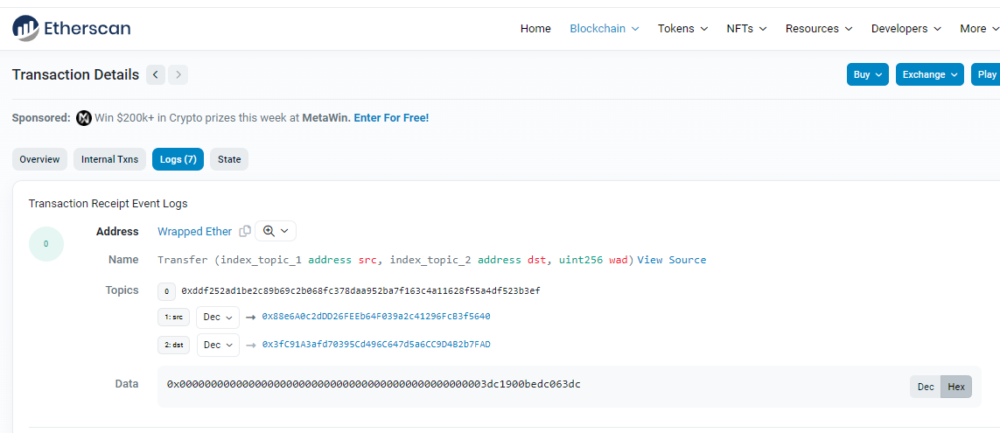
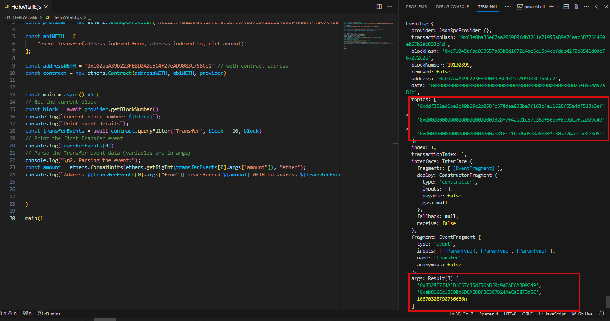
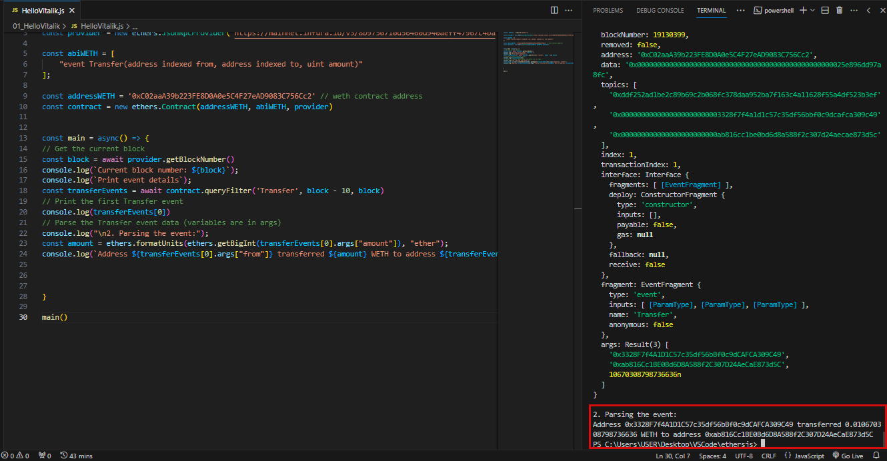

# WTF Ethers: 7. Retrieve Events

I've been revisiting `ethers.js` recently to refresh my understanding of the details and to write a simple tutorial called "WTF Ethers" for beginners.

**Twitter**: [@0xAA_Science](https://twitter.com/0xAA_Science)

**Community**: [Website wtf.academy](https://wtf.academy) | [WTF Solidity](https://github.com/AmazingAng/WTFSolidity) | [discord](https://discord.gg/5akcruXrsk) | [WeChat Group Application](https://docs.google.com/forms/d/e/1FAIpQLSe4KGT8Sh6sJ7hedQRuIYirOoZK_85miz3dw7vA1-YjodgJ-A/viewform?usp=sf_link)

All the code and tutorials are open-sourced on GitHub: [github.com/WTFAcademy/WTF-Ethers](https://github.com/WTFAcademy/WTF-Ethers)

-----

Note: This tutorial is based on ethers.js v6. If you are using v5, you can refer to the [WTF Ethers v5](https://github.com/WTFAcademy/WTF-Ethers/tree/wtf-ethers-v5).

In this lesson, we will learn how to use `ethers.js` to read events emitted by smart contracts. If you are not familiar with events in `Solidity`, you can read about them in the "Event" section of the WTF Solidity [Lesson 12](https://www.wtf.academy/en/solidity-start/Event/).

For more details, refer to the [ethers.js documentation](https://docs.ethers.org/v6/api/contract/#ContractEvent).

## Event

Events emitted by smart contracts are stored in the logs of the Ethereum virtual machine. Logs consist of two parts: the `topics` and the `data`. The event hash and `indexed` variables are stored in the `topics` for efficient queries, while non-indexed variables are stored in the `data` and cannot be directly queried but can store more complex data structures.

Take the `Transfer` event in an ERC20 token contract as an example. It is declared in the contract as follows:

```solidity
event Transfer(address indexed from, address indexed to, uint256 amount);
```

It records three variables: `from`, `to`, and `amount`, which correspond to the address the tokens are sent from, the address they are sent to, and the transfer amount, respectively. The `from` and `to` variables have the `indexed` keyword. When a transfer occurs, the `Transfer` event is logged and can be viewed on [etherscan](https://rinkeby.etherscan.io/tx/0x8cf87215b23055896d93004112bbd8ab754f081b4491cb48c37592ca8f8a36c7).



From the above image, you can see that the `Transfer` event is logged in the EVM log. The `Topics` contain three pieces of data corresponding to the event hash, the `from` address, and the `to` address. The `Data` contains only one piece of data, which is the transfer amount.

## Retrieving Events

We can use the `queryFilter()` function of the contract type in `Ethers` to read events emitted by contracts.

```js
const transferEvents = await contract.queryFilter('event name', starting block, ending block);
```

`queryFilter()` has three parameters: the event name (required), the starting block (optional), and the ending block (optional). The retrieval results will be returned as an array.

**Note**: The event to be retrieved must be included in the contract's ABI.

## Example: Retrieving `Transfer` Events from the `WETH` Contract

1. Create a `provider`.
    ```js
    import { ethers } from "ethers";
    // Connect to the Ethereum network using Alchemy's RPC node
    // You can refer to https://github.com/AmazingAng/WTFSolidity/blob/main/Topics/Tools/TOOL04_Alchemy/readme.md for Alchemy API preparation
    const ALCHEMY_GOERLI_URL = 'https://eth-goerli.alchemyapi.io/v2/GlaeWuylnNM3uuOo-SAwJxuwTdqHaY5l';
    const provider = new ethers.JsonRpcProvider(ALCHEMY_GOERLI_URL);
    ```

2. Create an `abi` that includes the event to be retrieved.
    ```js
    // WETH ABI, only including the Transfer event of interest
    const abiWETH = [
        "event Transfer(address indexed from, address indexed to, uint amount)"
    ];
    ```

3. Declare an instance of the `WETH` contract.
    ```js
    // Testnet WETH address
    const addressWETH = '0xb4fbf271143f4fbf7b91a5ded31805e42b2208d6'
    // Declare the contract instance
    const contract = new ethers.Contract(addressWETH, abiWETH, provider)
    ```

4. Retrieve the `Transfer` events within the last 10 blocks and print one event. We can see that the `topics` contain three pieces of data corresponding to the event hash, the `from` address, and the `to` address, while the `data` only contains one piece of data, which is the `amount`. Additionally, `ethers` automatically parses the event based on the ABI, and the parsed event is shown in the `args` member.
    ```js
    // Get the current block
    const block = await provider.getBlockNumber()
    console.log(`Current block number: ${block}`);
    console.log(`Printing event details:`);
    const transferEvents = await contract.queryFilter('Transfer', block - 10, block)
    // Print the first Transfer event
    console.log(transferEvents[0])
    ```

    

5. Read the parsed results of the event.
    ```js
    // Parse the Transfer event data (variables are in args)
    console.log("\n2. Parsing the event:");
    const amount = ethers.formatUnits(ethers.getBigInt(transferEvents[0].args["amount"]), "ether");
    console.log(`Address ${transferEvents[0].args["from"]} transferred ${amount} WETH to address ${transferEvents[0].args["to"]}`);
    ```

    

## Summary

In this lesson, we reviewed events in `Solidity` and learned how to retrieve events emitted by smart contracts using `ethers`. One important thing to note is that the event to be retrieved must be included in the contract's ABI.