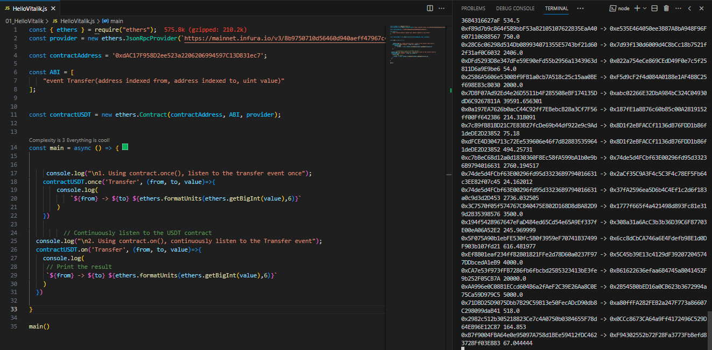

# WTF Ethers: 8. Contract Listeners

I've been revisiting `ethers.js` recently to refresh my understanding of the details and to write a simple tutorial called "WTF Ethers" for beginners.

**Twitter**: [@0xAA_Science](https://twitter.com/0xAA_Science)

**Community**: [Website wtf.academy](https://wtf.academy) | [WTF Solidity](https://github.com/AmazingAng/WTFSolidity) | [discord](https://discord.gg/5akcruXrsk) | [WeChat Group Application](https://docs.google.com/forms/d/e/1FAIpQLSe4KGT8Sh6sJ7hedQRuIYirOoZK_85miz3dw7vA1-YjodgJ-A/viewform?usp=sf_link)

All the code and tutorials are open-sourced on GitHub: [github.com/WTFAcademy/WTF-Ethers](https://github.com/WTFAcademy/WTF-Ethers)

-----

Note: This tutorial is based on ethers.js v6. If you are using v5, you can refer to the [WTF Ethers v5](https://github.com/WTFAcademy/WTF-Ethers/tree/wtf-ethers-v5).

In this lesson, we will learn how to listen to contract events and implement listening to the "Transfer" event of the USDT contract.

Refer to the [ethers.js documentation](https://docs.ethers.org/v6/api/contract/#ContractEvent) for more details.

## Listening to Contract Events

### `contract.on`
In `ethers.js`, the contract object has a `contract.on` method to continuously listen to contract events:

```js
contract.on("eventName", function)
```
`contract.on` takes two parameters: the event name to listen to, which needs to be included in the contract ABI, and the function to be called when the event occurs.

### contract.once

The contract object also has a `contract.once` method to listen to a contract event just once. It takes the same parameters as `contract.on`:

```js
contract.once("eventName", function)
```

## Listening to the `USDT` Contract

1. Declare the `provider`: Alchemy is a free ETH node provider. You need to apply for one before proceeding. You can refer to this guide to apply for the Alchemy API [WTF Solidity Tutorial - Tools Part 4: Alchemy](https://github.com/AmazingAng/WTFSolidity/blob/main/Topics/Tools/TOOL04_Alchemy/readme.md).

  ```js
  import { ethers } from "ethers";
  // Prepare Alchemy API
  // You can refer to [WTF Solidity Tutorial - Tools Part 4: Alchemy](https://github.com/AmazingAng/WTFSolidity/blob/main/Topics/Tools/TOOL04_Alchemy/readme.md) for the setup process
  const ALCHEMY_MAINNET_URL = 'https://eth-mainnet.g.alchemy.com/v2/oKmOQKbneVkxgHZfibs-iFhIlIAl6HDN';
  // Connect to the mainnet provider
  const provider = new ethers.JsonRpcProvider(ALCHEMY_MAINNET_URL);
  ```

2. Declare the contract variables: We only care about the "Transfer" event of the USDT contract. To listen to this event, we need to include it in the ABI. If you're interested in other functions and events, you can find them on [etherscan](https://etherscan.io/address/0xdac17f958d2ee523a2206206994597c13d831ec7#code).

  ```js
  // USDT contract address
  const contractAddress = '0xdac17f958d2ee523a2206206994597c13d831ec7';
  // Build the ABI for the Transfer event of USDT
  const abi = [
    "event Transfer(address indexed from, address indexed to, uint value)"
  ];
  // Generate the USDT contract object
  const contractUSDT = new ethers.Contract(contractAddress, abi, provider);
  ```

3. Use the `contract.once()` function to listen to the Transfer event once and print the result.

  ```js
    // Listen to the event only once
    console.log("\n1. Using contract.once(), listen to the Transfer event once");
    contractUSDT.once('Transfer', (from, to, value)=>{
      // Print the result
      console.log(
        `${from} -> ${to} ${ethers.formatUnits(ethers.getBigInt(value),6)}`
      )
    })
  ```
  

4. Use the `contract.on()` function to continuously listen to the Transfer event and print the result.
  ```js
    // Continuously listen to the USDT contract
    console.log("\n2. Using contract.on(), continuously listen to the Transfer event");
    contractUSDT.on('Transfer', (from, to, value)=>{
      console.log(
       // Print the result
       `${from} -> ${to} ${ethers.formatUnits(ethers.getBigInt(value),6)}`
      )
    })
  ```
  

## Summary
In this lesson, we introduced the simplest on-chain listening features in `ethers`, `contract.on()` and `contract.once()`. With the methods mentioned above, you can listen to specific events of a specific contract.