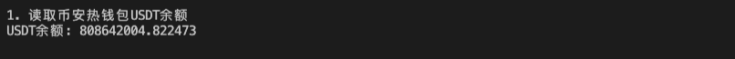

# WTF Ethers: 9. Event Filtering

I've been revisiting `ethers.js` recently to refresh my understanding of the details and to write a simple tutorial called "WTF Ethers" for beginners.

**Twitter**: [@0xAA_Science](https://twitter.com/0xAA_Science)

**Community**: [Website wtf.academy](https://wtf.academy) | [WTF Solidity](https://github.com/AmazingAng/WTFSolidity) | [discord](https://discord.gg/5akcruXrsk) | [WeChat Group Application](https://docs.google.com/forms/d/e/1FAIpQLSe4KGT8Sh6sJ7hedQRuIYirOoZK_85miz3dw7vA1-YjodgJ-A/viewform?usp=sf_link)

All the code and tutorials are open-sourced on GitHub: [github.com/WTFAcademy/WTF-Ethers](https://github.com/WTFAcademy/WTF-Ethers)

-----

Building upon the previous lesson, let's expand our knowledge by adding event filters during the listening process to filter out transfers from specific addresses.

Refer to the [ethers.js documentation](https://docs.ethers.org/v6/api/contract/#ContractEvent) for more details.

## Filters

When a contract emits a log (fires an event), it can contain up to 4 `indexed` items. These indexed data items are hashed and included in a [Bloom filter](https://en.wikipedia.org/wiki/Bloom_filter), which is a data structure that allows for efficient filtering. Therefore, an event filter can contain up to `4` topic sets, and each topic set serves as a condition to filter target events. The rules are as follows:

- If a topic set is `null`, the log topic at that position will not be filtered, and any value will match.
- If the topic set is a single value, the log topic at that position must match that value.
- If the topic set is an array, the log topic at that position must match at least one of the values in the array.


## Building Filters
The `contract` class in `ethers.js` provides the `contract.filters` method to simplify filter creation:

```js
const filter = contract.filters.EVENT_NAME( ...args ) 
```

Here, `EVENT_NAME` is the desired event name to filter and `..args` refers to the topic set/condition. Let's look at a few examples based on the previous rules.

1. Filtering `Transfer` events from the address `myAddress`:
  ```js
  contract.filters.Transfer(myAddress)
  ```

2. Filtering all `Transfer` events sent to the address `myAddress`:
  ```js
  contract.filters.Transfer(null, myAddress)
  ```

3. Filtering all `Transfer` events sent from the address `myAddress` to the address `otherAddress`:
  ```js
  contract.filters.Transfer(myAddress, otherAddress)
  ```

4. Filtering all `Transfer` events sent to the address `myAddress` or `otherAddress`:
  ```js
  contract.filters.Transfer(null, [ myAddress, otherAddress ])
  ```

## Listening for USDT Transfers from an Exchange

1. Tracking transactions where USDT is transferred out of Binance:
  
Before listening to the USDT contract, we need to understand the transaction log `Logs`, including the event `topics` and `data`. Let's find a transaction where USDT was transferred out of Binance and check its details using its hash on etherscan:

Transaction hash: [0xab1f7b575600c4517a2e479e46e3af98a95ee84dd3f46824e02ff4618523fff5](https://etherscan.io/tx/0xab1f7b575600c4517a2e479e46e3af98a95ee84dd3f46824e02ff4618523fff5)


This transaction performed one action: transferred `2983.98` USDT from `binance14` (Binance hot wallet) to the address `0x354de44bedba213d612e92d3248b899de17b0c58`.

Checking the event log `Logs` information:


- `address`: USDT contract address
- `topics[0]`: Event hash, `keccak256("Transfer(address,address,uint256)")`
- `topics[1]`: From address (Binance hot wallet)
- `topics[2]`: To address
- `data`: Transfer amount

2. Create `provider`, `abi`, and `USDT` contract variables:

  ```js
  const provider = new ethers.JsonRpcProvider(ALCHEMY_MAINNET_URL);
  // Contract address
  const addressUSDT = '0xdac17f958d2ee523a2206206994597c13d831ec7'
  // Exchange address
  const accountBinance = '0x28C6c06298d514Db089934071355E5743bf21d60'
  // Build ABI
  const abi = [
    "event Transfer(address indexed from, address indexed to, uint value)",
    "function balanceOf(address) public view returns(uint)",
  ];
  // Build contract object
  const contractUSDT = new ethers.Contract(addressUSDT, abi, provider);
  ```

3. Retrieve the balance of USDT in the Binance hot wallet. Currently, the Binance hot wallet has over 800 million USDT.
  ```js
  const balanceUSDT = await contractUSDT.balanceOf(accountBinance)
  console.log(`USDT balance: ${ethers.formatUnits(balanceUSDT,6)}\n`)
  ```
  


4. Create a filter to listen for USDT transfers to Binance.

  ```js
  // 2. Create a filter to listen for USDT transfers to the exchange
  console.log("\n2. Create a filter to listen for USDT transfers to Binance")
  let filterBinanceIn = contractUSDT.filters.Transfer(null, accountBinance);
  console.log("Filter details:")
  console.log(filterBinanceIn);
  contractUSDT.on(filterBinanceIn, (res) => {
    console.log('---------Listening for USDT transfers to Binance--------');
    console.log(
      `${res.args[0]} -> ${res.args[1]} ${ethers.formatUnits(res.args[2],6)}`
    )
  })
  ```
  

4. Create a filter to listen for USDT transfers from Binance.

  ```js
    // 3. Create a filter to listen for USDT transfers from the exchange
    let filterToBinanceOut = contractUSDT.filters.Transfer(accountBinance);
    console.log("\n3. Create a filter to listen for USDT transfers from Binance")
    console.log("Filter details:")
    console.log(filterToBinanceOut);
    contractUSDT.on(filterToBinanceOut, (res) => {
      console.log('---------Listening for USDT transfers from Binance--------');
      console.log(
        `${res.args[0]} -> ${res.args[1]} ${ethers.formatUnits(res.args[2],6)}`
      )
    }
    );
  ```
  

## Summary

In this lecture, we introduced event filters and used them to monitor `USDT` transactions related to the hot wallet of Binance exchange. You can use them to monitor any transactions you are interested in, such as discover new transactions made by `smart money`, monitor which projects the `NFT` experts are investing in, and so on.