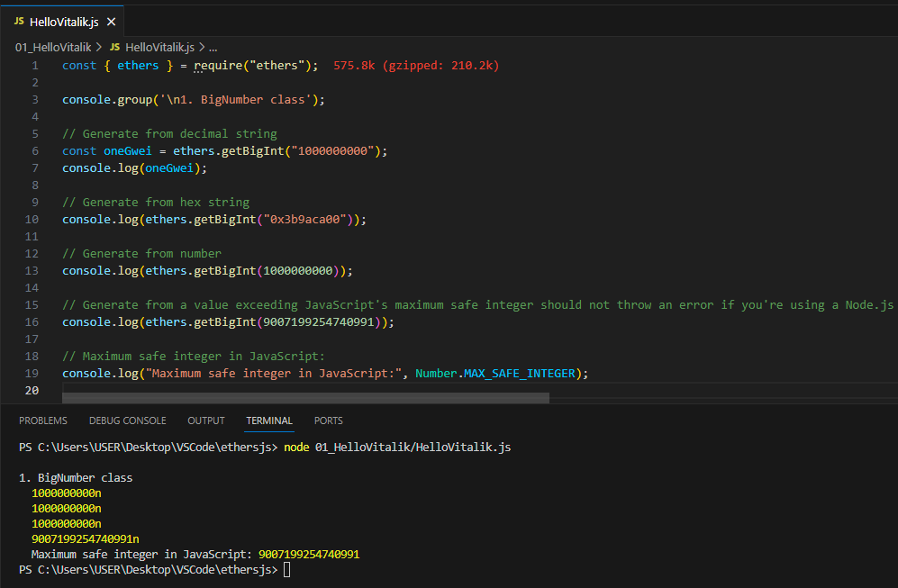
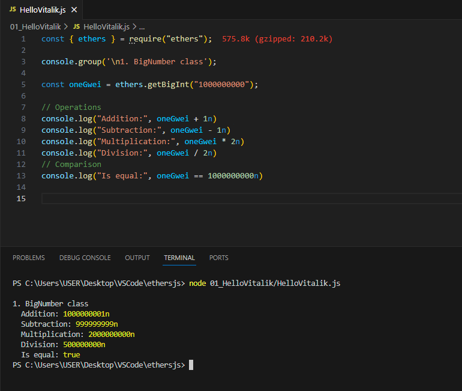
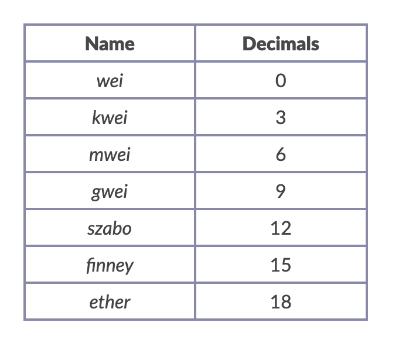
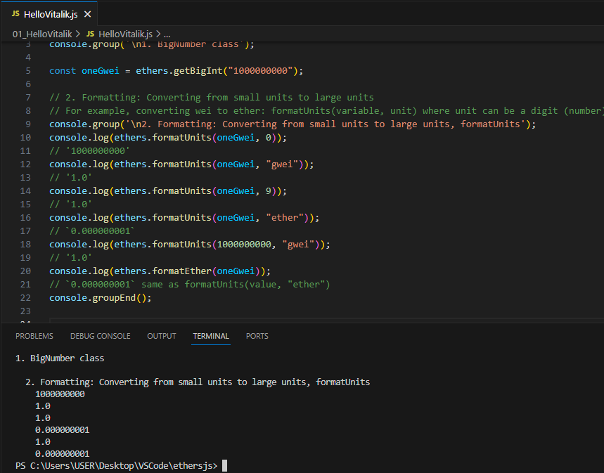
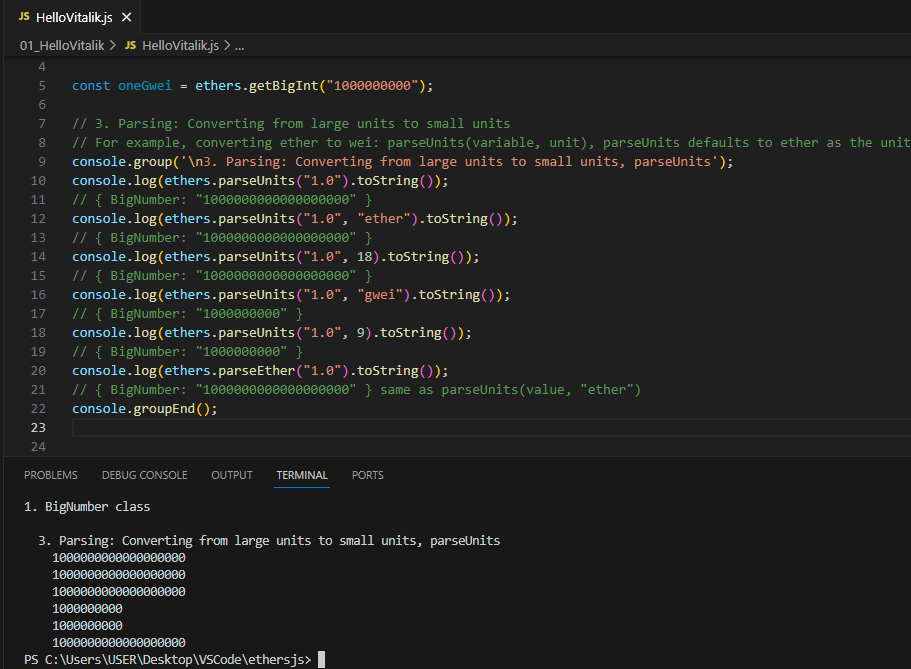

# WTF Ethers: 10. BigInt and Unit Conversion

I've been revisiting `ethers.js` recently to refresh my understanding of the details and to write a simple tutorial called "WTF Ethers" for beginners.

**Twitter**: [@0xAA_Science](https://twitter.com/0xAA_Science)

**Community**: [Website wtf.academy](https://wtf.academy) | [WTF Solidity](https://github.com/AmazingAng/WTFSolidity) | [discord](https://discord.gg/5akcruXrsk) | [WeChat Group Application](https://docs.google.com/forms/d/e/1FAIpQLSe4KGT8Sh6sJ7hedQRuIYirOoZK_85miz3dw7vA1-YjodgJ-A/viewform?usp=sf_link)

All the code and tutorials are open-sourced on GitHub: [github.com/WTFAcademy/WTF-Ethers](https://github.com/WTFAcademy/WTF-Ethers)

-----

Note: This tutorial is based on ethers.js v6. If you are using v5, you can refer to the [WTF Ethers v5](https://github.com/WTFAcademy/WTF-Ethers/tree/wtf-ethers-v5).

In this lesson, we will introduce the BigInt class and unit conversion.

## BigInt

In Ethereum, many calculations require values that exceed the safe range of JavaScript integers (the maximum safe integer in JavaScript is `9007199254740991`). Therefore, ethers.js uses the BigInt class native to JavaScript ES2020 to securely perform mathematical operations on numbers of any magnitude. In ethers.js, most operations that need to return a value will return as `BigInt`, and parameters that accept values will also accept them.

### Creating a BigInt Instance

You can use the `ethers.getBigInt()` function to convert types such as strings and numbers to `BigInt`.

**Note** the values exceeding the maximum safe integer in JavaScript cannot be converted from numbers.

```js
const oneGwei = ethers.getBigInt("1000000000"); // Generate from decimal string
console.log(oneGwei)
console.log(ethers.getBigInt("0x3b9aca00")); // Generate from hexadecimal string
console.log(ethers.getBigInt(1000000000)); // Generate from number
// Unable to generate a BigNumber from a number beyond the maximum safe integer in JavaScript
// ethers.getBigInt(Number.MAX_SAFE_INTEGER);
console.log("Maximum safe integer in JavaScript:", Number.MAX_SAFE_INTEGER)
```



### BigInt Operations

`BigInt` supports many operations, such as addition, subtraction, multiplication, division, modulus (mod), exponentiation (pow), absolute value (abs), etc:

> Note: Numeric values with the suffix `n` will automatically be converted to BigInt.

```js
// Operations
console.log("Addition:", oneGwei + 1n)
console.log("Subtraction:", oneGwei - 1n)
console.log("Multiplication:", oneGwei * 2n)
console.log("Division:", oneGwei / 2n)
// Comparison
console.log("Is Equal:", oneGwei == 1000000000n)
```



## Unit Conversion

In Ethereum, `1 ether` is equal to `10^18 wei`. Below are some commonly used units:



In applications, we often need to convert values between user-readable strings (in ether units) and machine-readable values (in wei units). For example, a wallet may specify the balance (in ether units) and gas price (in gwei units) for the user interface, but both of them must be converted to values in wei units when sending transactions. ethers.js provides some utility functions to facilitate such conversions.

- `formatUnits(variable, unit)`: Formatting, converting smaller units to larger units, such as wei to ether, which is useful for displaying balances. In the parameter, you can specify the number of decimal places (as a number) or the specific unit (as a string).

    ```js
    // Code Reference: https://docs.ethers.io/v6/api/utils/#about-units
    console.group('\n2. Formatting: Converting smaller units to larger units, formatUnits');
    console.log(ethers.formatUnits(oneGwei, 0));
    // '1000000000'
    console.log(ethers.formatUnits(oneGwei, "gwei"));
    // '1.0'
    console.log(ethers.formatUnits(oneGwei, 9));
    // '1.0'
    console.log(ethers.formatUnits(oneGwei, "ether"));
    // '0.000000001'
    console.log(ethers.formatUnits(1000000000, "gwei"));
    // '1.0'
    console.log(ethers.formatEther(oneGwei));
    // '0.000000001' equivalent to formatUnits(value, "ether")
    console.groupEnd();
    ```

    

- `parseUnits`: Parsing, converting larger units to smaller units, such as ether to wei, which is useful for converting user input values into wei units. In the parameter, you can specify the number of decimal places (as a number) or the specific unit (as a string).

    ```js
    // 3. Parsing: Converting larger units to smaller units
    // For example, converting ether to wei: parseUnits(value, unit), parseUnits defaults to ether unit
    // Code Reference: https://docs.ethers.io/v6/api/utils/#about-units
    console.group('\n3. Parsing: Converting larger units to smaller units, parseUnits');
    console.log(ethers.parseUnits("1.0").toString());
    // { BigNumber: "1000000000000000000" }
    console.log(ethers.parseUnits("1.0", "ether").toString());
    // { BigNumber: "1000000000000000000" }
    console.log(ethers.parseUnits("1.0", 18).toString());
    // { BigNumber: "1000000000000000000" }
    console.log(ethers.parseUnits("1.0", "gwei").toString());
    // { BigNumber: "1000000000" }
    console.log(ethers.parseUnits("1.0", 9).toString());
    // { BigNumber: "1000000000" }
    console.log(ethers.parseEther("1.0").toString());
    // { BigNumber: "1000000000000000000" } equivalent to parseUnits(value, "ether")
    console.groupEnd();
    ```

    

## Summary

In this lesson, we introduced the `BigInt` class, the commonly used units in Ethereum, and unit conversion bewteen them.