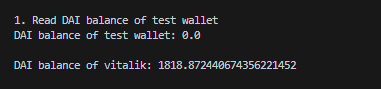
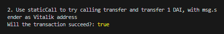
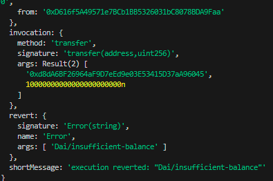

# WTF Ethers: 11. StaticCall

I've been revisiting `ethers.js` recently to refresh my understanding of the details and to write a simple tutorial called "WTF Ethers" for beginners.

**Twitter**: [@0xAA_Science](https://twitter.com/0xAA_Science)

**Community**: [Website wtf.academy](https://wtf.academy) | [WTF Solidity](https://github.com/AmazingAng/WTFSolidity) | [discord](https://discord.gg/5akcruXrsk) | [WeChat Group Application](https://docs.google.com/forms/d/e/1FAIpQLSe4KGT8Sh6sJ7hedQRuIYirOoZK_85miz3dw7vA1-YjodgJ-A/viewform?usp=sf_link)

All the code and tutorials are open-sourced on GitHub: [github.com/WTFAcademy/WTF-Ethers](https://github.com/WTFAcademy/WTF-Ethers)

-----

In this lesson, we will introduce the `staticCall` method of contract classes, which allows you to check whether a transaction will fail before sending it, saving a significant amount of gas.

The `staticCall` method is a method available in the `ethers.Contract` class, and other similar methods include `populateTransaction` and `estimateGas`.

## Transactions that Could Fail

Sending transactions on Ethereum requires expensive `gas` fees and carries the risk of failure. Failed transactions do not refund the gas fees. Therefore, it is crucial to know which transactions will fail before sending them. If you have used the MetaMask browser extension, you may be familiar with the following image.


If your transaction is likely to fail, MetaMask will inform you by showing the message "This transaction may fail." When users see this red warning message, they will cancel the transaction unless they want to experience the failure themselves.

How does MetaMask achieve this? This is because Ethereum nodes have an `eth_call` method that allows users to simulate a transaction and return the possible transaction result without actually executing it on the blockchain (the transaction will not be mined).

## `staticCall`

In `ethers.js`, you can use the `staticCall()` method of the `contract` object to call the `eth_call` method of an Ethereum node. If the call is successful, it returns `true`; if it fails, an error is thrown, and the reason for the failure is returned. The method is used as follows:

```js
const tx = await contract.functionName.staticCall(arguments, {override})
console.log(`Will the transaction succeed?`, tx)
```

- `functionName`: the name of the function you want to call.
- `arguments`: the arguments for the function call.
- `{override}`: optional, can include the following parameters:
    - `from`: the `msg.sender` during execution, which allows you to simulate the call from any address, such as Vitalik.
    - `value`: the `msg.value` during execution.
    - `blockTag`: the block height during execution.
    - `gasPrice`
    - `gasLimit`
    - `nonce`

## Simulating a `DAI` Transfer with `staticCall`

1. Create `provider` and `wallet` objects.
    ```js
    import { ethers } from "ethers";

    // Prepare Alchemy API, can refer to https://github.com/AmazingAng/WTFSolidity/blob/main/Topics/Tools/TOOL04_Alchemy/readme.md 
    const ALCHEMY_MAINNET_URL = 'https://eth-mainnet.g.alchemy.com/v2/oKmOQKbneVkxgHZfibs-iFhIlIAl6HDN';
    const provider = new ethers.JsonRpcProvider(ALCHEMY_MAINNET_URL);

    // Create wallet object using private key and provider
    const privateKey = '0x227dbb8586117d55284e26620bc76534dfbd2394be34cf4a09cb775d593b6f2b'
    const wallet = new ethers.Wallet(privateKey, provider)
    ```

2. Create the `DAI` contract object. Note that we use the `provider` instead of the `wallet` to instantiate the contract, otherwise `from` cannot be modified in the `staticCall` method (this may be a bug or a feature).

    ```js
    // DAI ABI
    const abiDAI = [
        "function balanceOf(address) public view returns(uint)",
        "function transfer(address, uint) public returns (bool)",
    ];
    // DAI contract address (mainnet)
    const addressDAI = '0x6B175474E89094C44Da98b954EedeAC495271d0F' // DAI Contract
    // Create DAI contract instance
    const contractDAI = new ethers.Contract(addressDAI, abiDAI, provider)
    ```

3. Check the `DAI` balance in the wallet, which should be 0.

    ```js
    const address = await wallet.getAddress()
    console.log("\n1. Check DAI balance in the test wallet")
    const balanceDAI = await contractDAI.balanceOf(address)
    console.log(`DAI balance: ${ethers.formatEther(balanceDAI)}\n`)
    ```
    

4. Use `staticCall` to call the `transfer()` function and set the `from` parameter as the address of Vitalik to simulate a transfer of `10000 DAI` from Vitalik. This transaction will succeed because Vitalik's wallet has sufficient `DAI`.

    ```js
    console.log("\n2. Use staticCall to attempt a transfer of 1 DAI, with msg.sender as the address of Vitalik")
    // Initiate the transaction
    const tx = await contractDAI.transfer.staticCall("vitalik.eth", ethers.parseEther("1"), {from:  await provider.resolveName("vitalik.eth")})
    console.log(`Will the transaction succeed?`, tx)
    ```
    

4. Use `staticCall` to call the `transfer()` function and set the `from` parameter as the address of the test wallet to simulate a transfer of `10000 DAI`. This transaction will fail, throwing an error with the reason `Dai/insufficient-balance`.

    ```js
    console.log("\n3. Use staticCall to attempt a transfer of 1 DAI, with msg.sender as the address of the test wallet")
    const tx2 = await contractDAI.transfer.staticCall("vitalik.eth", ethers.parseEther("10000"), {from: address})
    console.log(`Will the transaction succeed?`, tx)
    ```
    

## Summary
`ethers.js` encapsulates `eth_call` in the `staticCall` method, making it convenient for developers to simulate transaction results and avoid sending transactions that may fail. We have demonstrated the use of `staticCall` to simulate transfers from Vitalik and the test wallet. Of course, this method has many other applications, such as calculating transaction slippage for tokens. Use your imagination - where else can you apply `staticCall`?