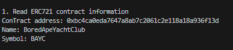
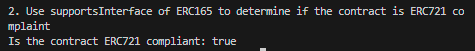

# WTF Ethers: 12. Identify ERC721 Contracts

I've been revisiting `ethers.js` recently to refresh my understanding of the details and to write a simple tutorial called "WTF Ethers" for beginners.

**Twitter**: [@0xAA_Science](https://twitter.com/0xAA_Science)

**Community**: [Website wtf.academy](https://wtf.academy) | [WTF Solidity](https://github.com/AmazingAng/WTFSolidity) | [discord](https://discord.gg/5akcruXrsk) | [WeChat Group Application](https://docs.google.com/forms/d/e/1FAIpQLSe4KGT8Sh6sJ7hedQRuIYirOoZK_85miz3dw7vA1-YjodgJ-A/viewform?usp=sf_link)

All the code and tutorials are open-sourced on GitHub: [github.com/WTFAcademy/WTF-Ethers](https://github.com/WTFAcademy/WTF-Ethers)

-----

In this tutorial, we will learn how to use `ethers.js` to identify if a contract is an `ERC721` standard.

## `ERC721`

`ERC721` is a popular non-fungible token (NFT) standard on the Ethereum network. If you're unfamiliar with this standard, you can read about it in [WTF Solidity 34: ERC721](https://www.wtf.academy/solidity-application/ERC721/). When working on NFT-related projects, we need to identify contracts that comply with the `ERC721` standard. For example, OpenSea automatically recognizes `ERC721` contracts and collects their names, codes, metadata, and other data for display. To identify `ERC721` contracts, we first need to understand `ERC165`.

## `ERC165`

With the [ERC165 standard](https://eips.ethereum.org/EIPS/eip-165), smart contracts can declare the interfaces they support for other contracts to check. Therefore, we can check if a smart contract supports the `ERC721` interface using `ERC165`.

The `IERC165` standard interface contract only declares a `supportsInterface` function. This function returns `true` if it implements that interface ID; otherwise, it returns `false`:

```solidity
interface IERC165 {
    /**
     * @dev Returns true if the contract implements the `interfaceId`
     * See: https://eips.ethereum.org/EIPS/eip-165#how-interfaces-are-identified[EIP section]
     *
     */
    function supportsInterface(bytes4 interfaceId) external view returns (bool);
}
```

`ERC721` contracts implement the `supportsInterface` function from the `IERC165` interface contract and return `true` when queried with `0x80ac58cd` (`ERC721` interface ID):

```solidity
   function supportsInterface(bytes4 interfaceId)
        external
        pure
        override
        returns (bool)
    {
        return
            interfaceId == type(IERC721).interfaceId 
    }
```

## Identifying `ERC721` Contracts

1. Create a `provider` to connect to the Ethereum mainnet.
    ```js
    // Prepare Alchemy API, you can refer to: https://github.com/AmazingAng/WTFSolidity/blob/main/Topics/Tools/TOOL04_Alchemy/readme.md 
    const ALCHEMY_MAINNET_URL = 'https://eth-mainnet.g.alchemy.com/v2/oKmOQKbneVkxgHZfibs-iFhIlIAl6HDN';
    const provider = new ethers.JsonRpcProvider(ALCHEMY_MAINNET_URL);
    ```

2. Create an instance of the `ERC721` contract. In the `abi` interface, we declare the `name()`, `symbol()`, and `supportsInterface()` functions to use. Here, we use the Bored Ape Yacht Club (BAYC) contract address.
    ```js
    // Contract ABI
    const abiERC721 = [
        "function name() view returns (string)",
        "function symbol() view returns (string)",
        "function supportsInterface(bytes4) public view returns(bool)",
    ];
    // ERC721 contract address (BAYC)
    const addressBAYC = "0xbc4ca0eda7647a8ab7c2061c2e118a18a936f13d"
    // Create an instance of the ERC721 contract
    const contractERC721 = new ethers.Contract(addressBAYC, abiERC721, provider)
    ```

3. Read the on-chain information of the contract: name and symbol.
    ```js
    // 1. Read the on-chain information of the ERC721 contract
    const nameERC721 = await contractERC721.name()
    const symbolERC721 = await contractERC721.symbol()
    console.log("\n1. Read the on-chain information of the ERC721 contract")
    console.log(`Contract Address: ${addressBAYC}`)
    console.log(`Name: ${nameERC721}`)
    console.log(`Symbol: ${symbolERC721}`)
    ```
    

4. Use the `supportsInterface()` function of `ERC165` to identify whether the contract is an `ERC721` standard. If it is, return `true`; otherwise, throw an error or return `false`.

    Note that the `selectorERC721` constant in this code has been extracted into the main function.
    ```js
    // 2. Use ERC165's supportsInterface() to determine if the contract is an ERC721 standard
    // ERC165 identifier for ERC721 interface
    const selectorERC721 = "0x80ac58cd"
    const isERC721 = await contractERC721.supportsInterface(selectorERC721)
    console.log("\n2. Use ERC165's supportsInterface() to determine if the contract is an ERC721 standard")
    console.log(`Is the contract an ERC721 standard? ${isERC721}`)
    ```
    

## Summary

In this tutorial, we learned how to use `ethers.js` to identify if a contract follows the `ERC721` standard. Since we utilized the `ERC165` standard, contracts that support the `ERC165` standard can be identified using this method, including `ERC721`, `ERC1155`, and others. However, for standards like `ERC20` that do not support `ERC165`, different methods need to be used to identify them. Do you know how to check if a contract is an `ERC20`?