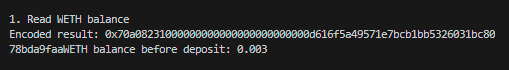
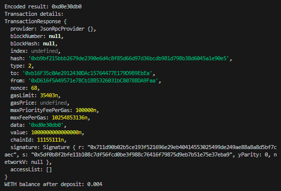

# WTF Ethers: 13. Encode Calldata

I've been revisiting `ethers.js` recently to refresh my understanding of the details and to write a simple tutorial called "WTF Ethers" for beginners.

**Twitter**: [@0xAA_Science](https://twitter.com/0xAA_Science)

**Community**: [Website wtf.academy](https://wtf.academy) | [WTF Solidity](https://github.com/AmazingAng/WTFSolidity) | [discord](https://discord.gg/5akcruXrsk) | [WeChat Group Application](https://docs.google.com/forms/d/e/1FAIpQLSe4KGT8Sh6sJ7hedQRuIYirOoZK_85miz3dw7vA1-YjodgJ-A/viewform?usp=sf_link)

All the code and tutorials are open-sourced on GitHub: [github.com/WTFAcademy/WTF-Ethers](https://github.com/WTFAcademy/WTF-Ethers)

-----

In this lesson, we will introduce the interface class in `ethers.js` and use it to encode calldata.

## Interface Class

The interface class in `ethers.js` abstracts the ABI encoding and decoding needed for interacting with contracts on the Ethereum network. ABI (Application Binary Interface) is a format similar to API, used to encode various types of data that contracts can process, enabling them to interact. For more information, see [WTF Solidity 27: ABI encoding](https://www.wtf.academy/solidity-advanced/ABIEncode/).

We can generate the `interface` variable from the `abi`, or directly retrieve it from the contract:

```js
// Generated using abi
const interface = ethers.Interface(abi)
// Retrieved from the contract
const interface2 = contract.interface
```

The interface class encapsulates several encoding and decoding methods. When interacting with some special contracts (such as proxy contracts), you need to encode parameters and decode return values:

**Note**: The relevant function must be included in the `abi`.

- `getSighash()`: Get the function selector, with the function name or function signature as the parameter.

    ```js
    interface.getSighash("balanceOf");
    // '0xddf252ad1be2c89b69c2b068fc378daa952ba7f163c4a11628f55a4df523b3ef'
    ```
- `encodeDeploy()`: Encode the parameters of the constructor, which can then be appended to the contract bytecode.
    ```js
    interface.encodeDeploy("Wrapped ETH", "WETH");
    ```

- `encodeFunctionData()`: Encode the calldata of the function.

    ```js
    interface.encodeFunctionData("balanceOf", ["0xc778417e063141139fce010982780140aa0cd5ab"]);
    ```
- `decodeFunctionResult()`: Decode the return value of the function.
    ```js
    interface.decodeFunctionResult("balanceOf", resultData)
    ```

## Example: Interacting with the `WETH` contract on test network 

Here, we will use the interface class to encode calldata and repeat the example of interacting with the test network `WETH` contract in [Lesson 5](https://github.com/WTFAcademy/WTFEthers/tree/main/en/05_WriteContract/readme.md).

1. Create the `provider` and `wallet` variables.

    ```js
    // Prepare Alchemy API, you can refer to https://github.com/AmazingAng/WTFSolidity/blob/main/Topics/Tools/TOOL04_Alchemy/readme.md 
    const ALCHEMY_GOERLI_URL = 'https://eth-rinkeby.alchemyapi.io/v2/GlaeWuylnNM3uuOo-SAwJxuwTdqHaY5l';
    const provider = new ethers.JsonRpcProvider(ALCHEMY_GOERLI_URL);

    // Create the wallet object using the private key and provider
    const privateKey = '0x227dbb8586117d55284e26620bc76534dfbd2394be34cf4a09cb775d593b6f2b'
    const wallet = new ethers.Wallet(privateKey, provider)
    ```

2. Create the `WETH` contract instance
    ```js
    // WETH ABI
    const abiWETH = [
        "function balanceOf(address) public view returns(uint)",
        "function deposit() public payable",
    ];
    // WETH contract address (Goerli test network)
    const addressWETH = '0xb4fbf271143f4fbf7b91a5ded31805e42b2208d6'
    // Declare the WETH contract
    const contractWETH = new ethers.Contract(addressWETH, abiWETH, wallet)
    ```

3. Call the `balanceOf()` function to read the `WETH` balance of the wallet address.

    ```js
    const address = await wallet.getAddress()
    // 1. Read the on-chain information of the WETH contract (WETH ABI)
    console.log("\n1. Read WETH balance")
    // Encode calldata
    const param1 = contractWETH.interface.encodeFunctionData(
        "balanceOf",
        [address]
      );
    console.log(`Encoded result: ${param1}`)
    // Create transaction
    const tx1 = {
        to: addressWETH,
        data: param1
    }
    // Send transaction, view/pure operations can use provider.call(tx)
    const balanceWETH = await provider.call(tx1)
    console.log(`WETH balance before deposit: ${ethers.formatEther(balanceWETH)}\n`)
    ```
    

4. Call the `deposit()` function to convert `0.001 ETH` to `0.001 WETH`, and print the transaction details and balance. You can see the balance change.

    ```js
    // Encode calldata
    const param2 = contractWETH.interface.encodeFunctionData(
        "deposit"          
        );
    console.log(`Encoded result: ${param2}`)
    // Create transaction
    const tx2 = {
        to: addressWETH,
        data: param2,
        value: ethers.parseEther("0.001")}
    // Send transaction, write operations require wallet.sendTransaction(tx)
    const receipt1 = await wallet.sendTransaction(tx2)
    // Wait for the transaction to be confirmed
    await receipt1.wait()
    console.log(`Transaction details:`)
    console.log(receipt1)
    const balanceWETH_deposit = await contractWETH.balanceOf(address)
    console.log(`WETH balance after deposit: ${ethers.formatEther(balanceWETH_deposit)}\n`)
    ```


## Summary

In this lesson, we introduced the interface classes in `ethers.js` and used them to encode `calldata` and interact with the `WETH` contract. When interacting with specific contracts (such as proxy contracts), you may need to use these methods to encode the parameters and decode the return values.
