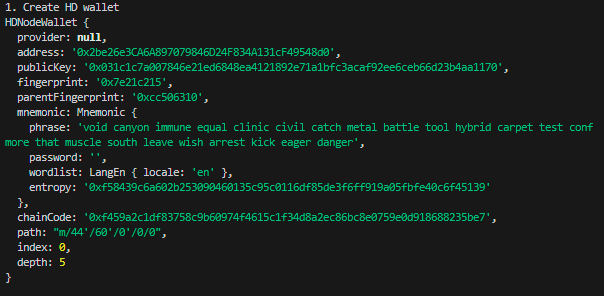
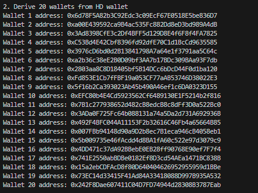
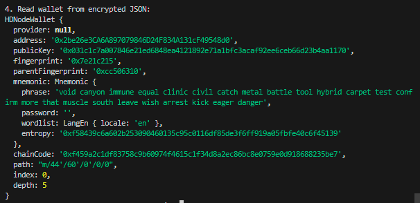

# WTF Ethers: 14. Batch Wallet Generation

I've been revisiting `ethers.js` recently to refresh my understanding of the details and to write a simple tutorial called "WTF Ethers" for beginners.

**Twitter**: [@0xAA_Science](https://twitter.com/0xAA_Science)

**Community**: [Website wtf.academy](https://wtf.academy) | [WTF Solidity](https://github.com/AmazingAng/WTFSolidity) | [discord](https://discord.gg/5akcruXrsk) | [WeChat Group Application](https://docs.google.com/forms/d/e/1FAIpQLSe4KGT8Sh6sJ7hedQRuIYirOoZK_85miz3dw7vA1-YjodgJ-A/viewform?usp=sf_link)

All the code and tutorials are open-sourced on GitHub: [github.com/WTFAcademy/WTF-Ethers](https://github.com/WTFAcademy/WTF-Ethers)

-----

In this chapter, we will introduce HD Wallets and write a script to generate wallets in batch.

## HD Wallets

HD Wallets (Hierarchical Deterministic Wallets) are digital wallets commonly used to store the digital keys of cryptocurrency holders, such as Bitcoin and Ethereum. With HD Wallets, users can create a series of key pairs from a random seed, providing convenience, security, and privacy. To understand HD Wallets, we need a basic understanding of Bitcoin's [BIP32](https://github.com/bitcoin/bips/blob/master/bip-0032.mediawiki), [BIP44](https://github.com/bitcoin/bips/blob/master/bip-0044.mediawiki), and [BIP39](https://github.com/bitcoin/bips/blob/master/bip-0039.mediawiki).

### BIP32

Before the introduction of BIP32, users had to keep track of a collection of private keys to manage multiple wallets. BIP32 allows the derivation of multiple private keys from a single random seed, making it more convenient to manage multiple wallets. The wallet address is determined by the derivation path, for example, "m/0/0/1".


### BIP44

BIP44 provides a set of universal specifications for the derivation path in BIP32, adapting to multiple chains such as Bitcoin and Ethereum. The specification consists of six levels, separated by "/":
```
m / purpose' / coin_type' / account' / change / address_index
```
Where:
- m: Fixed to "m"
- purpose: Fixed to "44"
- coin_type: Token type, 0 for Bitcoin mainnet, 1 for Bitcoin testnet, and 60 for Ethereum mainnet
- account: Account index, starting from 0
- change: External or internal chain, 0 for external chain, 1 for internal chain (usually 0)
- address_index: Address index, starting from 0. Change this field to generate new addresses, such as 1, 2, 3.

For example, the default derivation path for Ethereum is `"m/44'/60'/0'/0/0"`.

### BIP39

BIP39 allows users to store private keys in a way that can be memorized with a set of human-readable mnemonic words, rather than a string of hexadecimal numbers:

```
//Private Key
0x813f8f0a4df26f6455814fdd07dd2ab2d0e2d13f4d2f3c66e7fd9e3856060f89
//Mnemonic Words
air organ twist rule prison symptom jazz cheap rather dizzy verb glare jeans orbit weapon universe require tired sing casino business anxiety seminar hunt
```

## Generate Wallets in Batch

`ethers.js` provides the [HDNode class](https://docs.ethers.org/v6-beta/api/wallet/#HDNodeWallet) to facilitate the use of HD Wallets by developers. Below, we will use it to generate 20 wallets in batch from a mnemonic phrase.

1. Create an `HDNode` wallet variable. The mnemonic phrase used here is `'air organ twist rule prison symptom jazz cheap rather dizzy verb glare jeans orbit weapon universe require tired sing casino business anxiety seminar hunt'`.
    ```js
    // Generate a random mnemonic phrase
    const mnemonic = ethers.Mnemonic.entropyToPhrase(randomBytes(32))
    // Create an HD wallet
    const hdNode = ethers.HDNodeWallet.fromPhrase(mnemonic)
    console.log(hdNode);
    ```
    

2. Derive 20 wallets using the HD wallet.

    ```js
    const numWallet = 20
    // Derivation path: m / purpose' / coin_type' / account' / change / address_index
    // Switch the last address_index to derive new wallets from hdNode
    let basePath = "m/44'/60'/0'/0";
    let wallets = [];
    for (let i = 0; i < numWallet; i++) {
        let hdNodeNew = hdNode.derivePath(basePath + "/" + i);
        let walletNew = new ethers.Wallet(hdNodeNew.privateKey);
        console.log(`Wallet ${i+1} address: ${walletNew.address}`)
        wallets.push(walletNew);
    }
    ```
    

3. Save wallets as encrypted JSON:

    ```js
    const wallet = ethers.Wallet.fromPhrase(mnemonic)
    console.log("Create wallet from mnemonic phrase:")
    console.log(wallet)
    // Password for the encrypted JSON, can be changed to something else
    const pwd = "password"
    const json = await wallet.encrypt(pwd)
    console.log("Encrypted JSON of the wallet:")
    console.log(json)
    ```
    

4. Read wallets from encrypted JSON:
    ```js
    const wallet2 = await ethers.Wallet.fromEncryptedJson(json, pwd);
    console.log("\n4. Read wallet from encrypted JSON:")
    console.log(wallet2)
    ```
    

## Summary
In this chapter, we introduced HD Wallets (BIP32, BIP44, BIP39) and used `ethers.js` to generate 20 wallets in batch.