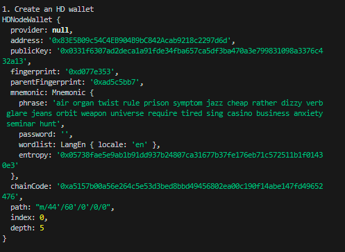
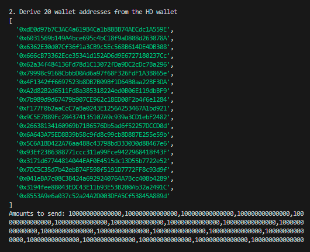
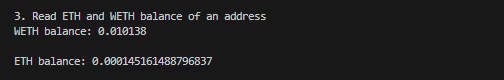
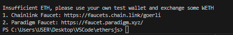

# WTF Ethers: 15. Batch Transfer

I've been revisiting `ethers.js` recently to refresh my understanding of the details and to write a simple tutorial called "WTF Ethers" for beginners.

**Twitter**: [@0xAA_Science](https://twitter.com/0xAA_Science)

**Community**: [Website wtf.academy](https://wtf.academy) | [WTF Solidity](https://github.com/AmazingAng/WTFSolidity) | [discord](https://discord.gg/5akcruXrsk) | [WeChat Group Application](https://docs.google.com/forms/d/e/1FAIpQLSe4KGT8Sh6sJ7hedQRuIYirOoZK_85miz3dw7vA1-YjodgJ-A/viewform?usp=sf_link)

All the code and tutorials are open-sourced on GitHub: [github.com/WTFAcademy/WTF-Ethers](https://github.com/WTFAcademy/WTF-Ethers)

-----

In this lesson, we will introduce how to perform batch transfers using `ethers.js`. By calling the `Airdrop` contract from the [WTF Solidity 33: Airdrop](https://www.wtf.academy/solidity-application/Airdrop/), we can achieve batch transfers in a single transaction, saving gas fees.

## Airdrop Contract

Here is a brief introduction to the `Airdrop` contract, you can find the details in the WTF Solidity tutorial. We will mainly use 2 functions:

- `multiTransferETH()`: Batch transfers of `ETH`, including 2 parameters:
    - `_addresses`: An array of user addresses to receive the airdrop (`address[]` type)
    - `_amounts`: An array of the token amounts corresponding to each address in `_addresses` (`uint[]` type)

- `multiTransferToken()`: Batch transfers of `ERC20` tokens, including 3 parameters:
    - `_token`: The address of the token contract (`address` type)
    - `_addresses`: An array of user addresses to receive the airdrop (`address[]` type)
    - `_amounts`: An array of the token amounts corresponding to each address in `_addresses` (`uint[]` type)

We have deployed an `Airdrop` contract on the `Goerli` testnet, with the address:
```
0x71C2aD976210264ff0468d43b198FD69772A25fa
```

## Batch Transfer

Next, we will write a script that calls the `Airdrop` contract to transfer `ETH` (native token) and `WETH` (ERC20 token) to 20 addresses.

1. Create an HD wallet to generate addresses in bulk.
    ```js
    console.log("\n1. Create an HD wallet");
    // Generate an HD wallet from the mnemonic
    const mnemonic = `air organ twist rule prison symptom jazz cheap rather dizzy verb glare jeans orbit weapon universe require tired sing casino business anxiety seminar hunt`;
    const hdNode = ethers.HDNodeWallet.fromPhrase(mnemonic);
    console.log(hdNode);
    ```
    

2. Use the HD wallet to generate 20 wallet addresses.
    ```js
    console.log("\n2. Derive 20 wallet addresses from the HD wallet");
    const numWallet = 20;
    // Derivation path: m / purpose' / coin_type' / account' / change / address_index
    // We only need to change the last part, address_index, to derive new wallets from hdNode
    let basePath = "m/44'/60'/0'/0";
    let addresses = [];
    for (let i = 0; i < numWallet; i++) {
        let hdNodeNew = hdNode.derivePath(basePath + "/" + i);
        let walletNew = new ethers.Wallet(hdNodeNew.privateKey);
        addresses.push(walletNew.address);
    }
    console.log(addresses);
    const amounts = Array(20).fill(ethers.parseEther("0.0001"));
    console.log(`Amounts to send: ${amounts}`);
    ```
    

3. Create a provider and wallet for token transfers.
    ```js
    // Provide the Alchemy API, you can refer to https://github.com/AmazingAng/WTF-Solidity/blob/main/Topics/Tools/TOOL04_Alchemy/readme.md 
    const ALCHEMY_GOERLI_URL = 'https://eth-goerli.alchemyapi.io/v2/GlaeWuylnNM3uuOo-SAwJxuwTdqHaY5l';
    const provider = new ethers.JsonRpcProvider(ALCHEMY_GOERLI_URL);

    // Create a wallet object from the private key and provider
    // If this wallet is out of Goerli testnet ETH
    // Please use your own testnet wallet, wallet address: 0x338f8891D6BdC58eEB4754352459cC461EfD2a5E, please don't send any ETH to this address
    // Note: Do not upload your private key to GitHub
    const privateKey = '0x21ac72b6ce19661adf31ef0d2bf8c3fcad003deee3dc1a1a64f5fa3d6b049c06';
    const wallet = new ethers.Wallet(privateKey, provider);
    ```

4. Create the Airdrop contract.
    ```js
    // Airdrop ABI
    const abiAirdrop = [
        "function multiTransferToken(address,address[],uint256[]) external",
        "function multiTransferETH(address[],uint256[]) public payable",
    ];
    // Airdrop contract address (Goerli testnet)
    const addressAirdrop = '0x71C2aD976210264ff0468d43b198FD69772A25fa'; // Airdrop Contract
    // Instantiate the Airdrop contract
    const contractAirdrop = new ethers.Contract(addressAirdrop, abiAirdrop, wallet);
    ```

5. Create the WETH contract.
    ```js
    // WETH ABI
    const abiWETH = [
        "function balanceOf(address) public view returns(uint)",
        "function transfer(address, uint) public returns (bool)",
        "function approve(address, uint256) public returns (bool)"
    ];
    // WETH contract address (Goerli testnet)
    const addressWETH = '0xB4FBF271143F4FBf7B91A5ded31805e42b2208d6'; // WETH Contract
    // Instantiate the WETH contract
    const contractWETH = new ethers.Contract(addressWETH, abiWETH, wallet);
    ```

6. Read the ETH and WETH balances for an address.
    ```js
    console.log("\n3. Read the ETH and WETH balances for an address");
    // Read the WETH balance for an address
    const balanceWETH = await contractWETH.balanceOf(addresses[10])
    console.log(`WETH balance: ${ethers.formatEther(balanceWETH)}\n`)
    // Fetch ETH balance
    const balanceETH = await provider.getBalance(addresses[10])
    console.log(`ETH balance: ${ethers.formatEther(balanceETH)}\n`)
    ```


7. Call the `multiTransferETH()` function to transfer `0.0001 ETH` to each wallet, and observe the changes in the balances.
    ```js
    console.log("\n4. Call the multiTransferETH() function to transfer 0.0001 ETH to each wallet")
    // Initiate the transaction
    const tx = await contractAirdrop.multiTransferETH(addresses, amounts, {value: ethers.parseEther("0.002")})
    // Wait for the transaction to be mined
    await tx.wait()
    // console.log(`Transaction details:`)
    // console.log(tx)
    const balanceETH2 = await provider.getBalance(addresses[10])
    console.log(`ETH balance of this wallet after the transfer: ${ethers.formatEther(balanceETH2)}\n`)
    ```


8. Call the `multiTransferToken()` function to transfer `0.0001 WETH` to each wallet, and observe the changes in the balances.

    ```js
    console.log("\n5. Call the multiTransferToken() function to transfer 0.001 WETH to each wallet")
    // Approve WETH to the Airdrop contract first
    const txApprove = await contractWETH.approve(addressAirdrop, ethers.parseEther("1"))
    await txApprove.wait()
    // Initiate the transaction
    const tx2 = await contractAirdrop.multiTransferToken(addressWETH, addresses, amounts)
    // Wait for the transaction to be mined
    await tx2.wait()
    // console.log(`Transaction details:`)
    // console.log(tx2)
    // Fetch the WETH balance
    const balanceWETH2 = await contractWETH.balanceOf(addresses[10])
    console.log(`WETH balance of this wallet after the transfer: ${ethers.formatEther(balanceWETH2)}\n`)
    ```


## Summary

In this tutorial, we learned how to use `ethers.js` to call the `Airdrop` contract for batch transfers. In the examples, we sent `ETH` and `WETH` to 20 different addresses, saving time and gas fees.