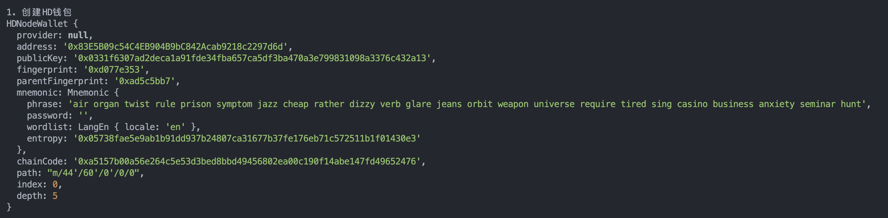
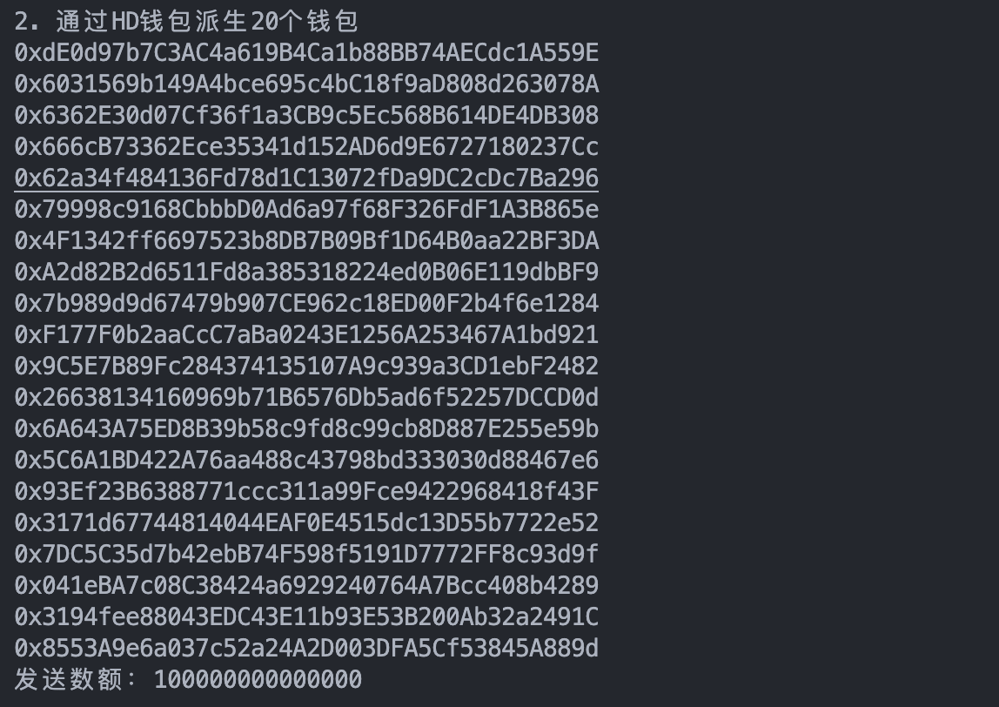

# WTF Ethers: 16. Batch Collect

I've been revisiting `ethers.js` recently to refresh my understanding of the details and to write a simple tutorial called "WTF Ethers" for beginners.

**Twitter**: [@0xAA_Science](https://twitter.com/0xAA_Science)

**Community**: [Website wtf.academy](https://wtf.academy) | [WTF Solidity](https://github.com/AmazingAng/WTFSolidity) | [discord](https://discord.gg/5akcruXrsk) | [WeChat Group Application](https://docs.google.com/forms/d/e/1FAIpQLSe4KGT8Sh6sJ7hedQRuIYirOoZK_85miz3dw7vA1-YjodgJ-A/viewform?usp=sf_link)

All the code and tutorials are open-sourced on GitHub: [github.com/WTFAcademy/WTF-Ethers](https://github.com/WTFAcademy/WTF-Ethers)

-----

In this session, we will introduce how to use `ethers.js` to collect the assets of multiple wallets (ETH and tokens) into one wallet.

## Batch Collect

After interacting and playing around with the chain, we need to consolidate and manage the assets of multiple wallets. You can use [HD Wallet](https://github.com/WTFAcademy/WTF-Ethers/blob/main/14_HDwallet/readme.md) or other methods to operate multiple wallets with different private keys, and then use the `ethers.js` script to complete the collection. Below, we will demonstrate the collection of `ETH` (native token) and `WETH` (ERC20 token) separately.

1. Create a `provider` and a `wallet`, where `wallet` is the receiving wallet for the assets.

    ```js
    // Prepare Alchemy API, you can refer to https://github.com/AmazingAng/WTF-Solidity/blob/main/Topics/Tools/TOOL04_Alchemy/readme.md 
    const ALCHEMY_GOERLI_URL = 'https://eth-goerli.alchemyapi.io/v2/GlaeWuylnNM3uuOo-SAwJxuwTdqHaY5l';
    const provider = new ethers.JsonRpcProvider(ALCHEMY_GOERLI_URL);
    // Create wallet object using private key and provider
    const privateKey = '0x21ac72b6ce19661adf31ef0d2bf8c3fcad003deee3dc1a1a64f5fa3d6b049c06'
    const wallet = new ethers.Wallet(privateKey, provider)
    ```

2. Declare the WETH contract.
    ```js
    // WETH ABI
    const abiWETH = [
        "function balanceOf(address) public view returns(uint)",
        "function transfer(address, uint) public returns (bool)",
    ];
    // WETH contract address (Goerli testnet)
    const addressWETH = '0xB4FBF271143F4FBf7B91A5ded31805e42b2208d6' // WETH Contract
    // Declare the WETH contract
    const contractWETH = new ethers.Contract(addressWETH, abiWETH, wallet)
    ```

3. Create an `HD` wallet to manage multiple wallets.

    ```js
    console.log("\n1. Create HD wallet")
    // Generate HD wallet from mnemonic
    const mnemonic = `air organ twist rule prison symptom jazz cheap rather dizzy verb glare jeans orbit weapon universe require tired sing casino business anxiety seminar hunt`
    const hdNode = ethers.HDNodeWallet.fromPhrase(mnemonic)
    console.log(hdNode);
    ```
    

4. Derive `20` wallets from the `HD` wallet, and these wallets should have assets.

    ```js
    const numWallet = 20
    // Derivation path: m / purpose' / coin_type' / account' / change / address_index
    // We only need to switch the last address_index to derive a new wallet from hdNode
    let basePath = "m/44'/60'/0'/0";
    let wallets = [];
    for (let i = 0; i < numWallet; i++) {
        let hdNodeNew = hdNode.derivePath(basePath + "/" + i);
        let walletNew = new ethers.Wallet(hdNodeNew.privateKey);
        wallets.push(walletNew);
        console.log(walletNew.address)
    }
    // Define the amount to send
    const amount = ethers.parseEther("0.0001")
    console.log(`Amount to send: ${amount}`)
    ```
    

5. Read the ETH and WETH balance of an address.

    ```js
    console.log("\n3. Read the ETH and WETH balance of an address")
    // Read the WETH balance
    const balanceWETH = await contractWETH.balanceOf(wallets[19])
    console.log(`WETH balance: ${ethersfromPhrase.formatEther(balanceWETH)}`)
    // Read the ETH balance
    const balanceETH = await provider.getBalance(wallets[19])
    console.log(`ETH balance: ${ethersfromPhrase.formatEther(balanceETH)}\n`)
    ```
    

6. Use the `sendTransaction()` method of the wallet class to send transactions and collect `ETH` from each wallet.

    ```js
    // 6. Batch collect ETH from wallets
    console.log("\n4. Batch collect ETH from 20 wallets")
    const txSendETH = {
        to: wallet.address,
        value: amount
    }
    for (let i = 0; i < numWallet; i++) {
        // Connect the wallet to the provider
        let walletiWithProvider = wallets[i].connect(provider)
        var tx = await walletiWithProvider.sendTransaction(txSendETH)
        console.log(`Collecting ETH from wallet ${i+1} ${walletiWithProvider.address}`)
    }
    await tx.wait()
    console.log(`ETH collection completed`)
    ```
    

7. Connect the `WETH` contract to the new wallet and call the `transfer()` method to collect `WETH` from each wallet.

    ```js
    for (let i = 0; i < numWallet; i++) {
        // Connect the wallet to the provider
        let walletiWithProvider = wallets[i].connect(provider)
        // Connect the contract to the new wallet
        let contractConnected = contractWETH.connect(walletiWithProvider)
        var tx = await contractConnected.transfer(wallet.address, amount)
        console.log(`The ${i+1}th wallet ${wallets[i].address} WETH collection starts`)
        }
    await tx.wait()
    console.log(`WETH collection ends`)
    ```


8. Read the post-collection ETH and WETH balance of an address, and you can see the decrease in `ETH` and `WETH` balances, collection succeeded!
    ```js
    console.log("\n6. Read the post-collection ETH and WETH balance of an address")
    // Read WETH balance
    const balanceWETHAfter = await contractWETH.balanceOf(wallets[19])
    console.log(`WETH holdings after collection: ${ethersfromPhrase.formatEther(balanceWETHAfter)}`)
    // Read ETH balance
    const balanceETHAfter = await provider.getBalance(wallets[19])
    console.log(`ETH holdings after collection: ${ethersfromPhrase.formatEther(balanceETHAfter)}\n`)
    ```


## Summary

In this lecture, we introduced batch collect and used `ethers.js` scripts to collect `ETH` and `WETH` from `20` wallets into one wallet.