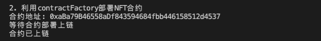
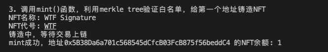

# WTF Ethers: 18. Digital Signature Script

I've been revisiting `ethers.js` recently to refresh my understanding of the details and to write a simple tutorial called "WTF Ethers" for beginners.

**Twitter**: [@0xAA_Science](https://twitter.com/0xAA_Science)

**Community**: [Website wtf.academy](https://wtf.academy) | [WTF Solidity](https://github.com/AmazingAng/WTFSolidity) | [discord](https://discord.gg/5akcruXrsk) | [WeChat Group Application](https://docs.google.com/forms/d/e/1FAIpQLSe4KGT8Sh6sJ7hedQRuIYirOoZK_85miz3dw7vA1-YjodgJ-A/viewform?usp=sf_link)

All the code and tutorials are open-sourced on GitHub: [github.com/WTFAcademy/WTF-Ethers](https://github.com/WTFAcademy/WTF-Ethers)

-----

In this chapter, we will introduce a method of using off-chain signatures as a whitelist for NFTs. If you are not familiar with the `ECDSA` contract, please refer to [WTF Solidity 37: Digital Signature](https://www.wtf.academy/solidity-application/Signature/).

## Digital Signature

If you have used `opensea` to trade NFTs, you will be familiar with signatures. The image below shows the window that pops up when signing with the small fox (`Metamask`) wallet. It proves that you own the private key without needing to disclose it publicly.


The digital signature algorithm used by Ethereum is called Elliptic Curve Digital Signature Algorithm (`ECDSA`), based on the digital signature algorithm of elliptic curve "private key - public key" pairs. It serves three main purposes: 

1. **Identity Authentication**: Proves that the signer is the holder of the private key.
2. **Non-Repudiation**: The sender cannot deny sending the message.
3. **Integrity**: The message cannot be modified during transmission.

## Digital Signature Contract Overview

The `SignatureNFT` contract in the [WTF Solidity 37: Digital Signature](https://github.com/AmazingAng/WTF-Solidity/blob/main/37_Signature/readme.md) uses `ECDSA` to validate whitelist addresses and mint NFTs. Let's discuss two important functions:

1. Constructor: Initializes the name, symbol, and signing public key `signer` of the NFT.

2. `mint()`: Validates the whitelist address using `ECDSA` and mints the NFT. The parameters are the whitelist address `account`, the `tokenId` to be minted, and the signature.

## Generating a Digital Signature

1. Message Packaging: According to the `ECDSA` standard in Ethereum, the `message` to be signed is the `keccak256` hash of a set of data, represented as `bytes32`. We can use the `solidityKeccak256()` function provided by `ethers.js` to pack and compute the hash of any content we want to sign. It is equivalent to `keccak256(abi.encodePacked())` in Solidity.

   In the code below, we pack an `address` variable and a `uint256` variable, and calculate the hash to obtain the `message`:
   ```js
   // Create message
   const account = "0x5B38Da6a701c568545dCfcB03FcB875f56beddC4";
   const tokenId = "0";
   // Equivalent to keccak256(abi.encodePacked(account, tokenId)) in Solidity
   const msgHash = ethers.solidityKeccak256(
       ['address', 'uint256'],
       [account, tokenId]);
   console.log(`msgHash: ${msgHash}`);
   // msgHash: 0x1bf2c0ce4546651a1a2feb457b39d891a6b83931cc2454434f39961345ac378c
   ```

2. Signing: To prevent users from mistakenly signing malicious transactions, `EIP191` advocates adding the `"\x19Ethereum Signed Message:\n32"` character at the beginning of the `message`, hashing it again with `keccak256` to obtain the `Ethereum signed message`, and then signing it. The wallet class in `ethers.js` provides the `signMessage()` function for signing according to the `EIP191` standard. Note that if the `message` is of type `string`, it needs to be processed using the `arrayify()` function. Example:
   ```js
   // Signing
   const messageHashBytes = ethers.getBytes(msgHash);
   const signature = await wallet.signMessage(messageHashBytes);
   console.log(`Signature: ${signature}`);
   // Signature: 0x390d704d7ab732ce034203599ee93dd5d3cb0d4d1d7c600ac11726659489773d559b12d220f99f41d17651b0c1c6a669d346a397f8541760d6b32a5725378b241c
   ```

## Off-Chain Signature Whitelist Minting of NFTs

1. Create a `provider` and `wallet`, where `wallet` is the wallet used for signing.
   ```js
   // Prepare Alchemy API (Refer to https://github.com/AmazingAng/WTF-Solidity/blob/main/Topics/Tools/TOOL04_Alchemy/readme.md for details)
   const ALCHEMY_GOERLI_URL = 'https://eth-goerli.alchemyapi.io/v2/GlaeWuylnNM3uuOo-SAwJxuwTdqHaY5l';
   const provider = new ethers.JsonRpcProvider(ALCHEMY_GOERLI_URL);
   // Create wallet object using the private key and provider
   const privateKey = '0x227dbb8586117d55284e26620bc76534dfbd2394be34cf4a09cb775d593b6f2b';
   const wallet = new ethers.Wallet(privateKey, provider);
   ```

2. Generate the `message` and sign it based on the whitelist addresses and the `tokenId` they can mint.
   ```js
   // Create message
   const account = "0x5B38Da6a701c568545dCfcB03FcB875f56beddC4";
   const tokenId = "0";
   // Equivalent to keccak256(abi.encodePacked(account, tokenId)) in Solidity
   const msgHash = ethers.solidityPackedKeccak256(
       ['address', 'uint256'],
       [account, tokenId]);
   console.log(`msgHash: ${msgHash}`);
   // Signing
   const messageHashBytes = ethers.getBytes(msgHash);
   const signature = await wallet.signMessage(messageHashBytes);
   console.log(`Signature: ${signature}`);
   ```
   

3. Create a contract factory to prepare for deploying the NFT contract.
   ```js
   // Human-readable ABI of the NFT
   const abiNFT = [
       "constructor(string memory _name, string memory _symbol, address _signer)",
       "function name() view returns (string)",
       "function symbol() view returns (string)",
        "function mint(address _account, uint256 _tokenId, bytes memory _signature) external",
        "function ownerOf(uint256) view returns (address)",
        "function balanceOf(address) view returns (uint256)",
    ];
    // Contract bytecode, in remix, you can find the bytecode in two places
    // i. Bytecode button in the deployment panel
    // ii. In the json file with the same name as the contract in the artifact folder in the File panel
    // The data corresponding to the "object" field inside is the bytecode, quite long, starts with 608060
    // "object": "608060405260646000553480156100...
    const bytecodeNFT = contractJson.default.object;
    const factoryNFT = new ethers.ContractFactory(abiNFT, bytecodeNFT, wallet);
    ```

4. Deploy the NFT contract using the contract factory.

    ```js
    // Deploy the contract, fill in the constructor parameters
    const contractNFT = await factoryNFT.deploy("WTF Signature", "WTF", wallet.address)
    console.log(`Contract address: ${contractNFT.target}`);
    console.log("Waiting for contract deployment on the blockchain")
    await contractNFT.waitForDeployment()
    // You can also use contractNFT.deployTransaction.wait()
    console.log("Contract deployed on the blockchain")
    ```
    

5. Call the `mint()` function of the `NFT` contract, use off-chain signature to verify the whitelist, and mint an `NFT` for the `account` address.

    ```js
    console.log(`NFT Name: ${await contractNFT.name()}`)
    console.log(`NFT Symbol: ${await contractNFT.symbol()}`)
    let tx = await contractNFT.mint(account, tokenId, signature)
    console.log("Minting, waiting for the transaction to be confirmed on the blockchain")
    await tx.wait()
    console.log(`Mint successful, NFT balance of address ${account}: ${await contractNFT.balanceOf(account)}\n`)
    ```
    

## For Production

To use off-chain signature verification whitelisting to issue `NFT` in a production environment, follow these steps:

1. Determine the whitelist.
2. Maintain the private key of the signing wallet in the backend to generate the `message` and `signature` for whitelisted addresses.
3. Deploy the `NFT` contract and save the public key of the signing wallet (`signer`) in the contract.
4. When a user wants to mint, request the `signature` corresponding to the address from the backend.
5. Use the `mint()` function to mint the `NFT`.

## Summary

In this lesson, we introduced how to use `ethers.js` together with smart contracts to verify whitelisting using off-chain digital signatures for NFTs. Merkle Tree and off-chain digital signatures are currently the most popular and cost-effective ways to distribute whitelists. If the whitelist is already determined during contract deployment, we recommend using the Merkle Tree approach. If the whitelist needs to be constantly updated after contract deployment, such as in the case of the Galaxy Project's `OAT`, we recommend using the off-chain signature verification approach, otherwise, the `root` of the Merkle Tree in the contract needs to be constantly updated, which costs alot of gas.