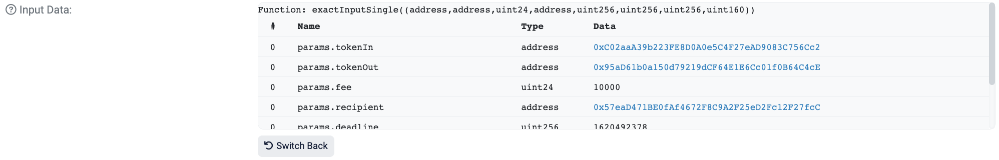
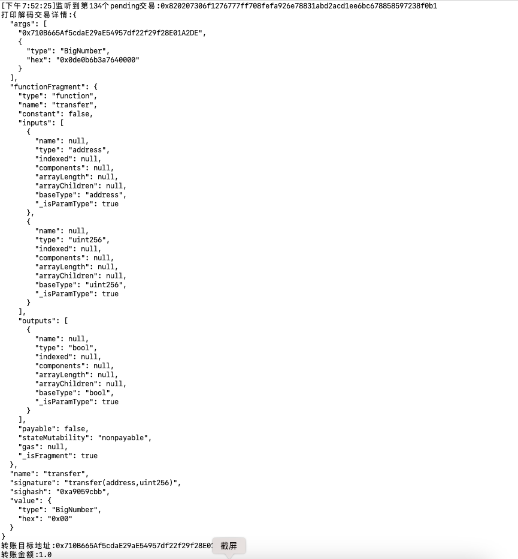

# WTF Ethers: 20. Decoding Transaction Details

I recently started studying `ethers.js` again to reinforce the details and create a "# WTF Ethers Guide" for beginners to use.

**Twitter**: [@0xAA_Science](https://twitter.com/0xAA_Science)

**WTF Academy Community**: [Official website wtf.academy](https://wtf.academy) | [WTF Solidity Tutorial](https://github.com/AmazingAng/WTF-Solidity) | [discord](https://discord.gg/5akcruXrsk) | [WeChat Group Application](https://docs.google.com/forms/d/e/1FAIpQLSe4KGT8Sh6sJ7hedQRuIYirOoZK_85miz3dw7vA1-YjodgJ-A/viewform?usp=sf_link)

All code and tutorials are open source on GitHub: [github.com/WTFAcademy/WTFEthers](https://github.com/WTFAcademy/WTF-Ethers)

-----

In this lesson, we will use a pending transaction as an example to demonstrate how to decode transaction details.

## Pending Transaction

A pending transaction is a transaction sent by a user but has not been included in a block by a miner yet. It appears in the mempool (transaction memory pool). For more information about the mempool, you can refer to the [# WTF Ethers Guide Lesson 19: Listening to the Mempool](https://github.com/WTFAcademy/WTF-Ethers/blob/main/19_Mempool/readme.md).

Below is an example of a pending transaction for transferring an `ERC20` token. You can view the transaction details on [etherscan](https://etherscan.io/tx/0xbe5af8b8885ea9d6ae8a2f3f44315554ff62daebf3f99b42eae9d4cda880208e):


The red box indicates the `input data` of this transaction, which appears as seemingly random hexadecimal data. In fact, it encodes the content of the transaction, including the invoked function and the input parameters. By clicking the **Decode Input Data** button on etherscan, we can decode this data:



After decoding, we can see the function called by this transaction and its input parameters.

## Interface Class

`ethers.js` provides the `Interface` class for decoding transaction data. Declaring the `Interface` class and declaring the `abi` are similar, for example:

```js
const iface = ethers.Interface([
    "function balanceOf(address) public view returns(uint)",
    "function transfer(address, uint) public returns (bool)",
    "function approve(address, uint256) public returns (bool)"
]);
```

## Decoding Transaction Data

Now let's write a script to decode the data of a pending transaction.

1. Create a `provider` and a `wallet`. It is recommended to use a `wss` connection instead of `http` when listening to transactions.

    ```js
    // Prepare the alchemy API, you can refer to https://github.com/AmazingAng/WTF-Solidity/blob/main/Topics/Tools/TOOL04_Alchemy/readme.md 
    const ALCHEMY_MAINNET_WSSURL = 'wss://eth-mainnet.g.alchemy.com/v2/oKmOQKbneVkxgHZfibs-iFhIlIAl6HDN';
    const provider = new ethers.WebSocketProvider(ALCHEMY_MAINNET_WSSURL);
    let network = provider.getNetwork()
    network.then(res => console.log(`[${(new Date).toLocaleTimeString()}] Connected to chain ID ${res.chainId}`));
    ```

2. Create an `Interface` object for decoding transaction details.

    ```js
    const iface = new ethers.Interface([
    "function transfer(address, uint) public returns (bool)",
    ])
    ```

3. Get the function selector.

    ```js
    const functionSignature = 'transfer(address,uint)'
    const selector = iface.getSighash(functionSignature)
    console.log(`Function selector is ${selector}`)
    ```

4. Listen for pending `ERC20` transfer transactions, retrieve the transaction details, and decode them:

    ```js
    provider.on('pending', async (txHash) => {
    if (txHash) {
        const tx = await provider.getTransaction(txHash)
        j++
        if (tx !== null && tx.data.indexOf(selector) !== -1) {
            console.log(`[${(new Date).toLocaleTimeString()}] Detected the ${j + 1}th pending transaction: ${txHash}`)
            console.log(`Printing decoded transaction details: ${JSON.stringify(iface.parseTransaction(tx), null, 2)}`)
            console.log(`Transfer destination address: ${iface.parseTransaction(tx).args[0]}`)
            console.log(`Transfer amount: ${ethers.utils.formatEther(iface.parseTransaction(tx).args[1])}`)
            provider.removeListener('pending', this)
        }
    }})
    ```

    

5. Decoding transaction parameters:

    

## Summary

In this lesson, we introduced the `Interface` class in `ethers.js` and used it to decode transactions in the `mempool` for Uniswap.