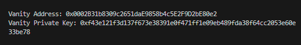

# WTF Ethers: 21. Vanity Address Generator

I've been revisiting `ethers.js` recently to refresh my understanding of the details and to write a simple tutorial called "WTF Ethers" for beginners.

**Twitter**: [@0xAA_Science](https://twitter.com/0xAA_Science)

**Community**: [Website wtf.academy](https://wtf.academy) | [WTF Solidity](https://github.com/AmazingAng/WTFSolidity) | [discord](https://discord.gg/5akcruXrsk) | [WeChat Group Application](https://docs.google.com/forms/d/e/1FAIpQLSe4KGT8Sh6sJ7hedQRuIYirOoZK_85miz3dw7vA1-YjodgJ-A/viewform?usp=sf_link)

All the code and tutorials are open-sourced on GitHub: [github.com/WTFAcademy/WTF-Ethers](https://github.com/WTFAcademy/WTF-Ethers)

-----

In this lesson, we will introduce how to generate vanity addresses using `ethers.js`. This is a tutorial worth $160M (not really).

## Vanity Addresses

In real life, some people pursue license plates like "888888". Similarly, in the blockchain world, people seek "vanity addresses". A vanity address is a personalized address that is easy to recognize and has the same level of security as other addresses. For example, an address starting with seven `0`s:

```solidity
0x0000000fe6a514a32abdcdfcc076c85243de899b
```

Yes, this is the vanity address involving the theft of $160 million by the prominent market maker, Wintermute ([report](https://www.blocktempo.com/head-market-maker-wintermute-hacked-loses-160-million-magnesium/)). As mentioned earlier, vanity addresses have the same level of security as regular addresses, so why was it attacked?

The issue lies in the vulnerability of the vanity address generator. Wintermute used a vanity address generator called "Profinity" to generate addresses, but the random seed used by this generator was flawed. Normally, a random seed should have 2^256 possibilities, but the seed used by Profinity was only 2^32 in length, making it vulnerable to brute force attacks. The hacker computed the private key of this addresses by brute-force and drained $160 million.

## Vanity Address Generator

Using `ethers.js`, we can write a vanity address generator in just 10 lines of code. It may not be as fast as other tools, but it is secure.

### Generating a Random Wallet

We can generate a wallet securely and randomly using the following code:

```js
const wallet = ethers.Wallet.createRandom() // Generate a random wallet, secure
```

### Regular Expressions

We need to use regular expressions to filter out the target vanity addresses. Here's a brief explanation of regular expressions:
   - To match the first few characters, we use the `^` symbol. For example, `^0x000` will match addresses starting with `0x000`.
   - To match the last few characters, we use the `$` symbol. For example, `000$` will match addresses ending with `000`.
   - We don't care about the middle characters, so we can use the `.*` wildcard. For example, `^0x000.*000$` will match addresses starting with `0x000` and ending with `000`.

In JavaScript, we can use the following expression to filter vanity addresses:
```js
const regex = /^0x000.*$/ // Expression, matches addresses starting with 0x000
isValid = regex.test(wallet.address) // Check the regular expression
```

### Vanity Address Generation Script

The logic of the vanity address generator is very simple. It continuously generates random wallets until it matches the desired vanity address. In our test, generating a vanity address starting with `0x000` takes only a few seconds, and each additional `0` increases the time by 16 times.

```js
import { ethers } from "ethers";
var wallet // Wallet
const regex = /^0x000.*$/ // Expression
var isValid = false
while(!isValid){
    wallet = ethers.Wallet.createRandom() // Generate a random wallet, secure
    isValid = regex.test(wallet.address) // Check the regular expression
}
// Print the vanity address and private key
console.log(`Vanity Address: ${wallet.address}`)
console.log(`Vanity Private Key: ${wallet.privateKey}`)
```



## Summary

In this lesson, we wrote a vanity address generator in less than 10 lines of code using `ethers.js` and saved $160 million.