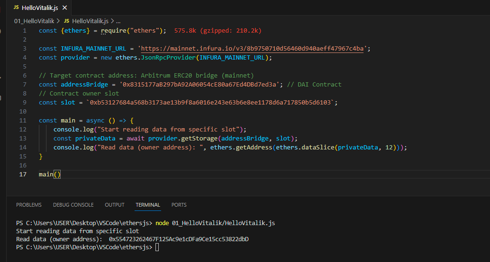

# WTF Ethers: 22. Read Any Data

I've been revisiting `ethers.js` recently to refresh my understanding of the details and to write a simple tutorial called "WTF Ethers" for beginners.

**Twitter**: [@0xAA_Science](https://twitter.com/0xAA_Science)

**Community**: [Website wtf.academy](https://wtf.academy) | [WTF Solidity](https://github.com/AmazingAng/WTFSolidity) | [discord](https://discord.gg/5akcruXrsk) | [WeChat Group Application](https://docs.google.com/forms/d/e/1FAIpQLSe4KGT8Sh6sJ7hedQRuIYirOoZK_85miz3dw7vA1-YjodgJ-A/viewform?usp=sf_link)

All the code and tutorials are open-sourced on GitHub: [github.com/WTFAcademy/WTF-Ethers](https://github.com/WTFAcademy/WTF-Ethers)

-----

All data on Ethereum is public, so `private` variables are not actually private. In this lesson, we will discuss how to read arbitrary data from a smart contract.

## Smart Contract Storage Layout

The storage in Ethereum smart contracts is a mapping of `uint256 -> uint256`. The size of `uint256` is `32 bytes`, and this fixed-sized storage space is called a `slot`. The contract's data is stored in individual slots, starting from `slot 0` by default and continuing sequentially. Each primitive data type occupies one slot, such as `uint`, `address`, and so on. However, more complex structures like arrays and mappings are more complicated, as detailed in the [documentation](https://docs.soliditylang.org/en/v0.8.17/internals/layout_in_storage.html?highlight=Layout%20of%20State%20Variables%20in%20Storage).


Therefore, even for `private` variables without a `getter` function, you can still read their values by accessing the respective slot.

## `getStorageAt`

`ethersjs` provides the `getStorageAt()` function for developers to conveniently read the value of a specific slot:

```js
const value = await provider.getStorageAt(contractAddress, slot)
```

`getStorageAt()` takes two arguments: the contract address `contractAddress`, and the index of the variable's `slot` that you want to read.

## Reading Arbitrary Data Script

Now, let's write a script that utilizes the `getStorageAt()` function to read the owner of the Arbitrum cross-chain bridge contract. This bridge contract is an upgradable proxy contract, and the `owner` is stored in a specific slot to avoid variable collisions, without a dedicated function for reading it. We can use `getStorageAt()` to read it.

```solidity
Contract Address: 0x8315177aB297bA92A06054cE80a67Ed4DBd7ed3a
Slot Index: 0xb53127684a568b3173ae13b9f8a6016e243e63b6e8ee1178d6a717850b5d6103
```

Code:

```js
import { ethers } from "ethers";

// Prepare Alchemy API (see https://github.com/AmazingAng/WTFSolidity/blob/main/Topics/Tools/TOOL04_Alchemy/readme.md)
const ALCHEMY_MAINNET_URL = 'https://eth-mainnet.g.alchemy.com/v2/oKmOQKbneVkxgHZfibs-iFhIlIAl6HDN';
const provider = new ethers.JsonRpcProvider(ALCHEMY_MAINNET_URL);

// Target Contract Address: Arbitrum ERC20 bridge (Mainnet)
const addressBridge = '0x8315177aB297bA92A06054cE80a67Ed4DBd7ed3a' // DAI Contract
// Contract Owner Slot
const slot = `0xb53127684a568b3173ae13b9f8a6016e243e63b6e8ee1178d6a717850b5d6103`

const main = async () => {
    console.log("Reading data from a specific slot...")
    const privateData = await provider.getStorage(addressBridge, slot)
    console.log("Data read (owner address): ", ethers.getAddress(ethers.dataSlice(privateData, 12)))    
}

main()
```

Output:



## Summary

In this lesson, we have learned how to read arbitrary data from a smart contract, including private data. Due to the transparency of the Ethereum network, it is essential not to store sensitive information in smart contracts!