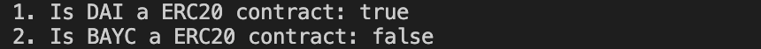

# WTF Ethers: 24. Identify ERC20 Contracts

I've been revisiting `ethers.js` recently to refresh my understanding of the details and to write a simple tutorial called "WTF Ethers" for beginners.

**Twitter**: [@0xAA_Science](https://twitter.com/0xAA_Science)

**Community**: [Website wtf.academy](https://wtf.academy) | [WTF Solidity](https://github.com/AmazingAng/WTFSolidity) | [discord](https://discord.gg/5akcruXrsk) | [WeChat Group Application](https://docs.google.com/forms/d/e/1FAIpQLSe4KGT8Sh6sJ7hedQRuIYirOoZK_85miz3dw7vA1-YjodgJ-A/viewform?usp=sf_link)

All the code and tutorials are open-sourced on GitHub: [github.com/WTFAcademy/WTF-Ethers](https://github.com/WTFAcademy/WTF-Ethers)

-----

In this lesson, we will learn how to use `ethers.js` to identify whether a contract follows the `ERC20` standard.

## `ERC20`

`ERC20` is the most commonly used token standard on Ethereum. If you are unfamiliar with this standard, you can refer to [WTF Solidity 31: ERC20](https://github.com/AmazingAng/WTF-Solidity/blob/main/31_ERC20/readme.md). The `ERC20` standard includes the following functions and events:
```solidity
interface IERC20 {
    event Transfer(address indexed from, address indexed to, uint256 value);

    event Approval(address indexed owner, address indexed spender, uint256 value);

    function totalSupply() external view returns (uint256);

    function balanceOf(address account) external view returns (uint256);

    function transfer(address to, uint256 amount) external returns (bool);

    function allowance(address owner, address spender) external view returns (uint256);

    function approve(address spender, uint256 amount) external returns (bool);

    function transferFrom(address from, address to, uint256 amount) external returns (bool);
}
```

## Identifying `ERC20` Contracts
In a previous [tutorial](https://github.com/WTFAcademy/WTF-Ethers/blob/main/12_ERC721Check/readme.md), we discussed how to identify `ERC721` contracts based on `ERC165`. However, since the release of `ERC20` predates `ERC165` (20 < 165), we cannot use the same method to identify `ERC20` contracts and need to find an alternative solution.

The blockchain is transparent, so we can obtain the bytecode of any contract address. Therefore, we can first retrieve the bytecode of a contract and compare it to see if it includes the functions specified in the `ERC20` standard.

First, we use the `getCode()` function of the `provider` to retrieve the bytecode of the corresponding address:
```js
let code = await provider.getCode(contractAddress)
```

Next, we need to check if the contract bytecode includes the function selectors specified in the `ERC20` standard. The corresponding selectors are stored in the contract bytecode: if the contract includes the `transfer(address, uint256)` function, the bytecode will include `a9059cbb`; if the contract includes `totalSupply()`, the bytecode will include `18160ddd`. If you're not familiar with function selectors, you can refer to the corresponding section in the [WTF Solidity tutorial](https://github.com/AmazingAng/WTF-Solidity/blob/main/29_Selector/readme.md). If you want to delve deeper into bytecode, you can read the [Dive into EVM](https://github.com/AmazingAng/WTFSolidity/blob/main/Topics/Translation/DiveEVM2017).

In this case, we only need to check the `transfer(address, uint256)` and `totalSupply()` functions instead of all six functions, because:
1. The `transfer(address, uint256)` function is the only one in the `ERC20` standard that is not included in the `ERC721`, `ERC1155`, and `ERC777` standards. Therefore, if a contract includes the `transfer(address, uint256)` selector, we can say it is an `ERC20` token contract rather than `ERC721`, `ERC1155`, and `ERC777`.
2. The additional check for `totalSupply()` is to prevent [selector collisions](https://github.com/AmazingAng/WTFSolidity/blob/main/S01_ReentrancyAttack/readme.md): a random bytecode sequence may accidentally match the selector of `transfer(address, uint256)` (4 bytes).

Here is the code:
```js
async function erc20Checker(addr){
    // Retrieve contract bytecode
    let code = await provider.getCode(addr)
    // Non-contract addresses have a bytecode of "0x"
    if(code != "0x"){
        // Check if bytecode includes the selectors of the transfer and totalSupply functions
        if(code.includes("a9059cbb") && code.includes("18160ddd")){
            // If so, it is an ERC20 contract
            return true
        }else{
            // If not, it is not an ERC20 contract
            return false
        }
    }else{
        return null;
    }
}
```

## Test Script

Now, let's use the `DAI` (ERC20) and `BAYC` (ERC721) contracts to test whether the script can correctly identify an `ERC20` contract.

```js
// DAI address (mainnet)
const daiAddr = "0x6b175474e89094c44da98b954eedeac495271d0f"
// BAYC address (mainnet)
const baycAddr = "0xbc4ca0eda7647a8ab7c2061c2e118a18a936f13d"

const main = async () => {
    // Check if the DAI contract is an ERC20 contract
    let isDaiERC20 = await erc20Checker(daiAddr)
    console.log(`1. Is DAI an ERC20 contract: ${isDaiERC20}`)

    // Check if the BAYC contract is an ERC20 contract
    let isBaycERC20 = await erc20Checker(baycAddr)
    console.log(`2. Is BAYC an ERC20 contract: ${isBaycERC20}`)
}

main()
```

The output is as follows:



The script successfully detects that the `DAI` contract is an `ERC20` contract, while the `BAYC` contract is not an `ERC20` contract.

## Summary

In this lesson, we learned how to retrieve the bytecode of a contract using the contract address and how to use function selectors to check if a contract follows the `ERC20` standard. The script successfully identified the `DAI` contract as an `ERC20` contract and the `BAYC` contract as not an `ERC20` contract. Do you have other ways to identify an ERC20 contract?