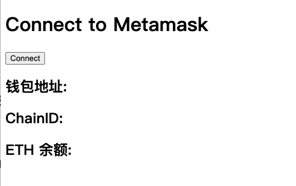

# WTF Ethers Toolbox: ET01. Connecting to Metamask

I've been revisiting `ethers.js` recently to refresh my understanding of the details and to write a simple tutorial called "WTF Ethers" for beginners.

**Twitter**: [@0xAA_Science](https://twitter.com/0xAA_Science)

**Community**: [Website wtf.academy](https://wtf.academy) | [WTF Solidity](https://github.com/AmazingAng/WTF-Solidity) | [discord](https://discord.gg/5akcruXrsk) | [WeChat Group Application](https://docs.google.com/forms/d/e/1FAIpQLSe4KGT8Sh6sJ7hedQRuIYirOoZK_85miz3dw7vA1-YjodgJ-A/viewform?usp=sf_link)

All the code and tutorials are open-sourced on GitHub: [github.com/WTFAcademy/WTF-Ethers](https://github.com/WTFAcademy/WTF-Ethers)

-----

In this lesson, we will learn how to connect to the Metamask wallet on a web page using `ethers.js` and retrieve the account address, chainID, and ETH balance.

## Metamask

Metamask is the most popular open-source wallet for Ethereum. It can be used as a browser extension on desktop or as a mobile app on Android and iOS.

Before you start developing with Metamask, you need to download it. Remember:

**Always download from the official website: https://metamask.io/download/**

**Always download from the official website: https://metamask.io/download/**

**Always download from the official website: https://metamask.io/download/**

Important things should be said three times. Many users have had their wallets stolen because they downloaded a pirated version of Metamask and entered their mnemonic phrase or private key.

## Connecting to Metamask

After installing the Metamask wallet, the browser injects a `window.ethereum` object into each page for interacting with the wallet. `ethers.js` provides a `BrowserProvider` that encapsulates a standard browser provider, making it easy to generate a provider object in your program:

```js
// Retrieve the provider
const provider = new ethers.BrowserProvider(window.ethereum)
```

You can then use the provider just like any other `ethers.js` provider. Here are a few examples.

First, let's write a simple HTML page because Metamask is a browser extension and must be used within a browser:

```html
<!DOCTYPE html>
<html lang="en">
  <head>
    <meta charset="UTF-8">
    <meta name="viewport" content="width=device-width, initial-scale=1.0">
  </head>
  <body>
    <h1 id="header">Connect to Metamask</h1>
    <button class="connect"> Connect</button>
    <h2>Wallet Address: <span class="showAccount"></span></h2>
    <h2>ChainID: <span class="showChainID"></span></h2>
    <h2>ETH Balance: <span class="showETHBalance"></span></h2>
  </body>
</html>
```



Next, let's embed some JavaScript scripts into the page.

1. Import the `ethers.js` package, retrieve the button and text variables from the page, and add a listener to the button that triggers the `onClickHandler()` function when clicked.

    ```js
    import { ethers } from "https://cdnjs.cloudflare.com/ajax/libs/ethers/6.2.3/ethers.js";
    const ethereumButton = document.querySelector('.connect');
    const showAccount = document.querySelector('.showAccount');
    const showChainID = document.querySelector('.showChainID');
    const showETHBalance = document.querySelector('.showETHBalance');

    ethereumButton.addEventListener(`click`, onClickHandler)
    ```

2. Now let's write the content of the `onClickHandler()` function, which starts by connecting to Metamask and creating the `provider` variable.

    ```js
    // Retrieve the provider
    const provider = new ethers.BrowserProvider(window.ethereum)
    ```

3. Retrieve and print the wallet address:

    ```js
    // Retrieve the wallet address
    const accounts = await provider.send("eth_requestAccounts", []);
    const account = accounts[0]
    console.log(`Wallet Address: ${account}`)
    showAccount.innerHTML = account;
    ```

4. Retrieve and print the ChainID:

    ```js
    // Retrieve the ChainID
    const { chainId } = await provider.getNetwork()
    console.log(`ChainID: ${chainId}`)
    showChainID.innerHTML = chainId;
    ```

5. Retrieve and print the wallet's ETH balance:

    ```js
    // Retrieve the ETH balance
    const signer = await provider.getSigner()
    const balance = await provider.getBalance(signer.getAddress());
    console.log(`ETH Balance: ${ethers.formatUnits(balance)}`)
    showETHBalance.innerHTML = ethers.formatUnits(balance);
    ```

6. When running locally, you need to install the `http-server` package, which you can do with the following command using npm:
    ```shell
    npm install --global http-server
    ```
    Then navigate to the appropriate folder and run the following command to start the webpage. Note that simply clicking the `.html` file won't run it.
    ```shell
    http-server .
    ```
    If you see the following output, it means the server is running successfully, and you can open the webpage with the provided URL.
    ```shell
    Starting up http-server, serving .
    Available on:
        http://127.0.0.1:8080
        http://10.6.8.162:8080
    ```


## Summary

In this lesson, we have learned how to connect to the Metamask wallet on a web page using `ethers.js`, retrieve the account address, chainID, and ETH balance. This is the foundation for building DApps.