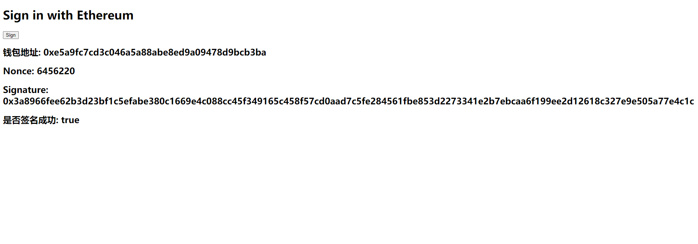

# WTF Ethers: Tools: ET02. Implement MetaMask Sign-In Functionality

I've been revisiting `ethers.js` recently to refresh my understanding of the details and to write a simple tutorial called "WTF Ethers" for beginners.

**Twitter**: [@0xAA_Science](https://twitter.com/0xAA_Science)

**Community**: [Website wtf.academy](https://wtf.academy) | [WTF Solidity](https://github.com/AmazingAng/WTF-Solidity) | [discord](https://discord.gg/5akcruXrsk) | [WeChat Group Application](https://docs.google.com/forms/d/e/1FAIpQLSe4KGT8Sh6sJ7hedQRuIYirOoZK_85miz3dw7vA1-YjodgJ-A/viewform?usp=sf_link)

All the code and tutorials are open-sourced on GitHub: [github.com/WTFAcademy/WTF-Ethers](https://github.com/WTFAcademy/WTF-Ethers)

-----

In this tutorial, we will explore how to connect to MetaMask, a popular open-source Ethereum wallet, on a web page using `ethers.js`. We will implement the functionality to sign and authorize with MetaMask for login purposes.

## MetaMask

MetaMask, also known as the "Little Fox" wallet, is the most popular open-source Ethereum wallet. It can be used as a browser extension on PC or as a mobile app on Android and iOS.

Before you start developing with MetaMask, you need to download and install it. Remember:

**Download it only from the official website: https://metamask.io/download/**

**Download it only from the official website: https://metamask.io/download/**

**Download it only from the official website: https://metamask.io/download/**

Important things need to be repeated three times. Many users have had their wallets hacked because they downloaded a counterfeit version of MetaMask and then entered their mnemonic phrase or private key.

## Connecting to MetaMask

After installing the MetaMask wallet, the browser will inject a `window.ethereum` object into every web page, which allows interaction with the wallet. The `ethers.js` library provides a `BrowserProvider` that encapsulates a standard Web3 Provider, making it convenient to generate a provider object directly in the program:

```js
// Get the provider
const provider = new ethers.BrowserProvider(window.ethereum);
```

After that, you can use the `provider` just like other `ethers.js` providers. Let's look at a few examples.

First, let's write a simple HTML page because MetaMask requires it to be used as a browser extension.

```html
<!DOCTYPE html>
<html lang="en">
<head>
    <meta charset="UTF-8">
    <meta name="viewport" content="width=device-width, initial-scale=1.0">
</head>
<body>
   <h1 id="header">Sign in with Ethereum</h1>
   <button class="sign">Sign</button>
   <h2>Wallet Address: <span class="showAccount"></span></h2>
   <h2>Nonce: <span class="showNonce"></span></h2>
   <h2>Signature: <span class="showSignature"></span></h2>
   <h2>Is Signature Successful: <span class="showSignStatus"></span></h2>
</body>
</html>
```


Now let's embed some JavaScript scripts into it.

1. Import the `ethers.js` library, get the button and text variables from the page, and add a listener to the button that triggers the `onClickHandler()` function when clicked.

    ```js
    import { ethers } from "https://cdn-cors.ethers.io/lib/ethers-5.6.9.esm.min.js";
    const signButton = document.querySelector('.sign');
    const showAccount = document.querySelector('.showAccount');
    const showNonce = document.querySelector('.showNonce');
    const showSignature = document.querySelector('.showSignature');
    const showSignStatus = document.querySelector('.showSignStatus');

    signButton.addEventListener(`click`, onClickHandler)
    ```

2. Next, let's create a variable to simulate a backend database that stores user information.

    ```js
    // Assume this is the backend database where the "users" table stores user objects, which include the user's address and associated nonce.
    // {"address": user address, "nonce": random nonce returned to the frontend}
    export const users = {}
    ```

3. Write a simulated backend API method: `auth(address)` to retrieve a random nonce generated by the backend based on the address for signing.

    ```js
    /**
     * Retrieve a random nonce generated by the backend based on the address for signing
     * @param address - User address
     * @returns - Random nonce
     *
     * This method simulates a backend service that retrieves data to be signed from the backend.
     */
    function auth(address) {
        let user = users[address]
        if (!user) {
            user = {
                address,
                nonce: Math.floor(Math.random() * 10000000)
            }
            users[address] = user
        } else {
            const nonce = Math.floor(Math.random() * 10000000)
            user.nonce = nonce
            users[address] = user
        }
        return user.nonce
    }
    ```

4. Write another simulated backend API method: `verify(address, signature)` to verify whether the user's signature is correct.

    ```js
    /**
     * Verify whether the user's signature is correct
     * @param address - User address
     * @param signature - Signature data
     * @returns - Whether the signature is valid
     *
     * This method simulates a backend service that verifies the user's signature and returns relevant login status data to complete the login process.
     */
    function verify(address, signature) {
        let signValid = false
        console.log(`address: ${address}`)
        // Retrieve the nonce from the database
        let nonce = users[address].nonce
        console.log(`nonce: ${nonce}`)
        // Verify the address that signed the nonce
        const decodedAddress = ethers.verifyMessage(nonce.toString(), signature.toString())
        console.log(`decodedAddress: ${decodedAddress}`)
        // Compare the address with the signature address
        if (address.toLowerCase() === decodedAddress.toLowerCase()) {
            signValid = true
            // For security reasons, change the nonce to prevent using the same nonce for login next time
            users[address].nonce = Math.floor(Math.random() * 10000000)
        }
        return signValid
    }
    ```
5. We write the content of the `onClickHandler()` function, first connect to MetaMask, create the `provider` variable, retrieve the data that the backend needs to sign, sign the data after obtaining it, and then request the backend to verify the signature.

    ```js
    // Front-end signing process
    async function onClickHandler() {
        console.log("Connecting wallet")
        // Get the provider
        const provider = new ethers.Web3Provider(window.ethereum)
        // Read wallet address
        const accounts = await provider.send("eth_requestAccounts", []);
        const account = accounts[0]
        console.log(`Wallet Address: ${account}`)
        showAccount.innerHTML = account;

        // Retrieve the data that needs to be signed from the backend
        const nonce = auth(account);
        showNonce.innerHTML = nonce;
        console.log(`Retrieving data to be signed from the backend: ${nonce}`)
        // Sign the data
        const signer = await provider.getSigner()
        const signature = await signer.signMessage(nonce.toString())
        showSignature.innerHTML = signature;
        // Verify the signature with the backend and complete the login
        const signStatus = verify(account, signature);
        showSignStatus.innerHTML = signStatus;
    }
    ```

6. When running locally, you need to install the `http-server` package. You can use the following command to install it via `npm`.
    ```shell
    npm install --global http-server
    ```
   Then switch to the appropriate folder and enter the following command to run the webpage. Note that directly clicking on the `.html` file will not work.
    ```shell
    http-server .
    ```
   If you see the following output, it means the server is running successfully. Open the provided URL to access the webpage.
    ```shell
    Starting up http-server, serving .
    Available on:
        http://127.0.0.1:8080
        http://10.6.8.162:8080
    ```
   Open the current tutorial page.
   ```shell
    Starting up http-server, serving .
    Available on:
        http://127.0.0.1:8080/ET02_SignInWithEthereum/index.html
        http://10.6.8.162:8080/ET02_SignInWithEthereum/index.html
    ```



## Application in the project

**The main use is to allow Ethereum Address (EVM) users to log in to centralized platforms through this login method.**

**How to use Metamask for one-click login**

The basic idea of ​​one-click login is that by signing a piece of data using a private key, ownership of the account can be easily proven through encryption. If you manage to sign the exact data generated by our backend, the backend will consider you as the owner of that wallet address. Therefore, we can build an identity authentication mechanism based on message signing, and use the user's wallet address as their identifier.

**How the entire login process works in the project**
- Step 1: Backend User Data Table: The backend saves `address` and the corresponding `nonce` in the user data table.
- Step 2: Generate Random Numbers: For each `address` in the database, generate a random string in the nonce field.
- Step 3: User Retrieves their Random Number: Use the backend API to retrieve the nonce for the `address`.
- Step 4: User Signs the Nonce: Sign the nonce.
- Step 5: Signature Verification: Based on the address in the request body, retrieve the corresponding user from the database, especially its related random number nonce, and then verify the signature. If the verification is successful, it proves the ownership of the wallet address, and then the JWT or session identifier can be returned to the front end to complete the login.
- Step 6: Change the Nonce: Modify the nonce to prevent the user from using the same nonce and signature to log in again (to prevent leakage).

PS: The nonce here can be a string that needs to be signed. It does not necessarily have to be a random number. It can be something like this; in many projects, the sign is not just a nonce, usually it is accompanied by some other content.

Something like this:
```
Sign up with Ethereum to the app.

URI: https://app.xxxx.com
Version: 1
Chain ID: 1
Nonce: 6971359
Issued At: 2023-02-16T06:03:49.534Z
```

## Implementation of `ethers.verifyMessage(nonce, signature)` in the backend
Java Backend Project
Import `web3j` with Maven
```
<dependency>
   <groupId>org.web3j</groupId>
   <artifactId>core</artifactId>
   <version>4.5.16</version>
</dependency>
```
Java main method example code
```java
import org.web3j.crypto.ECDSASignature;
import org.web3j.crypto.Hash;
import org.web3j.crypto.Keys;
import org.web3j.crypto.Sign;
import org.web3j.utils.Numeric;

import java.math.BigInteger;
import java.nio.charset.StandardCharsets;
import java.util.Arrays;

public class SignInWithEthereum {
   public static void main(String[] args) {
      String address = "0x4adbe2009cff6a1e9d280d28815c49e91b8ebad0";
      String nonce = "3618473";
      String signature = "0x9a38fb504315869609ef2e948b1a80f670e6ff725d16b5ae443b118eb2d108bc3c659c2417d96bbff240b44d4f1078fde73b72f83cc71e4e726640bc19a9c2a91c";
      String MESSAGE_PREFIX = "\u0019Ethereum Signed Message:\n";
      try {
         String digest = Hash.sha3(
                 Numeric.toHexStringNoPrefix(
                         (MESSAGE_PREFIX + nonce.length() + nonce).getBytes(StandardCharsets.UTF_8)));

         byte[] signatureBytes = Numeric.hexStringToByteArray(signature);
         byte v = signatureBytes[64];
         if (v < 27) {
            v += 27;
         }
         byte[] r = (byte[]) Arrays.copyOfRange(signatureBytes, 0, 32);
         byte[] s = (byte[]) Arrays.copyOfRange(signatureBytes, 32, 64);

         Sign.SignatureData signatureData = new Sign.SignatureData(v, r, s);
         int header = 0;
         for (byte b : signatureData.getV()) {
            header = (header << 8) + (b & 0xFF);
         }
         if (header < 27 || header > 34) {
            System.out.println("false");
```
}

int recId = header - 27;
BigInteger key = Sign.recoverFromSignature(
        recId,
        new ECDSASignature(
                new BigInteger(1, signatureData.getR()), new BigInteger(1, signatureData.getS())),
        Numeric.hexStringToByteArray(digest));
if (key == null) {
    System.out.println("false");
}
String signAddress = ("0x" + Keys.getAddress(key)).trim();
System.out.println("signAddress:" + signAddress);
if (address.toLowerCase().equals(signAddress.toLowerCase())) {
    System.out.println("true");
}
} catch (Exception e) {
    System.out.println("false");
}
}
}
```
Java Utility Class

```Java
import java.math.BigInteger;
import java.nio.charset.StandardCharsets;
import java.util.Arrays;

import org.web3j.crypto.ECDSASignature;
import org.web3j.crypto.Hash;
import org.web3j.crypto.Keys;
import org.web3j.crypto.Sign;
import org.web3j.crypto.Sign.SignatureData;
import org.web3j.utils.Numeric;

public class EthersUtils {
    private static final String MESSAGE_PREFIX = "\u0019Ethereum Signed Message:\n";

    public static String verifyMessage(String message, String signature) {
        return EthersUtils.recoverAddress(EthersUtils.hashMessage(message), signature);
    }

    public static String hashMessage(String message) {
        return Hash.sha3(
                Numeric.toHexStringNoPrefix(
                        (EthersUtils.MESSAGE_PREFIX + message.length() + message).getBytes(StandardCharsets.UTF_8)));
    }

    public static String recoverAddress(String digest, String signature) {
        SignatureData signatureData = EthersUtils.getSignatureData(signature);
        int header = 0;
        for (byte b : signatureData.getV()) {
            header = (header << 8) + (b & 0xFF);
        }
        if (header < 27 || header > 34) {
            return null;
        }
        int recId = header - 27;
        BigInteger key = Sign.recoverFromSignature(
                recId,
                new ECDSASignature(
                        new BigInteger(1, signatureData.getR()), new BigInteger(1, signatureData.getS())),
                Numeric.hexStringToByteArray(digest));
        if (key == null) {
            return null;
        }
        return ("0x" + Keys.getAddress(key)).trim();
    }

    private static SignatureData getSignatureData(String signature) {
        byte[] signatureBytes = Numeric.hexStringToByteArray(signature);
        byte v = signatureBytes[64];
        if (v < 27) {
            v += 27;
        }
        byte[] r = (byte[]) Arrays.copyOfRange(signatureBytes, 0, 32);
        byte[] s = (byte[]) Arrays.copyOfRange(signatureBytes, 32, 64);
        return new SignatureData(v, r, s);
    }
}
```


## Summary

In this lecture, we introduced how to connect to MetaMask on a web page using `ethers.js` and complete the login process on a decentralized website after signing authorization. A user's wallet address completes the login process for a central login website.